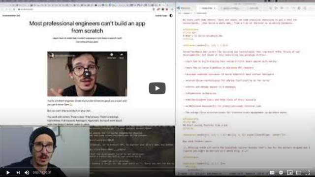

Say you've got a JAMStack app with authentication. Works great, loads fast, some pages need login.

That part's easy with something like [useAuth](https://github.com/Swizec/useAuth), a manual integration with Auth0, or any number of 3rd party providers.

You have some code that asks _"Is this user logged in?"_. Show them the page or some "Please Login" interface. There's a button somewhere that starts the login flow.

Something like this for example:


Now what if you want to add an area that only some users have access to? How would you do that?


🤔

## Roles are the answer

User roles are the simplest approach to granular permissions. Everything else I've tried gets out of hand super fast.

Is this user a student or not? Access to course.

Does this user have module X? Access.

You can go as detailed as you want. Admin vs. not-admin is often the first and only role-based permission. Some apps eventually need more.

The more roles you add, the more complex it all gets. But trust me, roles are the only approach that scales at all.

A friend of mine lived through a horror story where it took an entire team and 3 years to build a robust permission system for a large app. 3 years 😳

Roles are way easier.

## With useAuth 0.7.0

[](https://www.youtube.com/watch?v=X9PHqmnzr4k)

Hot off the presses, [useAuth 0.7.0](https://github.com/Swizec/useAuth) adds a helper to check for user roles. Still just for Auth0, soon for others I promise.

Here's what you do:

```javascript
const ForStudentsOnly = () => {
	const { isAuthorized } = useAuth()
	
	if (isAuthorized("Student")) {
		return <ReallyCoolContent />
	} else {
		return <NoAccess />
	}
}
```

And that's pretty much it, really.

The `isAuthorized` method verifies your user is currently logged-in and that they have the `Student` role.

You'll need to add a rule to your Auth0 config as well. They don't send this info by default. Don't know why, I tried everything. 😔

```javascript
// this goes in Auth0/rules config as a new rule
function (user, context, callback) {
  const namespace = 'https://YOUR_DOMAIN';
  const assignedRoles = (context.authorization || {}).roles;
  
  user.user_metadata = user.user_metadata || {};

  user.user_metadata.roles = assignedRoles;

  context.idToken[namespace + '/user_metadata'] = user.user_metadata;

  callback(null, user, context);
}
```

And you have to make sure that namespace matches a config in the `<AuthProvider>` that wraps your whole component tree. That's how `useAuth` hooks into the React context and keeps track of everything.

```javascript
export const wrapPageElement = ({ element, props }) => (
  <AuthProvider
    // ...
    customPropertyNamespace="https://YOUR_DOMAIN"
  >
    <Layout {...props}>{element}</Layout>
  </AuthProvider>
)
```

No, I don't know why the namespace needs to be a full URL. The Auth0 documentation isn't clear on that part and I was unable to hunt down details on the forums.

## How do you get roles onto users in the first place?

Ah yes, _adding_ roles to users. That part is a little tricky.

Here's an article I wrote on [Connecting Gumroad to Auth0 for paywalled JAMStack apps](https://swizec.com/blog/connecting-gumroad-to-auth0-for-paywalled-jamstack-apps/) ❤️

The TL;DR is that your checkout provider triggers your cloud function through a webhook and that adds a role to your user. You can also do it manually.

I use Gumroad, Stripe works too. I use AWS Lambda, a Netlify or Vercel cloud function should be fine.

```javascript
// this bit of code adds a role to user
  if (FindYourIdea_PRODUCTS.includes(ping.product_permalink)) {
    // create or get user
    const user = await upsertUser(ping)

    if (user) {
      const auth0 = await getAuth0Client()

      // add the right role
      await auth0.assignRolestoUser(
        { id: user.user_id! },
        {
          // hardcoded FindYourIdea role id from Auth0 URL
          roles: [ROLE_ID],
        }
      )
    }
  }
```

Full details in the [Connecting Gumroad to Auth0 for paywalled JAMStack apps](https://swizec.com/blog/connecting-gumroad-to-auth0-for-paywalled-jamstack-apps/) article.

## What if there's many roles to check?

This is where life gets tricky. The more roles you have, the trickier. 😅

Somewhere in your code there's going to be a component like this.

```javascript
const LockedContent = (props) => {
  const allowUnauth = UNAUTH_PAGES.includes(currentLocation(props))
  const { isAuthorized, isAuthenticated } = useAuth()

  if (!allowUnauth && !isAuthenticated()) {
    // not even logged in, ask for login
    return <PleaseLogin />
  } else {
    if (isFindYourIdeaPage(props)) {
      if (isAuthorized("FindYourIdea")) {
        // FindYourIdea page, access -> show
        return <Content {...props} />
      } else {
        // FindYourIdea page, no access -> buy
        return <PleasePurchase findYourIdea />
      }
    } else if (isAuthorized("Student")) {
      // ServerlessReactDev page, acces -> show
      return <Content {...props} />
    } else if (allowUnauth) {
      // no auth required -> show
      return <Content {...props} />
    } else {
      // ServerlessReactDev page, no access -> buy
      return <PleasePurchase />
    }
  }
}
```

Like I said, messy. And there's nothing you can do about it.

Might look a little better, if you bake it into your router and use individual checks on individual pages. But the complexity remains. Somewhere something has to check this stuff. 🤷‍♀️

Using different components for different content pages makes it easier – check authorization in the component itself. But I'm using some MDX shenanigans and the `<Content>` component doesn't know what it's showing.

So a nice big truth table is what I gotta do.

https://twitter.com/Swizec/status/1250144894808547328

## What about without useAuth?

Same principle my friend. You get the role for your user and you ask _"Does this role have access to this page?"_

✌️

Cheers,  
~Swizec

PS: the [coding-on-a-ipad workflow I suggested on Friday totally worked](https://swizec.com/blog/looking-for-the-perfect-light-work-device/) 🤘

[](https://youtu.be/OqZeMqRqr9A)
