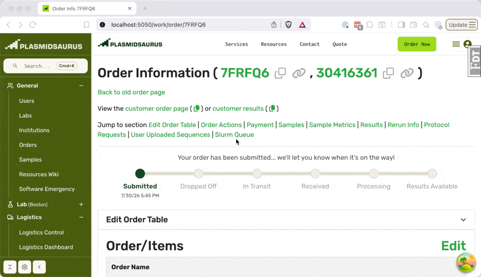
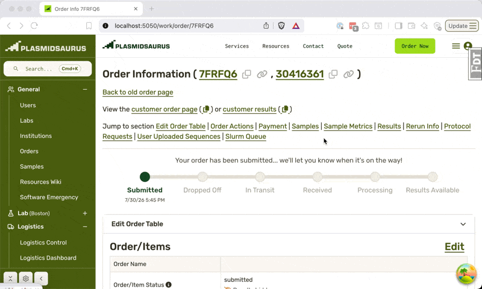
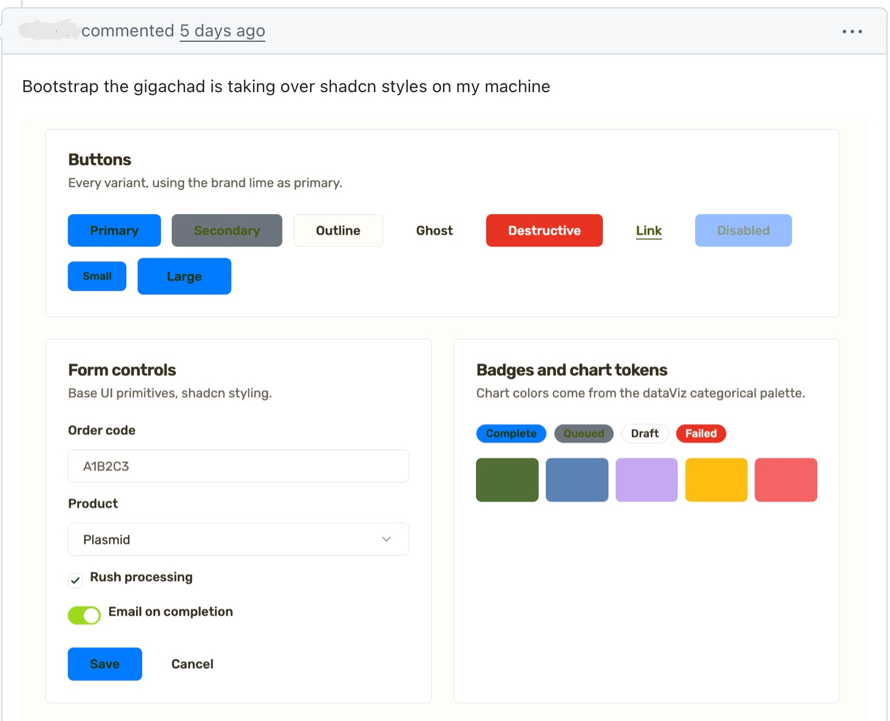
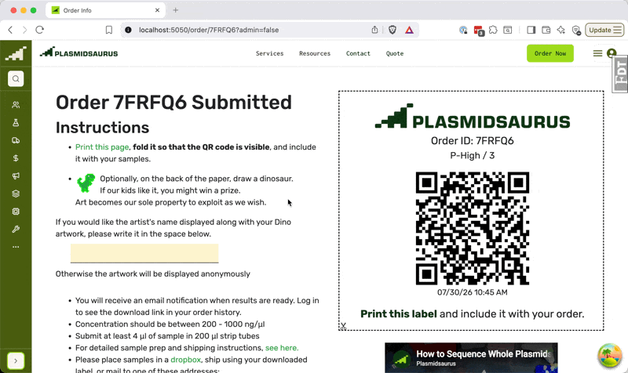
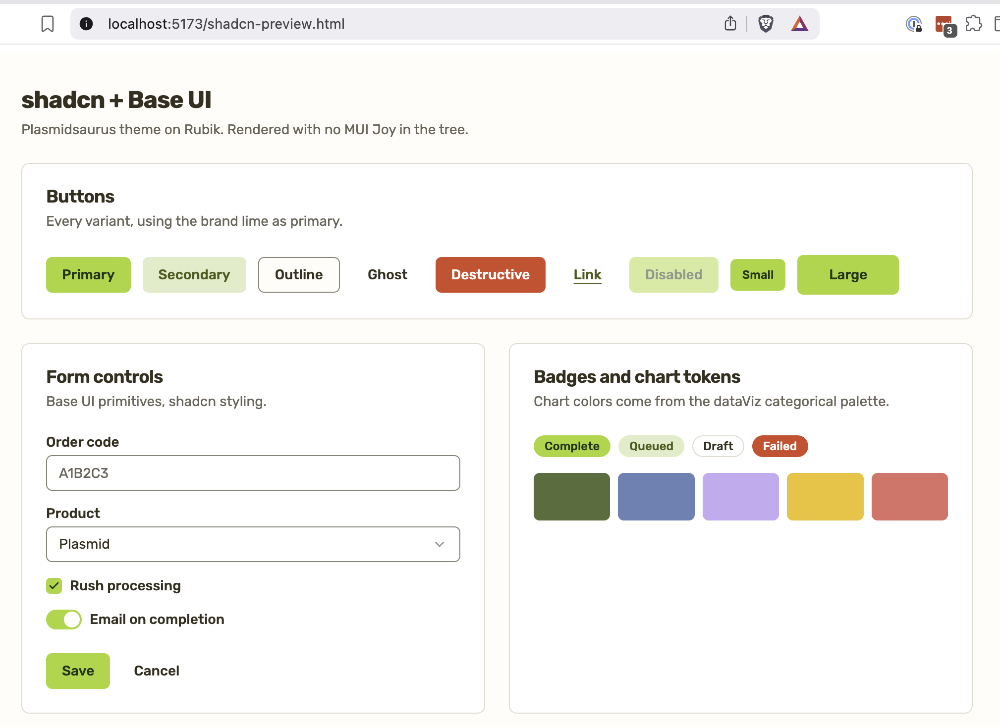

At scale you're always mid-migration but you _never_ do a big-bang rewrite, right? I think that's changing 🤨

You see the secret of our industry is that "you never rewrite your software" but we're all always rewriting our software. When the business changes every 6 months, what else are you gonna do?

https://twitter.com/Swizec/status/1924875257669943383

## Managing migrations is the job

How you manage these migrations is everything. We used to say [rewrites fail because you can't stop the business](https://swizec.com/blog/you-can-t-stop-the-business-or-why-rewrites-fail/) and you'll get stuck:

- maintaining two systems,
- with a new system that never catches up,
- or high opportunity cost as the current system stagnates.

Well-factored systems are easier to rewrite because you can go piece by piece. The strangler fig or ship of theseus rewrite.

But these are annoying and break people's brains. You'll spend almost as much energy [talking stakeholders and users through the change](https://swizec.com/blog/code-is-the-easy-part-or-how-we-refactored-half-the-business-to-fix-a-janky-script) as you will changing the code.

## Speed changes the math

This week I did something crazy: I rewrote all our old Bootstrap styles across hundreds of pages into Tailwind. One big pull request, 22,000 line diff, lots of manual testing, no review. Like ripping off a bandaid.

https://twitter.com/Swizec/status/2082909391465111771

And guess what, it worked! I fixed 13 tiny bugs that day but the company didn't stop, nothing broke badly, everyone kept doing their jobs, and now our UI looks prettier and more consistent.

All internal tools, and a few customer-facing pages, went from a hodge podge of styles like this:



To a more unified system like this:



People across departments look at this internal order page ~150 times per hour. It is central to our operations and some of the styling dates back to founder code. There are worse pages out there.

Obviously my big migration didn't de-jankify everything, but getting rid of Bootstrap was a big step. When we started fixing our design system, it quickly became obvious the old CSS needs to go.



## Anatomy of a modern big bang migration

How do you "fix the design system" in a company with high agency engineers where every page looks like it was designed by someone else because yes it was?

Even our customer pages don't look consistent.

Every page looks like someone pulled a locally ~~optimal~~ best-effort design out of their arse with little thought for the whole. Because that's exactly what happened. Sometimes at the level of individual widgets!

Look at this mess



That's the page you see after giving us money. Thousands of dollars sometimes.

### Experiment 1 – yolo rewrite

We wanted to take this opportunity to fix tech debt.

In our React code we use [JoyUI](https://v7.mui.com/joy-ui/getting-started/), which was end-of-life'd over a year ago. In our Jinja HTML code, we "use" [Bootstrap](https://getbootstrap.com). That is to say Bootstrap is available and people loosely follow its guidelines while vibing their own custom CSS of the day.

Make it work _then_ maybe make it right.

A few weeks ago I gave Claude a simple instruction: Rewrite all our JoyUI in MUIv7. Keep working until you're done. Make no mistakes.

It churned for ~8 hours and produced a monster PR. The result was _"almost salvageable"_. Many little bugs that would take us months to fix and honestly not a big improvement on existing code.

Crucially **we got the same mess as before but in a new library**. This was important information.

### Human taste first

From that experiment we learned that AI _can_ do huge migrations quickly but **we need to do the human taste step first**. You have to give AI clear guidance on what good looks like then it can do the mechanistic transformations for you.

We picked [ShadCN](https://ui.shadcn.com) + [Base UI](https://base-ui.com) for our new stack. ShadCN for the library of styled components and BaseUI for the library of working components.

Then we built a custom ShadCN theme based on our brand colors.



ShadCN is based on [Tailwind](https://tailwindcss.com), a CSS library, which is nice because it supports our React code _and_ our Jinja HTML code.

### Experiment 2 – guided rewrite

With our theme in hand, we now saw that Bootstrap was a problem. Time to get rid of Bootstrap.

```
We're having a lot of trouble with bootstrap messing up tailwind css, but we don't really care to keep the bootstrap styles.

Spin up a local dev server and login as my test account:
<info>

Migrate all bootstrap and plain CSS styles over to the new Tailwind classes we created for ShadCN. This code is jinja+html+jquery so don't try to migrate to React, just swap out styles for tailwind classes as appropriate.

/goal work page by page and use the browser to visually verify the UI looks decent. Small differences are okay but functionality should stay. Fix all the pages you can find and finish by removing bootstrap from the codebase
```

That was the prompt. Claude churned for a few hours and we got a mostly working result. I spent the next day poking around, testing things, and asking Claude to fix classes of bugs.

### Fix classes of bugs

The biggest trick, I think, was to look for classes of bugs with lots of manual testing. I clicked on every little link and button and interactive control.

Instead of fixing each bug individually, I'd go ask Claude _"hey look for every JS selector based on CSS classes and update"_ or _"Hey we use .hidden but it should be .d-none, fix every occurrence"_.

This lets you hillclimb towards working code quickly. You fix many pages every time you find something.

### Ship and fix

This part takes guts. Once you have the 22,000 line pull request and you've tested everything you can think of and there's no way anyone's looking at all that code, you gotta ship.

You can see in my heart rate when this PR merged.

https://twitter.com/Swizec/status/2082993899073892603

It broke immediately. I missed an important deploy step and half the Tailwind styles went missing. Chaos. Bug reports every 2 seconds as people found their favorite pages critical to their workflow completely broken.

Luckily the fix was an easy tweak to our deploy pipeline.

Then I spent the day fixing little issues that folks reported. Again looking for classes of bugs over individual instances. All 13 bugs fixed in prod by end of day. Not bad.

### Experiment 3 – cleanup

Now, how do you make sure that Tailwind soup doesn't devolve into the same mess all over again?

```html
<!-- before -->
<button
  class="inline-flex items-center justify-center gap-2 whitespace-nowrap rounded-md
               text-sm font-medium transition-colors focus-visible:outline-none
               focus-visible:ring-2 focus-visible:ring-ring disabled:pointer-events-none
               disabled:opacity-50 no-underline h-9 px-4 py-2 bg-primary
               text-primary-foreground hover:bg-primary/85"
>
  Create New PO
</button>
```

You think engineers will consistently apply all that? Don't be silly 🥲

AI to the rescue once more. This is a classification task – find common patterns and extract a vocabulary of high level classes we can use.

```
<!-- after -->
<button class="ps-btn ps-btn-primary">Create New PO</button>
```

There we go. It took Claude another ~2 hours of churning, with a couple of followup prompts, to reduce:

> 33,017 class tokens → 12,765. Class attributes longer than 12 tokens: 961 → 8 (and those eight are genuine one-offs).

We've got our design system for the Jinja HTML side 💪

## Worth it?

I just did a team's worth of work in 5 days. With support from others on quick code review, bug reports, and design opinions.

I think it cost a few hundred bucks in tokens. Pretty cheap.

Without AI, this never would've been worth the effort. Just the overhead of wrangling enough people to pull it off would make me wanna reconsider.

Honestly I feel shook to the core of my 20 YoE.

Cheers,<br />
\~Swizec
