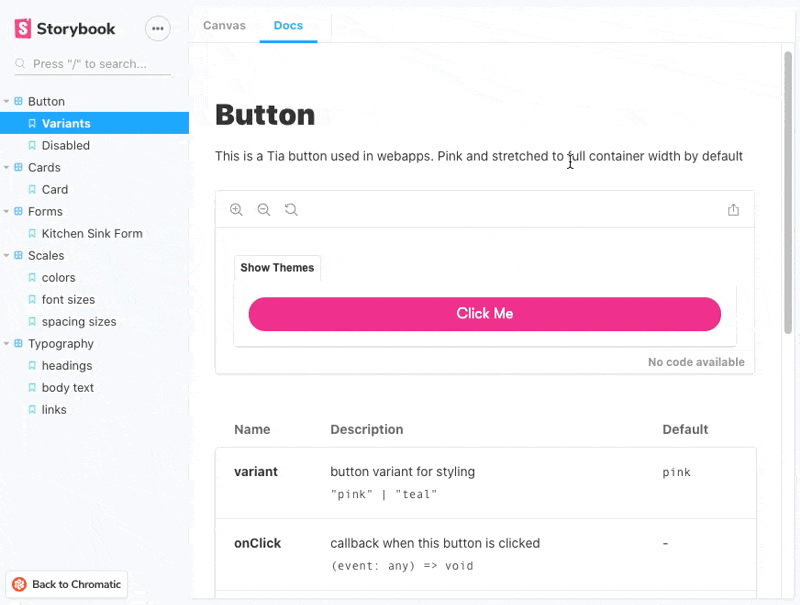
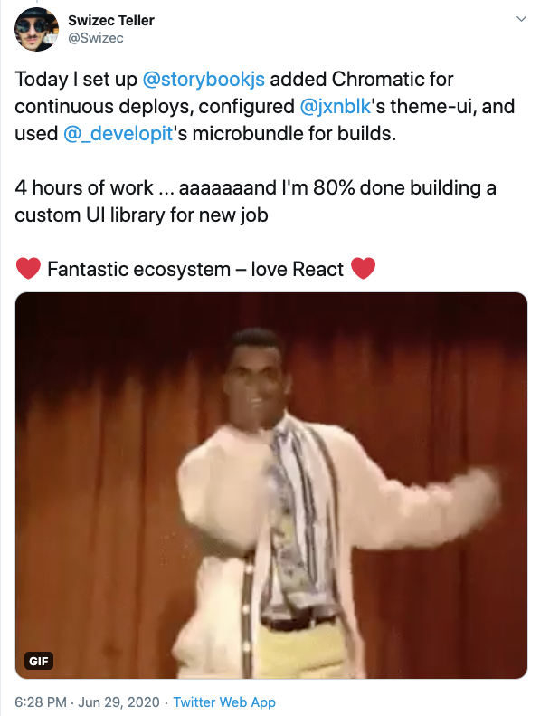
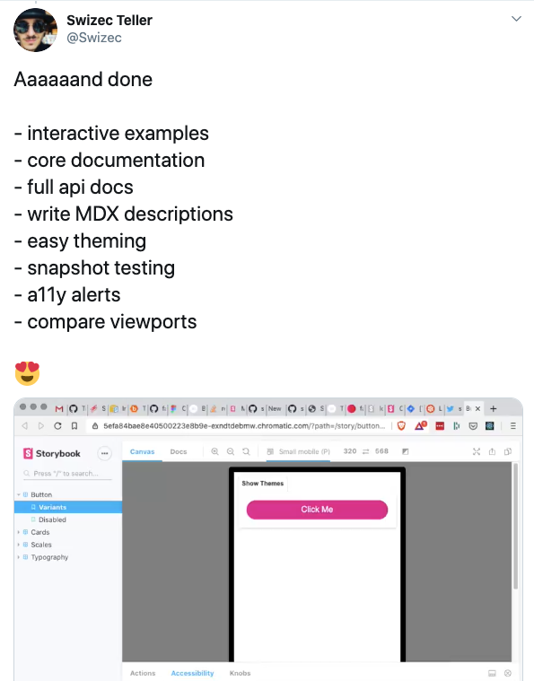
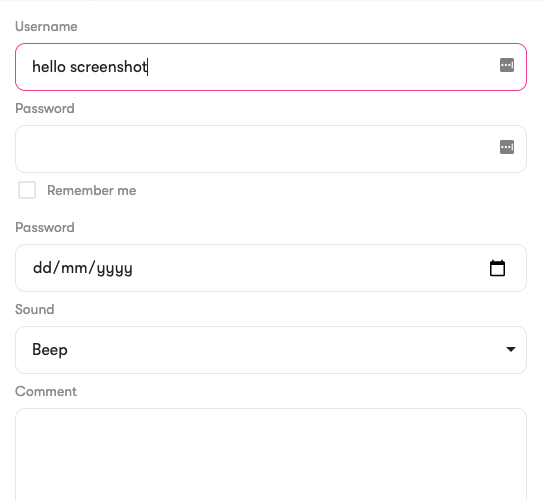

Friend, my first design system took 3 years to build. My last just 3 days. Here's what I learned.



First, what is a design system anyway?

A design system is the ideal workflow for UI. A set of core reusable elements and rules that spit out good-looking interfaces without design skill on your part.

You and your designer set the tone once, create the elements, some basic rules, then you work from mockups. Everything you build looks perfect and your designer spends time on UX not fiddly details.

You the engineer can build perfect UI from a napkin sketch.

😍

That's the theory.

Life is messy so a good design system must also be flexible. Local over-rides for one-offs.

## Prereqs

You'll need a couple prereqs before you get started:

1.  **A designer that agrees systems are good**. Some designers see their work as art. Every element is custom, every button a little different, every screen a new masterpiece. You can't systemize this. You will suffer. Sorry.
2.  **A componentized approach to UI**. Use a component-based framework like React, Vue, or Angular. You _can_ do it with CSS classes but this is easier. Trust me.

The main benefit of components is that you can encapsulate both UI _and_ UX. Not just looks but also behavior.

PS: I got lucky and get to do this from scratch. You can introduce a design system gradually but it's a little trickier.

[](https://twitter.com/Swizec/status/1276624374003404800)

## Goal

Every select field, say, should look _and_ feel the same. Across your entire app. So why build it from scratch every time?

You want something like this:

```javascript
import { Select } from "my-design-system"

const Form = () => {
	return (
		<form>
			<Select options={...} />
		</form>
	)
}
```

And that's your standard beautiful magnificent and all round marvelous select field.

Build it once use it everywhere. ✌️

Test it once, approve it once, back-and-forth with designer once, back-and-forth with QA once, back-and-forth with PM once ... and then it works forever. You're good until the next redesign.

And with a little luck any future redesign will touch just your design system. You might not even have to touch any application code.


Where classes – utility classes especially – fall down is this reusability. Do I have to add `bg-gray flex1 color-blue p3` or was it `bg-gray flex2 color-white p4` 🤔

Stop. You've already lost.

Every QA cycle, every PM test, every new feature you will have to carefully vet every little detail. Because they're always done from scratch.

A design system saves you that effort.

## How you create a design system in 2020

[](https://twitter.com/Swizec/status/1277776081559289856)

3 years ago when I started building my first, the ecosystem wasn't quite "there" yet.

CSS-in-JS or CSS modules? Big fat CSS classes or utilities? React, Vue, or nothing? How to scales? How to colors? Weird names or long names? Build a catalogue or not? How do you docs? Do you even need docs?

Crap, what about responsiveness? Do you grid or flex? `float: left`?? 🤨

I've tried it all.

This is what I've landed on as the ultimate solution:

1.  **Use [Storybook](https://github.com/storybookjs/storybook)** – spits out a catalogue and docs too. Live preview of your components, human readable descriptions with docs, you can even just write documentation in MDX and storybook handles the rest. Hell it even spits out API Docs based on TypeScript types. 🤘
2.  **Add [Chromatic](https://www.chromatic.com/)** – a SaaS from the creators of Storybook. Gives you a hosted versioned Storybook. Added bonus: snapshot testing of all your components. Screams at you when there's a visual regression 😍
3.  **Use TypeScript** – the VS Code experience with TS is just wonderful. Hints and docs as you mouse-over a component are fantastic. Very helpful when you work on a team.
4.  **Start with [theme-ui](https://github.com/system-ui/theme-ui)** – this part is React only. `theme-ui` is the best balance between developer experience/ergonomics and solid design system. Does most of the work for you.

I started from scratch with `npm install @storybook/react --save-dev` and 3 days later had a full custom design system ✌️

[](https://twitter.com/Swizec/status/1278500671587663872)

The trick is to lean hard into the ecosystem and let others do your work.

### Here's how

1.  **Install all the dependencies**

```
// devDependencies
"@babel/core": "^7.10.3",
"@storybook/addon-info": "^5.3.19",
"@storybook/preset-typescript": "^3.0.0",
"@storybook/react": "^5.3.19",
"@theme-ui/presets": "^0.3.0",
"@types/jest": "^26.0.3",
"@types/node": "^14.0.14",
"@types/react": "^16.9.41",
"@types/react-dom": "^16.9.8",
"@types/storybook__addon-info": "^5.2.1",
"@types/theme-ui": "^0.3.4",
"babel-loader": "^8.1.0",
"chromatic": "^5.0.0",
"jest": "^26.1.0",
"react-docgen-typescript-loader": "^3.7.2",
"ts-jest": "^26.1.1",
"ts-loader": "^7.0.5",
"typescript": "^3.9.5"
"storybook-addon-theme-ui": "^0.1.5",

// peer dependencies
"react-dom": "^16.13.1",
"react": "^16.13.1"

// dependencies
"theme-ui": "^0.3.1"
```

`theme-ui` is your only real dependency. The rest are used in development.

Don't worry about the low version number on `theme-ui`. It builds on lessons learned from several earlier attempts.

[@jxnblk](https://twitter.com/jxnblk) did a great job

2.  **Configure storybook to be fab**

Storybook by default is great. Storybook with some addons is fantastic.

The most important parts for me are:

- easy/automatic documentation
- accessibility checks
- knobs to visually test components
- typescript support

Configuring all this happens in the `.storybook` directory.

```javascript
// .storybook/addons.js

// register some of the addons
import "@storybook/addon-actions/register";
import "@storybook/addon-viewport/register";
import "@storybook/addon-a11y/register";
```

Some addons like to be included via the `addons.js` file. Others go in `main.js`. I still don't understand why.

```javascript
// .storybook/config.js

// configure defaults for all your stories

import { addParameters, addDecorator } from "@storybook/react";
import "@storybook/addon-console";
import { withThemeProvider } from "storybook-addon-theme-ui";
import { withConsole } from "@storybook/addon-console";
import { withA11y } from "@storybook/addon-a11y";
import { withKnobs } from "@storybook/addon-knobs";
import * as presets from "@theme-ui/presets";

import * as themes from "../src/themes";

addParameters({
    themeUi: {
        themes: [
            { theme: themes.askTia, name: "Ask Tia" },
            { theme: presets.base, name: "Base Preset" },
            { theme: presets.deep, name: "Deep Preset" },
        ],
    },
    actions: { argTypesRegex: "^on.*" },
});

addDecorator((storyFn, context) => withConsole()(storyFn)(context));
addDecorator(withThemeProvider);
addDecorator(withA11y);
addDecorator(withKnobs);
```

This configures defaults for every story in your storybook. That is every example you want to put up. Things like adding the theme provider, enabling knobs and accessibility checks, etc.

```javascript
// .storybook/main.js

// configure webpack, more addons, and typescript
const path = require("path");

module.exports = {
    stories: ["../src/**/*.stories.@(tsx|js|mdx)"],
    addons: [
        {
            name: "@storybook/addon-docs",
            options: {
                configureJSX: true,
                babelOptions: {},
                sourceLoaderOptions: null,
            },
        },
        "@storybook/addon-knobs/register",
    ],
    webpackFinal: async (config) => {
        config.module.rules.push({
            test: /\.(ts|tsx)$/,
            use: [
                {
                    loader: require.resolve("ts-loader"),
                },
                // Optional
                {
                    loader: require.resolve("react-docgen-typescript-loader"),
                },
            ],
        });

        config.resolve.extensions.push(".ts", ".tsx");
        return config;
    },
};
```

This part adds the documentation addon, support for typescript, and MDX.

MDX is important because it means you write your design system descriptions _once_ and they double as both testing and documentation. It's great.

3.  **Customize theme-ui for your design**

This is the fun part.

`theme-ui` actually does all the work for you. As long as you don't need custom behavior.

It comes with more pre-built components than you can shake a stick at. All the components you'll need, really.

And it supports themes for custom coloring, spacing, etc. All _you_ gotta do is configure a custom theme for your organization.

Something like this:

```javascript
// src/themes.ts

export const askTia = {
    space: [0, 4, 8, 16, 32, 48, 64, 128, 256, 512],
    sizes: [0, 4, 8, 16, 32, 48, 64, 128, 256, 512],
    radiuses: [0, 5, 10],
    fonts: {
        body: "GT_WalsheimRegular, Helvetica, sans-serif",
        heading: "inherit",
        monospace: "Menlo, monospace"
    },
    fontSizes: [14, 16, 18, 22],
    // ...
    colors: {
        ...tiaColors,

        // colors required by theme-spec
        // https://theme-ui.com/theme-spec
        text: tiaColors.black,
        background: tiaColors.white,
        primary: tiaColors.pink,
        secondary: tiaColors.blue,
        accent: tiaColors.teal,
        highlight: tiaColors.pink,
        muted: tiaColors.whisper
    },
```

Custom colors are the quickest way to achieve a great custom look.

I recommend giving them color names. Primary/secondary/accent gets confusing fast. Especially when variants are in play.

You should map primary to color so `theme-ui` default components pick up on your colors. This saves you time.

4.  **Customize theme-ui elements**

Once the basic scales are in place, you gotta apply them to different elements. Rather than creating your own from scratch, tell `theme-ui` what to do.

A custom input, for example.

```javascript
// src/themes.ts

const tiaInput = {
    borderColor: "greyVeryLight",
    pt: 0,
    pr: 3,
    pb: 0,
    pl: 3,
    height: 5,
    color: "text",
    fontSize: 1,
    fontFamily: "body",
    mb: 2,
    borderRadius: (t: any) => t.radiuses[2],
    "&:focus": {
        borderColor: "pink",
        outline: "none"
    }
};

// ...

export const askTia = {
	// ...
	forms: {
    input: {
        ...tiaInput
    },
    select: {
        ...tiaInput,
        // this is to fix caret centering
        "& + svg": {
            "margin-top": "-10px"
        }
    },
    // ...
}
```

And a custom form falls out ❤️



5.  **Use your design system**

The best part is that you get to use scales. Scales that you defined in your custom theme.

Look at this input definition, for example:

```javascript
borderColor: "greyVeryLight",
pt: 0,
pr: 3,
pb: 0,
pl: 3,
height: 5,
color: "text",
fontSize: 1,
fontFamily: "body",
mb: 2,
```

Lots of magic numbers right? They map to the size and space scales.

```javascript
export const askTia = {
    space: [0, 4, 8, 16, 32, 48, 64, 128, 256, 512],
    sizes: [0, 4, 8, 16, 32, 48, 64, 128, 256, 512],
```

`pr: 3` means `padding-right: askTia.space[3]` 👉 16px

Same for color scales. You say `greyVeryLight` and theme-ui checks the color map to get the digits.

And if you need to do something custom, there's the `sx` prop.

```javascript
// div
// padding 16px
// margin 32px
// width 256px
// height 128px
// background #EF308D
<Box sx={ p: 3, m: 4, width: 8, height: 7 } bg="pink" />
```

Some elements come with helper props. `bg` is very common, `variant` is another.

Beyond that, the `sx` prop lets you define everything you'd otherwise use the `style` prop for. Except it goes through your theme config.

Also great for adding dark mode. Change theme. 🤘

Happy Friday

Cheers,  
~Swizec
