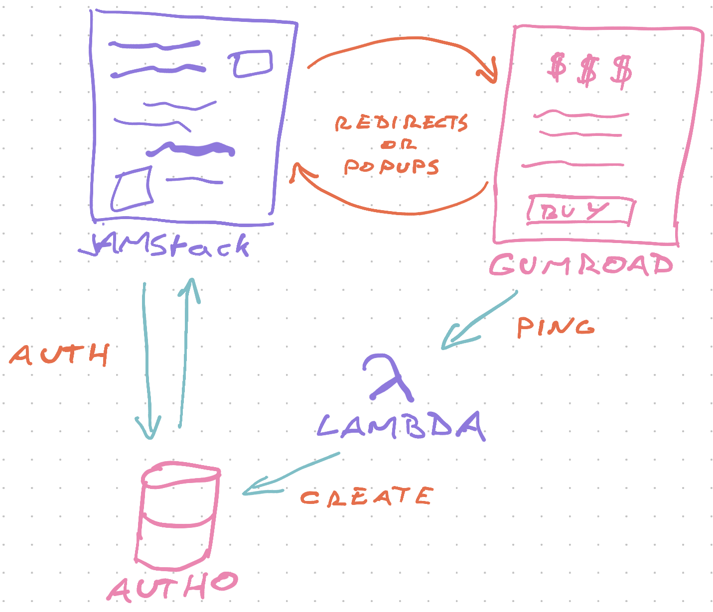
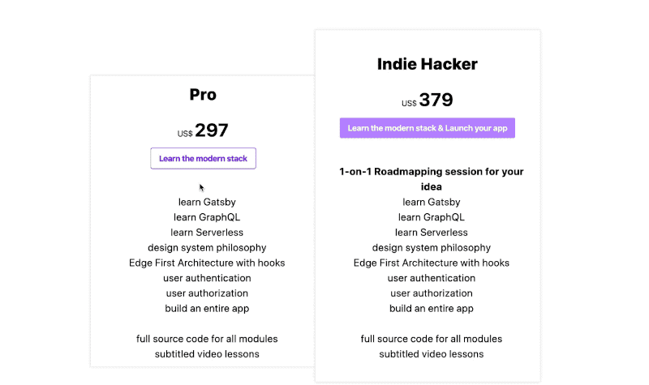
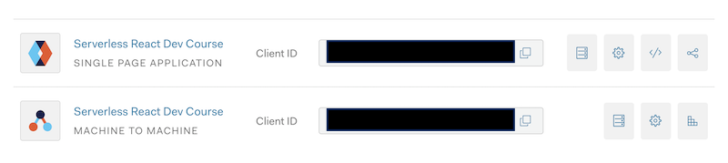

Lots of folks were curious how I connect Gummroad and Auth0 on [my custom course platform](https://swizec.com/blog/why-and-how-i-built-my-own-course-platform/) so here's a short tutorial. The same approach works if you swap Gumroad out for Stripe ✌️

Here's the tl;dr:

0.  User visits your JAMStack app (Gatsby for me)
1.  User clicks Buy Button
2.  Gumroad checkout pops up
3.  User purchases
4.  Gumroad calls a webhook
5.  AWS Lambda wakes up, creates account on Auth0
6.  User is redirected back to JAMStack
7.  User can now login



You can replace the Gumroad popup with a redirect to Stripe Checkout. We use that approach in the example app for my [ServerlessReact.Dev](https://serverlessreact.dev) course.

If you want to support free trials, you can use the AWS Lambda to add a role for existing users instead of creating new accounts. That way people can login, use your app, and get extra permissions once they buy.

You can watch me figure this out from scratch on a stream:

https://www.youtube.com/watch?v=lwaHKXItp2k

## Start with a buy button

Assuming you've got a JAMStack app – Gatsby, NextJS, or even CreateReactApp are all fine – a buy button is just a bit of React. I like to use [Rebass](https://rebassjs.org/) buttons.

```javascript
import React from 'react'
import { Button } from "rebass"

const BuyButton = ({ gumroadID, cta }) => (
	<Button
    as="a"
    href={`https://gumroad.com/l/${gumroadID}?wanted=true`}
    data-gumroad-product-id={gumroadID}
    data-gumroad-single-product="true"
    mx={2}
    sx={{
      ":hover": {
        cursor: "pointer",
      },
    }}
  >
    {cta}
  </Button>
)
```

This renders a button as a link tag, links to Gumroad, and enables the Gumroad popover. Users can purchase without leaving the page and if that doesn't work (no JS, weird browser, etc), they go to Gumroad's checkout page.



You'll need to include Gumroad's script tag on your page. [ReactHelmet](https://github.com/nfl/react-helmet) works great for that.

## AWS Lambda Webhook

The webhook is where things get interesting.

Gumroad supports a [Gumroad Ping](https://gumroad.com/ping), which is a POST request sent to a URL of your choice on every purchase. Stripe calls it a [Stripe Webhook](https://stripe.com/docs/webhooks).

Webhooks let you do stuff on important events in 3rd party services. Creating a user in our case.

I set my hook up using Serverless with AWS Lambda. NextJS's `/api` directory would be a good choice too. Or Netlify's cloud functions. They're all the same thing – a JavaScript function that runs when a URL gets a POST request.

```yaml
service: serverlessreactdev

provider:
  name: aws
  runtime: nodejs12.x
	iamRoleStatements:
    - Effect: Allow
      Action:
        - secretsmanager:GetSecretValue
      Resource:
        - Fn::Join:
            - ":"
            - - arn:aws:secretsmanager
              - Ref: AWS::Region
              - Ref: AWS::AccountId
              - secret:*
              
functions:
  gumroadping:
    handler: dist/gumroadPing.pingHandler
    events:
      - http:
          path: gumroadPing
          method: POST
          cors: true
```

This config creates a new service, uses Node 12, adds some permissions, and creates a `gumroadping` AWS Lambda function.

A benefit of using AWS directly is that you can use [AWS Secrets Manager](https://aws.amazon.com/secrets-manager/) to securely store API keys and keep your infrastructure config in this one file.

`sls deploy` spits out a URL. Gumroad sends a POST request and AWS runs your code.

### pingHandler

`pingHandler` is where that work happens.

```typescript
import qs from "querystring"

const SR_PRODUCTS = [
  "https://gum.co/IeDvq",
  "https://gum.co/WTeMS",
  "https://gumroad.com/l/IeDvq",
  "https://gumroad.com/l/WTeMS",
]

export const pingHandler = async (
  event: APIGatewayEvent
): Promise<APIResponse> => {
  const ping: GumroadPing = qs.parse(event.body!) as any

  console.log("ping for", ping.product_permalink)

  if (SR_PRODUCTS.includes(ping.product_permalink)) {
    console.log("doing the thing")
    const user = await upsertUser(ping)

    if (user) {
      const auth0 = await getAuth0Client()

      await auth0.assignRolestoUser(
        { id: user.user_id! },
        {
          // hardcoded Student role id from Auth0 URL
          roles: ["rol_wyNa81ZMSaFU7wSW"],
        }
      )
    }
  }

  return response(200, {})
}
```

A couple things happen here:

1.  Parse request body with `querystring`
2.  Check product against a constant whitelist
3.  Create or update a user on Auth0 with `upsertUser`
4.  Add authorization role to user
5.  Say all went well

We always return success and assume errors will throw. When your code throws AWS responds with a 500. That's fine.

We're also hardcoding the `Student` role because Auth0 doesn't work with role names and it's too much work to read the list, find the ID, and add that.


Step 2 is important because Gumroad pings for all purchases. Wouldn't wanna give access to someone who bought a different product. 🙃

As you can see this code is very scalable and generic. But it doesn't have to be. That's the beauty of cloud functions – they do one thing and one thing only.

### upsertUser

`upsertUser` is where users get created or updated.

Using upserts lets you support free trials and people who repurchase after a refund or whatever. Folks who have an account already.

```typescript
import passwords from "generate-password"

async function upsertUser(purchaseData: GumroadPing) {
  const auth0 = await getAuth0Client()

  const users = await auth0.getUsersByEmail(purchaseData.email)

  if (users.length > 0) {
    return users[0]
  } else {
    return auth0.createUser({
      connection: "Username-Pass-Auth",
      email: purchaseData.email,
      name: purchaseData.full_name,
      password: passwords.generate({
        length: 18,
        numbers: true,
        symbols: false,
        excludeSimilarCharacters: true,
      }),
    })
  }
}
```

Get the Auth0 client, find user by email. If user exists, return, otherwise create a new user.

For better security we generate a random secure password. Users have to go through the password reset flow on their first login.

Makes the UX more cumbersome and the whole system more secure. You don't want to store these passwords and you don't want to send them by email. You also don't want them to be guessable.

Infosec matters.

### getAuth0Client

`getAuth0Client` is a helper method to instantiate an Auth0 client. Makes your code more readable :)

```typescript
import { ManagementClient } from "auth0"

async function getAuth0Client() {
  const secrets = await auth0Tokens()
  const auth0 = new ManagementClient({
    domain: `${secrets.domain}.auth0.com`,
    clientId: secrets.clientId,
    clientSecret: secrets.clientSecret,
    scope: "read:users update:users create:users",
  })

  return auth0
}
```

Call `getAuth0Tokens` to get secrets, instantiate a new `ManagementClient` for Auth0. This one lets you manage users and stuff.

### auth0Tokens

`auth0Tokens` is a helper method to read API tokens and secrets from AWS Secrets Manager. This is important to avoid hardcoding secrets in your code, sharing them with other developers, and making sure they're secure at rest.

You get a sort of triple-blind secret.

Public can't see it. Developers can't see it. Servers can't see it. Secret only exists in memory at runtime. 🔐

Attacking that would require an OS-level hack.

```typescript
import AWS from "aws-sdk"

const secrets: { [key: string]: Secret } = {}

export const auth0Tokens = async () => {
  const SecretId = "auth0APITokensServerlessReact"
  const ssm = new AWS.SecretsManager()
  const data = await ssm
    .getSecretValue({
      SecretId,
    })
    .promise()

  if (!("SecretString" in data)) {
    throw new Error(`Error getting secret ${SecretId}`)
  }

  if (data.SecretString) {
    // real production should expire this cache
    secrets[SecretId] = JSON.parse(data.SecretString)
  } else {
    throw new Error(`Error getting secret ${SecretId}`)
  }

  return secrets[SecretId]
}
```

Reads secret from AWS Secrets Manager, stores it in local variable for next time so you don't have to ping ASM every time you need a secret while your code runs.

I should open source this 🤔

### An important sidenote

You'll need 2 Auth0 apps. This one took me for a spin. 😅

1 app for your JAMStack frontend 1 app for your Lambda backend



## Authenticate and Authorize users

You're creating users for every purchase. Now what?

Use [useAuth](https://github.com/Swizec/useAuth) to handle authentication and authorization in your app.

Assuming standard configuration from useAuth docs, you can paywall any component in your JAMStack app like this:

```javascript
// candidate for useAuth feature
function isAuthorized(user) {
  return user["https://serverlessreact.dev/user_metadata"].roles.includes(
    "Student"
  )
}

const Paywalled = () => {
	const { isAuthenticated, user } = useAuth()
	
	if (isAuthenticated() && isAuthorized(user)) {
		return <SpecialContent />
	}else{
		return <BuyButton />
	}
}
```

`useAuth` handles the Auth0 authentication lifecycle and returns an `isAuthenticated` method and a `user` object.

Call `isAuthenticated` to see if user is logged in with a valid session, use `isAuthorized` to verify they've got the right role. Then let them through.

Otherwise show them the buy button.

### Tell Auth0 to include role metadata

You'll have to add an [Auth0 Rule](https://auth0.com/docs/rules) that includes user roles in response data to your Auth0 config.

```javascript
function (user, context, callback) {
  const namespace = 'https://serverlessreact.dev';
  const assignedRoles = (context.authorization || {}).roles;
  
  user.user_metadata = user.user_metadata || {};

  user.user_metadata.roles = assignedRoles;

  context.idToken[namespace + '/user_metadata'] = user.user_metadata;

  callback(null, user, context);
}
```

This was the smallest code that works for me. Cobbled together from online discussions, a few blogs, and some trial and error.

I didn't dive too much into details and I don't know why Auth0 doesn't include `meta_data` by default.


### Bonus UX points

For bonus UX points, you should give people temporary access when they come back from that Gumroad purchase.

Gumroad gives you specific URL params that mean _"This user just bought your course"_. Would be great if they didn't have to then login, change their password, and go through a bazillion steps just to get access.

It's the approach I use on [ServerlessHandbook.dev](https://serverlesshandbook.dev) where there's no logins. Just local storage after a Gumroad redirect.

Just add a check ...

```javascript
if ((isAuthenticated() && isAuthorized(user)) || justBackFromGumroad())
```

Make `justBackFromGumroad` check the URL query :)

## ✌️

And that's how you can paywall parts of your JAMStack app.

To learn more about these techniques, check out [ServerlessHandbook.Dev](https://serverlesshandbook.dev) and my new course [ServerlessReact.Dev](https://serverlessreact.dev)

Cheers,  
~Swizec
