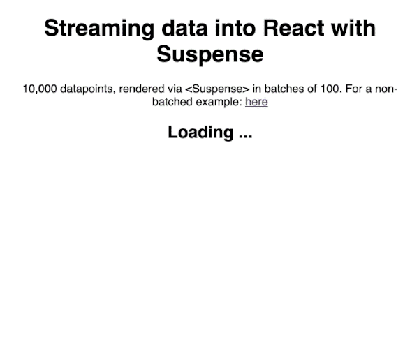
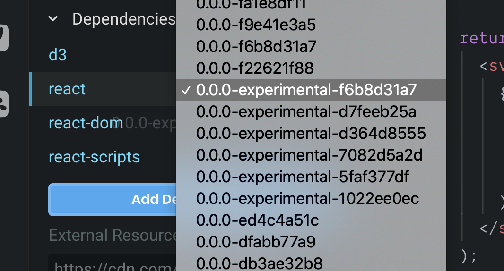
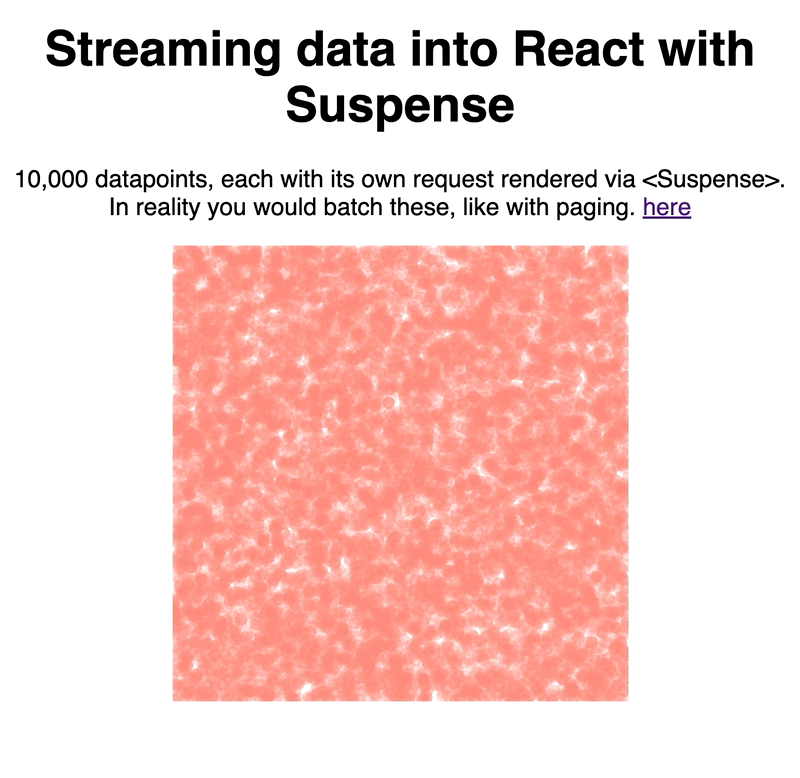

I've been playing around with React's new [Concurrent Mode](https://reactjs.org/docs/concurrent-mode-intro.html) and it is amazing. A little mind-bendy, a dash mad, and a whole lot of wonderful.

[](https://codesandbox.io/s/dark-waterfall-uzlzb)

Your app might get faster even if you don't change anything. 👌

That's because concurrent mode is backwards compatible. Your code works the same ... if you've been following React best practices. If you haven't, god help you.

https://www.youtube.com/watch?v=NngI9tZz48E

## So what _is_ concurrent mode?

It's a change in how React schedules updates to your UI.

> /../ UI libraries, including React, typically work today. Once they start rendering an update, including creating new DOM nodes and running the code inside components, they can’t interrupt this work. We’ll call this approach “blocking rendering”. In Concurrent Mode, rendering is not blocking. **It is interruptible**. This improves the user experience. It also unlocks new features that weren’t possible before.

What this means is that you can start new UI updates _before the old ones finish_.

Say you're building a dataviz with streaming data. You're 5,000 elements in so adding another 1,000 takes a while. You start rendering and a new batch shows up before you're done.

Now what?

With blocking renders you have to wait.

With concurrent mode you stop the current render and schedule a new one. 👌

It's similar to how D3 transitions always let you schedule a new transition without worry. Each new transition first stops whatever's going on, then starts the new transition from current state.

Try clicking this ball real fast to see what I mean

https://codesandbox.io/s/p789r1928x

Not quite concurrent mode but a similar idea.

## Ok so what?

So what!? This is amazing. This is what we've been waiting for for 2 years my friend.

Not only is concurrent mode a big step forward for React itself, it also gives us some new abilities. The community is still figuring out the details, but what I've seen buzzing on twitter looks exciting.

My favorite new ability is [React Suspense](https://reactjs.org/docs/concurrent-mode-suspense.html) for data fetching. Dan just published an example where he loads code for the page _at the same time as its data_. And then concurrent mode figures out the rest.

https://twitter.com/dan_abramov/status/1191569529471549440


Various react routes will have to implement this to work properly. You can't quite do it unless you know what data you'll need _before_ your components render.

That's the biggest shift in mindset: Fetch data before/while rendering. Not _after_ initial render like we used to:

```javascript
// this is the old fetch-on-render pattern
function MyComponent() {
	const [loading, setLoading] = useState(true);
	const [data, setData] = useState(null)
	
	useEffect(() => {
		// run effect to load data when component first renders
		fetchData().then(data => {
			setData(data)
			setLoading(false)
		})
	}, [])
	
	if (loading) {
		return <Spinner />
	}else{
		return <ShowData data={data} />
	}
}
```

Dunno about you, but I'm tired of writing that code. Fingers crossed we get some amazing new libraries around Suspense. 🤞

While we wait, here's some concurrent mode stuff you _can_ do right now.

## Trying concurrent mode yourself

The easiest way to try concurrent mode is to fire up a CodeSandbox and choose React's experimental channel.



Same thing works in your `package.json`. Please don't use it in production yet. Experiment and play only. There's bugs to fix and features to come :)

We played around on a recent livestream and created a couple tiny examples using React Suspense's new fetch-as-you-render ability.

https://www.youtube.com/watch?v=NngI9tZz48E

Our context is a D3 scatterplot because a) it looks pretty and b) [reactfordataviz.com](https://reactfordataviz.com) 😛

Don't worry, if you're not into dataviz. The same core concepts apply.

We created a fake data streaming API, rendered each unit of data with the new `<Suspense />` component, and let React handle the rest. Works great.

Try it out here 👇

[CodeSandbox 1](https://codesandbox.io/s/festive-lake-62r14)

[CodeSandbox 2](https://codesandbox.io/s/dark-waterfall-uzlzb)

### A fake streaming data API

We split our fake API into two endpoints:

- fetch a total count
- fetch datapoints one by one until done

A real world API analog would be an API that deals with large data. First you make a request for some meta data (counts, dates, ranges, etc), then page through the large dataset.

For simplicity and stress testing, we fetch each item individually. Timeouts simulate `fetch()` calls.

```javascript
// Pretennds to fetch meta data, our total count
function fetchCount() {
  console.log("fetching count ...");
  return new Promise(resolve => {
	  // this would be a fetch() in nreal life
    setTimeout(() => {
      console.log("fetched count");
      resolve(10000);
    }, 1000);
  });
}

// Here we have a set of requests that depend
// on data from initial request
// which is kinda messy but realistic

// fetchItems sets out to fetch every item
function fetchItems(countPromise) {
  console.log("fetching items ...");
  return new Promise(resolve => {
	  // start by waiting for meta data
    countPromise.then(count => {
      resolve(
	      // map through a count-sized empty array 
	      // create promises
        new Array(count).fill(null).map((_, i) => {
          // create a promise for each individual item request
          return wrapPromise(fetchItem(i));
        })
      );
    });
  });
}

// fetches an individual item at `index`
function fetchItem(index) {
  return new Promise(resolve => {
	  // this would be a fetch() in real life
    setTimeout(() => {
	    // each datapoint is a random { x, y } object
	    // could be anything in real life
      resolve({
        x: Math.random(),
        y: Math.random()
      });
		  // promise resolves at a random timeout
		  // this creates a nicer effect and better tests Suspense :)
    }, Math.random() * 1000);
  });
}
```

### An API that understands

Those function calls simulate API requests. We have to wrap them in a way that `<Suspense>` understands.

I borrowed the promise wrapper that Dan Abramov uses in [official docs on Suspense](https://reactjs.org/docs/concurrent-mode-suspense.html). You'd build something more robust for real life use. Or, if you're like me, wait for libraries to show up. 😇

```javascript
// This is our top level function for data fetching
// We'll use this to fetch data as we render the page
export function fetchData() {
  let countPromise = fetchCount();
  let itemsPromise = fetchItems(countPromise);

  return {
    count: wrapPromise(countPromise),
    items: wrapPromise(itemsPromise)
  };
}

// Suspense integrations like Relay implement
// a contract like this to integrate with React.
// Real implementations can be significantly more complex.
// Don't copy-paste this into your project!
function wrapPromise(promise) {
  let status = "pending";
  let result;
  let suspender = promise.then(
    r => {
      status = "success";
      result = r;
    },
    e => {
      status = "error";
      result = e;
    }
  );
  return {
    read() {
      if (status === "pending") {
        throw suspender;
      } else if (status === "error") {
        throw result;
      } else if (status === "success") {
        return result;
      }
    }
  };
}
```

The idea behind `wrapPromise` is to create a uniform interface for Suspense to hook into your promise. This way it can tell whether it's still waiting, there was an error, or you're ready to render.

I imagine this makes it easier to integrate with a variety of data fetching mechanisms. Wrapper makes them conform to Suspense's API.

## Render-as-you-fetch

[](https://codesandbox.io/s/festive-lake-62r14)

Once we've got the API wrappers set up, we can render our React app in parallel with fetching the data. In some cases even in parallel with fetching the code itself. (code splitting)

```javascript
import { fetchData } from "./fakeApi";

const resource = fetchData();
```

We start the request at top level, _not_ inside an effect. This way it starts as soon as the file loads.

Presumably that's just before you're ready to render. The approach won't work if you're loading 500 pages all in a single bundle and only 1 of them is visible.

> Top-level fetching assumes your router handles code splitting and loads only the files it needs.

To render our data without UI glitching, we use the `<Suspense>` component ✌️

```javascript
function App() {
  return (
    <div className="App">
      // ...
      
      // show a Loading ... state while the first request finishes
      <Suspense fallback={<h2>Loading ...</h2>}>
        <DataList />
      </Suspense>
    </div>
  );
}
```

We wrap everything in Suspense to show a loading state while we fetch meta data. The `count` in our case.

The `<DataList>` component itself tries to read from our API and render what it gets.

```javascript
const DataList = () => {
  const count = resource.count.read();

  return (
    <svg width="300" height="300">
      {new Array(count).fill(null).map((d, i) => (
        <Suspense fallback={null} key={i}>
          <DataItem index={i} />
        </Suspense>
      ))}
    </svg>
  );
};
```

This is important and very easy to get wrong. _Suspense goes **around** the component that's reading data_.

https://twitter.com/dan_abramov/status/1191390129795063810

Yeah, happened the very first time I tried to build with React Suspense without following the docs. You get that experiment in your inbox next week, it's super neat.

Now here's where it gets real fun: You can nest suspended components.

Notice how we're wrapping each `<DataItem>` in its own suspense?

```javascript
      {new Array(count).fill(null).map((d, i) => (
        <Suspense fallback={null} key={i}>
          <DataItem index={i} />
        </Suspense>
      ))}
```

That's because each item is in charge of its own API fetching. Seems kinda bonkers, but this new approach (also popular in GraphQL circles) is really powerful.

Each React component should take care of its own data fetching. The times when you had a central authority take care of all data are behind us. Edge computing is now. Even if just in our UI tree. 🦾

```javascript
const DataItem = ({ index }) => {
  const item = resource.items.read()[index].read();
  // We know Math.random() generates in [0, 1]
  const xScale = d3
    .scaleLinear()
    .domain([0, 1])
    .range([0, 300]);
  const yScale = d3
    .scaleLinear()
    .domain([0, 1])
    .range([0, 300]);

  return (
    <circle
      cx={xScale(item.x)}
      cy={yScale(item.y)}
      r={4}
      fill="#f87"
      fillOpacity="0.3"
    />
  );
};
```

Each item hooks into its own `index`'d API promise that we created in `fetchItem` earlier.

`items.read()` returns an array of wrapped promises. `[index]` gets the one for _this_ item. `.read()` waits for that promise to return some data.

The surrounding `<Suspense>` component handles suspending and fallback renders while this component waits for data to show up. Once data shows up, Suspense renders `<DataItem>` which uses a little D3 magic to translate `[0, 1]` numbers to a bigger scale and renders an SVG circle.


### Streaming in batches

Now of course reading data one by one like that is slow.

Instead, you can use a paging approach and load a many data points at once. 100 worked pretty well with our fake API.

[](https://codesandbox.io/s/dark-waterfall-uzlzb)

Rendering code looks the same, just gets an extra loop.

```javascript
const DataItem = ({ index }) => {
  const batch = resource.items.read()[index].read();
  // ...

  return batch.map(item => (
    // render circle
  ));
};
```

And we changed the fake API to return multiple datapoints per batch.

```javascript
function fetchItems(countPromise) {
  console.log("fetching items ...");
  return new Promise(resolve => {
    countPromise.then(count => {
      resolve(
	      // a promise for every 100th element of "count"
        new Array(count / 100).fill(null).map((_, i) => {
          // create a promise for each individual batch request
          return wrapPromise(fetchBatch(i));
        })
      );
    });
  });
}

function fetchBatch(index) {
  return new Promise(resolve => {
    // IRL this setTimeout would be a fetch()
    setTimeout(() => {
      resolve(
	      // return 100 datapoints per fetch
        new Array(100).fill(null).map(i => ({
          x: Math.random(),
          y: Math.random()
        }))
      );
    }, Math.random() * 1000);
  });
}
```

## Fin

I encourage you to give React Suspense and concurrent mode in general a try. It's pretty great, almost ready for the real world, and it might make you rethink how you structure your apps.

Encouraging you to push data loading into the edges of your component tree seems like a particularly powerful pattern. **Load data as close to where you're using it as possible.**

Enjoy ❤️  
~Swizec
