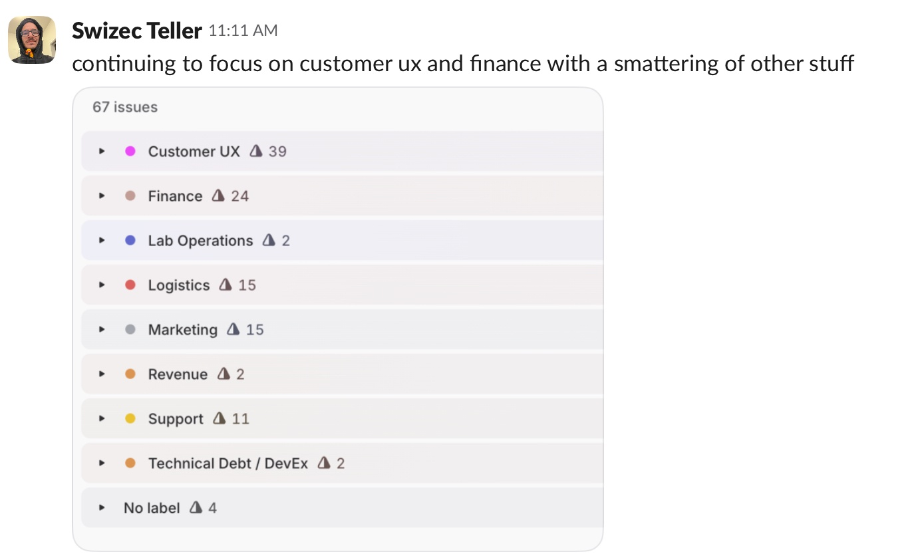

The points are fake and the score is made up but we always finish 70% of our sprint and get around 30 points done per person. Hey waitaminute that almost sounds useful 🤨

I've said before that [working in a high growth startup is like spinning plates](https://swizec.com/blog/yes-its-like-spinning-plates) – you do a bit here a bit there and kick the can to survive another day. There's always more work than people and [spaceship-first development makes this worse](https://swizec.com/blog/beware-the-spaceships) because starting is easy and finishing is hard.

On my team we add ~50 new ideas to triage every sprint, work on 5 or 6 ongoing major projects, keep our production systems running (the SRE work), and build any number of little features and bugfixes that keep folks happy and aren't worth the overhead of a project.

Sprint planning is how we stay sane. There's 4 of us.

## You can't do everything

A few months ago I remember sitting in the back of an uber zooming up highway 101 texting my leadership coach _"I did it I planned my sprint with all our highest priorities! We're 190% over capacity but physics will take care of the rest"_.

_"Okay so your plan is to disappoint half your stakeholders and teach them you can't get it done?"_

🥲

Every issue on that board is somebody's whole day. The tool they use to do their job. The page they stare at for hours and notice every little bug and detail. The stupid software they have to work around. The new feature they hope will drive revenue and get them a promo.

But you can't do everything. You have to choose.

What's the most important thing your team can work on? What gets the most wins for everyone? What's low effort high return? Who's been complaining for a while and needs some love? Whose ask is a quick win that's easy for you to do and a huge unlock for them? Whose [small fire can burn a little longer](https://swizec.com/blog/let-small-fires-burn/)? Where do you have momentum and should push a little longer? Who needs space to focus on the important and ignore the urgent? What makes everything else easy or unnecessary?

Physics always wins. Every time you work on something, you're not working on something else.

## Turn contention into collaboration

We meet with internal stakeholders regularly. Call it a sprint demo if you want, the name doesn't matter.

The goal of this meeting is to

- show you what shipped
- discuss what's in progress
- align on priorities

I've noticed that showing what you shipped matters. Like when our couple's therapist explained that I can't just buy flowers, I have to _say I bought flowers because I love you_. So dumb why else would I buy flowers 🙄

But it works. You have to do the thing then show your stakeholders that you did the thing. People don't notice that a problem stopped happening or a new tool became available. If all you ever talk about is future work, the impression is that nothing ever gets done.

Use [stack ranking to align on priorities](https://swizec.com/blog/the-unreasonable-effectiveness-of-stack-ranking). You'll need a tool that lets you drag issues around into a manual sort based on priorities. We like Linear.

The magic phrases are:

- _"Here's what we're working on. Does that align with your expectations? Anything more urgent on your mind?"_
- _"Here's our list of stacked priorities. We're going to pull 5 issues from the top when planning our sprint. Anything on your mind that's more important? Anything new come up since we last spoke? Spot anything that's missing from the board?"_

When there's suggestions, slap them on the board and drag things around until everyone agrees with the order. Now you're the good guy helping everyone collaborate instead of the bad guy saying No to great ideas.

😉

## To make a sprint, grab from the top

I use tags to create a backlog for every stakeholder team (workstream). We groom and prioritize in regular meetings.

Each of our longer-term projects also holds a prioritized backlog. These tasks are focused on completing quarterly objectives or whatever. This stuff you have to _make time_ for because it's never going to feel urgent.

With all backlogs roughly prioritized, sprint planning is easy: **Round-robin and skim from the top**. A few points from this project, a few from that one, take a couple points from this stakeholder and that.

You know that you'll complete 30 to 40 points per person and that you typically add 20% more scope during sprint. Urgent things come up, tasks split into three, something's harder than it looked, shit happens.

_Ideally_ when you add something to sprint you take other things out. We're building that habit. When something comes up that doesn't feel urgent we throw the task into triage. I go through triage before planning a sprint and decide if the idea goes into sprint or a stakeholder backlog to get prioritized later.

## Tell others your plan

I like to look at the sprint at high level and see if it feels balanced. We focusing on what we said we would?

Then I like to go around and share screenshots of individual tags with stakeholder teams so they know what to expect. This gives them a chance to raise objections, but mostly it makes them feel informed and in the loop.

Make engineering feel like a partner and not a chaotic mystery force that keeps changing their tools at random.

Having a clear list helps you stay focused and finish what you started. Because nobody wants a half-finished spaceship or the shiny idea du jour. They want superpowers that help them do their job.

Cheers, 
\~Swizec
