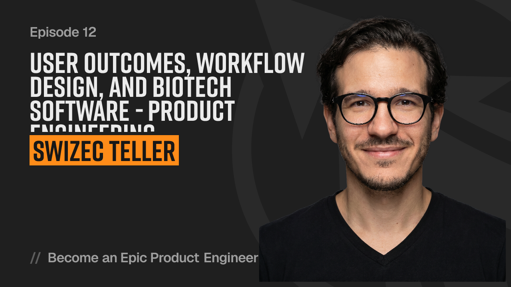

Good software is invisible and most metrics are wrong. You want _less_ engagement because you got the job done.

We talked with Kent C Dodds on his podcast about workflow design, watching people work, and building software for people who need to get a job done. Focus on user outcomes.

Check it out [here](https://www.epicproduct.engineer/user-outcomes-workflow-design-and-biotech-software-product-engineering-with-swizec-tel~w1nqr), it was a great conversation. Kent asks wonderful questions.

Learn the domain and watch the work happen. Understanding what your users want is the hardest part of product engineering.

Define success before you start. What is the one core thing you're trying to achieve? Do that and avoid the rest.

I've been thinking a lot about product engineering lately and what distinguishes a good engineer from a great engineer these days. I think your product sense is the next great differentiator.

Cheers, 
\~Swizec

PS: I'm gonna write more about this [but been a little busy](https://bsky.app/profile/swizec.com/post/3mnfqywdrx22p)
