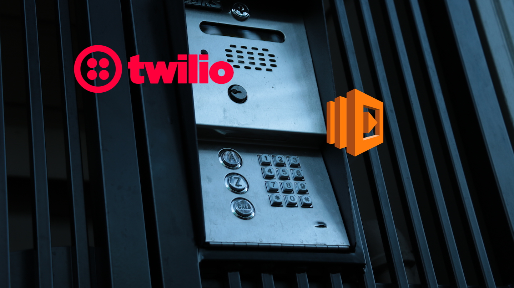
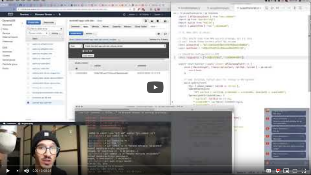
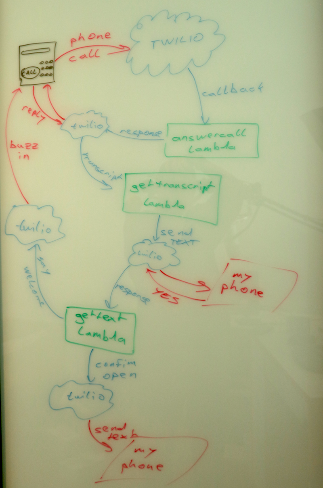
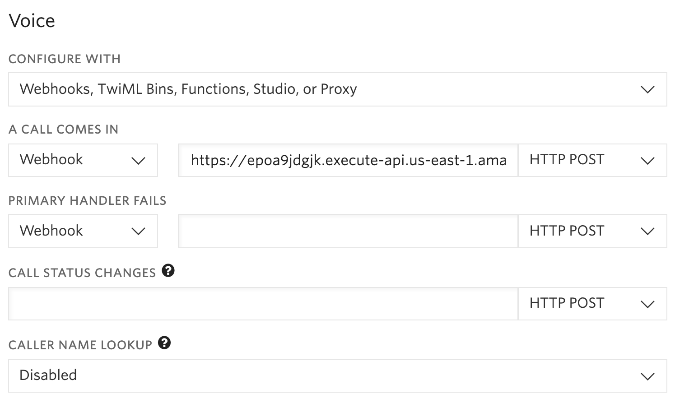
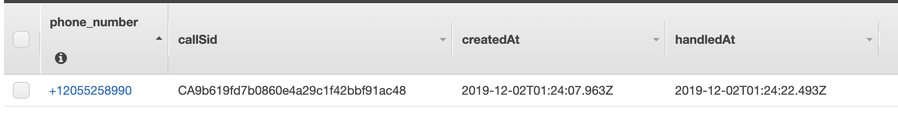
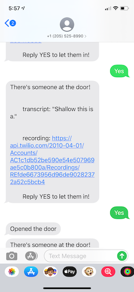

Remember [the doorbell slack bot I built in 2016](https://swizec.com/blog/how-to-make-slack-and-twilio-talk-to-each-other/)? Probably not, but the girl whose sanity it saved became one of my best friends. For 2 years she could focus on work instead of answering the phone every time [Yup Inc](https://yup.com) got a visitor.

Then we moved and the bot died.

2 weeks ago _I_ moved and the new apartment has a front gate buzzer, but no package concierge. For the first time in 5 years we're gonna have to answer the door! 😱

Millennials are killing the doorbell industry by texting "here" but that don't work for deliveries. Especially if you're not home.

The buzzer looks like this:



Delivery person finds your name, taps `call` and the box calls a pre-programmed phone number. You pick up the phone, talk to the person, and press `9` to let them in. They drop off the package behind a locked gate and people don't steal it. 👌

Now here's the thing: My phone is where phone calls go to die. And I don't want my girlfriend to be on the hook every time I order something from Giant Dildos Dot Com.

The box accepts 1 phone number.

So I sat down for 3 hours and banged out a serverless app that answers the door, transcribes the audio, sends us a text, waits for reply, and opens the door if you say YES. 🤙

[](https://www.youtube.com/watch?v=eZm7WZizgVw)

Final integration test around the [3:00:35 mark](https://youtu.be/eZm7WZizgVw?t=10838)

You can read [the code on GitHub](https://github.com/Swizec/doorbell-app)

Code contains my old Twilio Auth Token because lazy. Someone racked up $300 in fraudulent calls within minutes. That was dumb.

https://twitter.com/Swizec/status/1201374225224757248

## How you can answer the door with AWS Lambda and Twilio



👆 sketch of how it works. It's harder to draw than I thought. Here's a description of the process:

1.  Delivery person makes call
2.  Twilio picks up the phone
3.  Twilio sends request to AWS Lambda `"What should I say?"`
4.  Lamda responds with instructions 4.1. Say _"Welcome, what do you want? State your business after the beep and press any key"_ 4.2. Record response 4.3. Wait for 60 seconds
5.  Twilio talks to callbox
6.  Person says what they want and presses a key
7.  Twilio sends recording to AWS Lambda `"now what?"`
8.  Lambda responds with further instructions 8.1. Say _"Thanks, someone will let you in_ 8.2. Pause for 60 seconds 8.3. If still in call, say _"Sorry, nobody responded"_ 8.4. Hang up
9.  Twilio sends all that to callbox and pauses the call
10. In parallel, twilio transcribes the recording
11. Twilio sends transcript to AWS Lambda `"here transcript, now what?"`
12. Lambda saves Call ID and callbox number in DB for later
13. Lambda tells Twilio to text Swiz
14. Twilio sends text
15. Swiz sees text and replies with `YES`
16. Twilio gets text response and sends to AWS Lambda `"here, response. Now what?"`
17. Lambda looks up original Call ID 17.1. If no ongoing call, bail 17.2. If more than 60 seconds since call, bail (it hung up)
18. Lambda checks if my text matches `yes`
19. Send voice call response to Twilio 19.1. Say _"Letting you in"_ or _"Sorry, you can't come in"_ 19.2. Dial 9
20. Twilio sends all that to callbox
21. Door unlocks, delivery gets delivered
22. Lambda sends text to Swizec saying _"All good, person was let in"_

Sounds complicated, right? Thanks to AWS Lambda and Serverless it's pretty easy 👉 Each step becomes a standalone JavaScript function. The sophistication comes from how they work together.

Like I mention in the [Serverless Pros & Cons chapter](https://serverlesshandbook.dev/serverless-pros-cons/) of [Serverless Handbook](https://serverlesshandbook.dev):

> Serverless lets you trade function complexity for systems complexity. Individual pieces are easier to build & test, but _the system_ becomes hairier.

You can see this in action [during the livestream](https://www.youtube.com/watch?v=eZm7WZizgVw). Every few minutes we integration test the next piece of the puzzle. 🤘


### Step 1: Picking up the phone

This is the first Lambda in our system. It answers the phone when Twilio converts it to an API POST request.

```typescript
// src/answercall.ts

export const handler = async (event: APIGatewayEvent) => {
    if (event.httpMethod.toLowerCase() === "post") {
        // Twilio sent us a phone call, assumed to be gate buzzer box
        return handleBuzzerCall();
    } else {
        // Someone got here with a browser
        return {
            statusCode: 200,
            body:
                "Hello 👋, this URL is meant to be used via a buzzer box phone call. You probably don't want to be here"
        };
    }
};

async function handleBuzzerCall() {
    const response = new twiml.VoiceResponse();
    response.say(
        "Welcome! What do you want? Answer after the beep, then press any key"
    );
    response.record({
        action: "acceptRecording",
        timeout: 60,
        transcribe: true,
        transcribeCallback: "acceptTranscript"
    });

    return sendTwiml(response);
}
```

Twilio sends a POST request with various params, which we ignore since our response is always the same: A TwiML message constructed via [Twilio's node library](https://www.twilio.com/docs/libraries/node).

TwiML is Twilio's markup language based on XML used to respond to voice calls and handle text messages.

`response.say()` turns into a `<Say>Hello</Say>` line and becomes a spoken computer voice. `response.record()` allows us to record the person's reply.

In this case we're giving a 60 second `timeout`, asking Twilio to `transcribe`, and telling it to send the recording to an `acceptRecording` endpoint. Twilio is smart enough to handle relative URLs so we don't have to worry about that.

We use Twilio's dashboard to map a phone number to an API endpoint.



### Step 2: Accept voice recording, ask to wait

After the person says what they want, they press a button. This tells Twilio to stop recording and talk to our next lambda: `acceptRecording`.

```typescript
// src/acceptRecording.ts

export const handler = async (event: APIGatewayEvent) => {
    const response = new twiml.VoiceResponse();

    response.say("Thank you. Someone will let you in right away.");
    response.pause({
        length: 60
    });
    response.say("Looks like nobody answered, try calling a real human.");

    return sendTwiml(response);
};
```

Same spiel as before 👉 we get a POST request and respond with some TwiML constructed with Twilio's node library. Let the person know someone's about to answer the door, wait 60 seconds, and if nothing happens deliver the bad news.

Btw, the `sendTwiml` function is a helper to avoid code duplication:

```typescript
// src/utils.ts

export const sendTwiml = (twiml: any) => {
    return {
        statusCode: 200,
        headers: {
            "Content-Type": "application/xml"
        },
        body: twiml.toString()
    };
};
```

Status Code 200 means request succeeded, content type `application/xml` so Twilio API doesn't get confused, and `twiml` converted to a string as the body.

### Step 3: Accept transcript, send text

Twilio's transcript API doesn't let you send TwiML into a phone call. That's why this is separate from the recording lambda, which just replies.

```typescript
// src/acceptTranscript.ts

export const handler = async (event: APIGatewayEvent) => {
    const { RecordingUrl, TranscriptionText, CallSid, Called } = qs.parse(
        event.body!
    );

    // Save (CallSid, Called) pair for lookup in SMS handler
    await updateItem({
        Key: { phone_number: Called as string },
        UpdateExpression:
            "SET callSid = :callSid, createdAt = :createdAt, handledAt = :handledAt",
        ExpressionAttributeValues: {
            ":callSid": CallSid as string,
            ":createdAt": new Date().toISOString(),
            ":handledAt": null
        }
    });

    const client = twilio(accountSid, authToken);
    for (let recipient of recipients) {
        await client.messages.create({
            body: `There's someone at the door!\n\n
        transcript: "${TranscriptionText}"\n\n
        recording: ${RecordingUrl}\n
        Reply YES to let them in!
        `,
            to: recipient,
            from: Called as string
        });
    }

    return {
        statusCode: 200,
        body: "success"
    };
};
```

This time we do care about params Twilio sends with their request:

- `RecordingUrl` is the audio file I can listen to
- `TranscriptionText` is the machine transcription of the audio, usually good, sometimes hilariously wrong
- `CallSid` is the original call ID, we'll need it to hook back into the call
- `Called` is the phone number that was called, which helps us identify the callbox (future proofing, if I productize)

We use `updateItem` to save the `(CallSid, Called)` pair in DynamoDB. Our next lambda will use this to hook into the original call and to keep track of whether the call was handled yet. Great when multiple people reply YES to the same call.



### Step 4: Handle SMS reply

Handling the `YES` reply to that SMS gets tricky. A bunch of situations to consider: What if there's no call? What if they're late? What if someone else said YES already?

So we build the main `handler` method with a big conditional and call helper methods.

```typescript
// src/handleSMSReply.ts

export const handler = async (event: APIGatewayEvent) => {
    const { Body, To } = qs.parse(event.body!);
    const { Item } = await getItem({ Key: { phone_number: To as string } });

    if (Item && !Item.handledAt && !outdated(Item)) {
        if ((Body as string).toLowerCase().includes("yes")) {
            // open the door
            return openDoor(Item.callSid, To as string);
        } else {
            // don't open the door
            return closeDoor(Item.callSid, To as string);
        }
    } else {
        const response = new twiml.MessagingResponse();
        let text =
            "No ongoing call. Only text this number in response to a message ✌️";

        if (Item) {
            // call was found
            if (Item.handledAt) {
                text = "Someone else already answered the door";
            } else if (outdated(Item)) {
                text = "You missed the 60second timeout";
            }
        }

        return sendTwiml(response.message(text));
    }
};
```

Takes the sms `Body` and `To` phone number from Twilio's POST request and checks the DynamoDB database.

If there's a call and it hasn't been handled and it's not too late, we call `closeDoor` or `openDoor` based on the text `Body`. Otherwise we reply with a text saying there's no call, it's too late, or all is well.

The `openDoor` and `closeDoor` functions are similar. They both call `continueCall` to talk to the callbox and send a text to let me know the deed is done.

```typescript
// src/handleSMSReply.ts

// Texts user that door is openinng
// Hooks into ongoing phone call
// Sends dial tone
async function openDoor(callSid: string, phone_number: string) {
    const success = await continueCall(callSid, true);

    const response = new twiml.MessagingResponse();
    let message;

    if (success) {
        message = response.message("Opened the door");

        // flag call as handled
        await updateItem({
            Key: { phone_number },
            UpdateExpression: "SET handledAt = :handledAt",
            ExpressionAttributeValues: {
                ":handledAt": new Date().toISOString()
            }
        });
    } else {
        message = response.message("Something went wrong");
    }

    return sendTwiml(message);
}
```

Oh and they update the database to say `call handled`. Same `updateItem` method as before :)

Hooking into the waiting call to open the door looks like this:

```typescript
// src/handleSMSReply.ts

async function continueCall(callSid: string, openDoor: boolean) {
    const client = twilio(accountSid, authToken);
    try {
        const response = new twiml.VoiceResponse();
        if (openDoor) {
            response.say("Buzzing you in");
            response.play({ digits: "ww9wwww" });
        } else {
            response.say("Sorry, residents said you can't come in");
        }

        await client.calls(callSid).update({ twiml: response.toString() });
        return true;
    } catch (e) {
        console.log("Error continuing call");
        console.log(e);
        return false;
    }
}
```

Here's where storing that `callSid` becomes useful. We can update an ongoing call without being part of the original API loop 💪

We send Twilio some TwiML to let the person know they're being buzzed in and dial number `9` with some waits.

## That is all ✌️

And that completes the crazy flowchart from before. A sequence of small steps you can understand and test on their own. When combined they make magic.



Cheers,

~Swizec

PS: wanna learn more about using serverless? I'm making [Serverless Handbook](https://serverlesshandbook.dev/) the best way to get started
