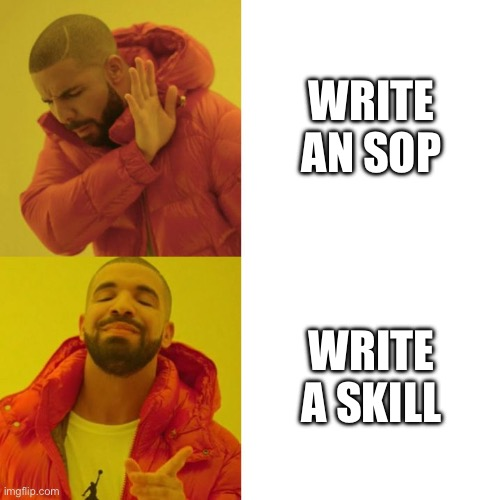

Ever worked with a useful software architect? Yeah me neither. But I sure have tried to be one.

Software architects have a weird role: Think about the code _tomorrow_. Today's code is what it is, how do we make it good tomorrow? Without slowing down, losing business, or falling off a cliff.

## The architect failure modes

The [worst architects](https://www.joelonsoftware.com/2001/04/21/dont-let-architecture-astronauts-scare-you/) write lots of docs nobody reads, make proclamations of The One True Way, and fall out of touch. Many effective architects put on the Software Janitor hat and burn out in 2 years.

You can't [keep up with your slop cannons](https://swizec.com/blog/theory-of-constraints-ai-and-code-review/). AI or not, the winning model is a mix of people who ship fast and people who clean up the mess. Choose your analogy:

- [pirates and architects](https://x.com/danshipper/status/2035842017553465814)
- [pioneers, settlers, and town planners](https://blog.gardeviance.org/2015/03/on-pioneers-settlers-town-planners-and.html)
- [working balls of mud](https://swizec.com/blog/big-ball-of-mud-the-worlds-most-popular-software-architecture/)

https://twitter.com/Swizec/status/1772312082295189859

## Build systems

The most effective thing you can do as a software architect or principal engineer is **build systems**. How do you engineer software such that slop monkeys can do their thing safely?

That's easy in theory: You meditate high on a mountain, write a few docs about How Things Are Done Around Here, nobody reads them, you complain, then unhelpfully say _"I told you so"_ when things inevitably go wrong.

You get fired for being useless and kind of annoying.

Writing vision docs isn't enough, how do you _implement_ that vision? As the team moves and evolves and people come and go how do you keep everyone following your grand vision?

Code review! System design review! You go in every pull request and do the codebase gardening. You join every architecture discussion and gently nudge with your experience.

You are now the bottleneck. You get fired because everyone takes weeks to ship. Or people route around the obstacle and you are ignored. You get fired for being useless.

So how do you garden a codebase without burning out in every pull request and system design review? How do you not annoy everyone into submission?

- culture
- feedback loops
- automation

### Culture

Your first system is culture. Build a culture where everyone returns the shopping cart.

First step is to make sure they own the consequences. No throw code over the wall and move onto the next feature. _You_ have to test and make sure it works. _You_ shepherd things to production and tell stakeholders that it shipped.

Now your face is on the feature. When it breaks, the stakeholders will ping you 😈

The magic words are: _"I trust you, we know your phone number_

Next step is to make sure everyone understands how to do it right. When you give feedback or answer questions, **spend an extra 2 minutes to explain your reasoning**. This creates an epistemology check for yourself – are you sure your answer is good – and spreads your software philosophy through the team.

Soon you'll find people writing your code comments and sharing your analogies when you're not even in the room. ❤️

Find analogies that land then say them a lot. You'll notice I talk about skateboards and user superpowers a lot. Do as a comedian and build an arsenal of quips and phrases tested on live audiences.

### Feedback loops

A strong culture trumps all. But even the strongest culture gets squished under the weight of modern software. The complexity is too much.

You need feedback loops. Tests, types, and observability.

Tests help you trick inexperienced engineers into writing good software. A forcing function to separate IO from logic, separate gnarly core business modeling from json bureaucracy, and so on.

Plus they catch bugs sometimes maybe.

[Strong typing beats tests](https://swizec.com/blog/the-efficacy-of-typescript/) I find. It catches the mistakes that happen in large systems – an API changed and you didn't know. Or you changed a function and need to update all consumers. Or there's a communication gap between teams and you need clear contracts.

Integration tests + strong typing is best.

You [need observability the most](https://swizec.com/blog/why-you-need-observability-more-than-tests/). Observability tells you how your software is doing in production. It's how you find those once in a thousand edge cases that happen 10 times per day.

And observability is how you [make mistakes easy to fix](https://swizec.com/blog/why-you-need-observability-more-than-tests/) – ship code, get an alert, fix code, ship again. Software only moves forward.

### Automation

You have to [automate common tasks](https://swizec.com/blog/what-i-learned-from-software-engineering-at-google#automate-common-tasks). It's the only way to scale.

Set up linters, auto-formatters, and other basic quality checks. This cuts down on code review, makes merging code easier, and removes a huge source of pointless debate. Discuss the rules once (or even better, dont) and config them in a bot forever.

Now with LLMs you can do one better – write nuanced code review rules and have a robot write code comments you'd normally have to add.

We've tried this and it works well. A bot checks your code and leaves architecture structural comments based on lessons learned in the past.

Instead of a vision doc nobody reads, you write a set of rules for the bot to follow and run this on important pull requests. The bot leaves comments like

- _"Hey there's too much logic in this API-level function, please write thin interfaces talking to a core service that contains the business logic"_
- _"Hey this code doesn't fit with the spec of the ticket you're working on"_
- _"Please avoid mocking in tests, it hides bugs_
- _"This business logic has diverged"_
- _"You now have 5 functions that do the same thing, consider refactoring"_

Works great.

## Garden the system, not the codebase

You have to garden the system, not the codebase. It's socio-technical and humans are 3/4ths of the challenge. Computers are easy.

Loop engineering the kids are calling it.

Cheers, 
\~Swizec
