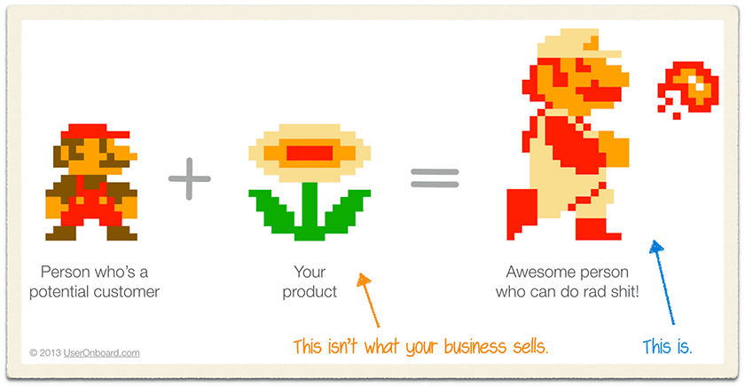

AI has turned work into a slot machine. Pull the lever and oooh it _almost_ worked! Just one more pull, this time for sure

Suddenly it's 3 hours later and you've spent half the day chasing a rabbit hole that definitely was not today's priority. You had an idea, it looked easy, AI can do this ... it could not. Not without your guidance and attention.

How's the real work coming? 😅

Between you and me: we're shipping more code, building bigger and better features than ever before, solving way more of the little problems we never would have prioritized before, but **we're not finishing sprints**.

More work is getting done, less work is getting _finished_. Our leading indicators look great (PRs, code, documents, tasks), but our trailing indicators smell flabby (getting to done done).

🤨

Here's the thing, doing the work doesn't matter. That's not what we're here for. The artefacts are just something companies measure because it's easy.

Asking you to write a project brief is easier than making sure you understand the goal and talk to customers. Asking for a task breakdown is easier than verifying you've got a mental model of a problem. Asking for tasks moving across the board is easier than talking to customers and asking _"Are you happy? Is your life easier?"_.

All that artefact stuff is bullshit. I don't care about the documents and the tasks and the meetings and all the rest. It's nice that we produce a lot of markdown and large file diffs, but here's what I care about:

What can users do that they couldn't do last week? What new superpowers have we ~~built~~ shipped? That's the outcome. Forget the artefacts.

It's okay if the superpowers are small. It's okay to fix bugs and resolve paper cuts. It's fantastic to build systems and make things easier. The point is that we're making life better for our users.

AI makes it easy to focus inwards and feel impressed with all the churn and motion and output you're producing. But your users don't care. They'll never see your document, never gonna care about your code, they won't even care how clever you felt.

Did you make their lives better? That's all users want.

Cheers, 
\~Swizec
