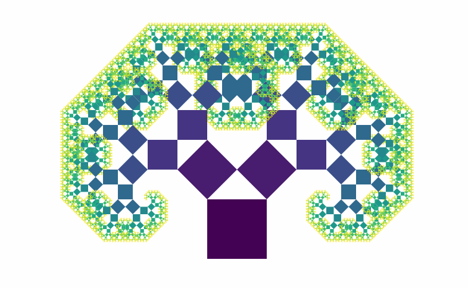
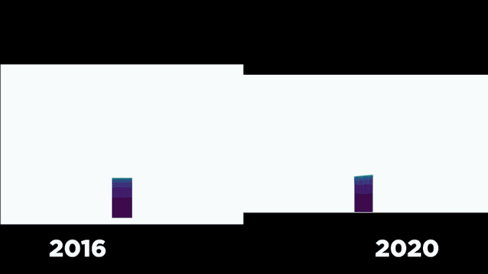
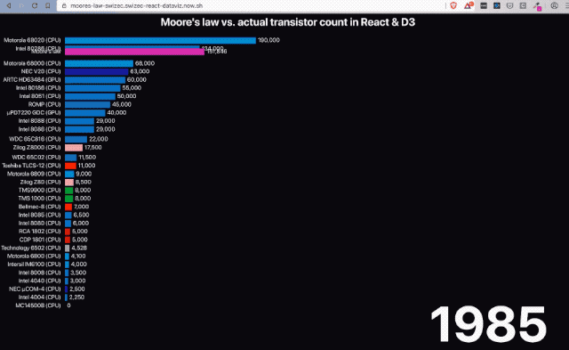

Back in 2016 React performance was top of mind. Sure React makes life easy, _but is it worth it?!?_

You have the DOM abstraction, the synthetic event system, the weird reconciliation, the batching of DOM updates, the ... there's a lot going on. Can it really be _faster_ than vanilla? \[^1]

I devised a devilish plan. An example to end all examples.

[](https://swizec.com/blog/fractals-in-react/)

[React Fractals!](https://swizec.com/blog/fractals-in-react/)

Folks from the community ❤️ helped me fix some trigonometry and the React Fractals demo became interactive:

[](https://swizec.com/blog/dancing-tree-fractal-with-react/)

_Feel_ the computer struggle to keep up. Feel it! 😈

Here's the exact same code 4 years later. No changes, no library updates, nothing.

[]()

🤯

Try for yourself: https://react-fractals.now.sh/

## Why fractals are bad

I remember making those gifs in 2016. Had to move my mouse veeeeery carefully so they came out okay. 😅

My machine was a respectable [first-gen MacBook Pro retina](<https://en.wikipedia.org/wiki/MacBook_Pro#Third_generation_(Retina)>). Getting up there in age but a very respectable computer with the maxed out specs. \[^2]

Here's the problem:

```javascript
// src/Pythagoras.js

const Pythagoras = ({
    w,
    x,
    y,
    heightFactor,
    lean,
    left,
    right,
    lvl,
    maxlvl,
}) => {
    // avoid infinite recursion
    if (lvl >= maxlvl || w < 1) {
        return null;
    }

    // grab memoized calculations for each level
    const { nextRight, nextLeft, A, B } = memoizedCalc({
        w: w,
        heightFactor: heightFactor,
        lean: lean,
    });

    let rotate = "";

    // SVG rotate transformation, not GPU accelerated :(
    if (left) {
        rotate = `rotate(${-A} 0 ${w})`;
    } else if (right) {
        rotate = `rotate(${B} ${w} ${w})`;
    }

    // draw
    return (
        <g transform={`translate(${x} ${y}) ${rotate}`}>
            {`// draw current level`}
            <rect
                width={w}
                height={w}
                x={0}
                y={0}
                style={{ fill: interpolateViridis(lvl / maxlvl) }}
            />

            {`// draw current level`}
            <Pythagoras
                w={nextLeft}
                x={0}
                y={-nextLeft}
                lvl={lvl + 1}
                maxlvl={maxlvl}
                heightFactor={heightFactor}
                lean={lean}
                left
            />

            <Pythagoras
                w={nextRight}
                x={w - nextRight}
                y={-nextRight}
                lvl={lvl + 1}
                maxlvl={maxlvl}
                heightFactor={heightFactor}
                lean={lean}
                right
            />
        </g>
    );
};
```

Fractals are recursive.

Each `<Pythagoras>`\[^3] component renders 2 more. The angle calculations are memoized for each level to save time\[^4]. Still this is a terrible case.

Recursion means that every render has to re-render _every element_. They're all dependent.

At the maximum recursion level of 11 that's `2^11 = 2048` SVG elements that React and your browser have to re-render in real time on every mouse move.

Well, not _every_ mouse move – we throttle to React's pace of state updates:

```javascript
// src/App.js

// Throttling approach borrowed from Vue fork
// https://github.com/yyx990803/vue-fractal/blob/master/src/App.vue
// rAF makes it slower than just throttling on React update
onMouseMove(event) {
    if (this.running) return;
    this.running = true;

    const [x, y] = d3mouse(this.refs.svg),
        scaleFactor = scaleLinear()
            .domain([this.svg.height, 0])
            .range([0, 0.8]),
        scaleLean = scaleLinear()
            .domain([0, this.svg.width / 2, this.svg.width])
            .range([0.5, 0, -0.5]);

    this.setState({
        heightFactor: scaleFactor(y),
        lean: scaleLean(x)
    });
    this.running = false;
}
```

Mouse move events fire multiple times per frame, which means you can swamp the CPU with calculations you're not even drawing. You can use the `this.running` trick as a lock to prevent flushing multiple `setState` events before they finish.

This worked in React 16.3.

With [concurrent mode in the future](https://reactjs.org/docs/concurrent-mode-intro.html) this becomes trickier.

## Why this code works so well in 2020

Imagine my surprise when I go to see if React's concurrent mode makes this faster and it's already smooth as butter.

https://twitter.com/Swizec/status/1263663856779321346

A few things happened since 2016 my friend.

JavaScript itself got faster. 4 years of research and development on the V8 engine, DOM manipulation, etc. Lots of very smart people working on that.

Computers got faster too.

We might not be getting record breaking CPU gigahertz every year, but [Moore's Law is far from dead](https://reactfordataviz.com/articles/moores-law/).

[](https://reactfordataviz.com/articles/moores-law/)

My current computer is a [16" MacBook Pro](<https://en.wikipedia.org/wiki/MacBook_Pro#Fifth_generation_(Magic_Keyboard)>). Same 16GB of RAM, _less_ speed per core at 2.4GHz – but there's 8 of them instead of 4. And the RAM chips are faster and the motherboard is faster and everything around the CPU is faster.

While my code stayed the same _my environment_ got faster.

That's the beauty of working on the web. Your work keeps improving all on its own.

## Why webapps keep getting slower

Before you ask why the web _feels_ slower and slower despite these wonderful advances in computing and browser technology ...

... because nobody's waiting. They keep adding shit.

Sit back and relax my friend. You don't need the new feature. You don't need the next shiny. Chill.

Let your environment make your code better.


✌️

Cheers,<br/>
~Swizec

\[^1]: technically React _can't_ be faster than vanilla because there's a layer of overhead. Your manual solution will be faster _if you're crazy careful_. Most likely it's going to end up slower and messier or you'll end up reinventing React.

\[^2]: maxed out specs for [my computer in 2016](https://everymac.com/systems/apple/macbook_pro/specs/macbook-pro-core-i7-2.7-15-mid-2012-retina-display-specs.html) were a quad-core 2.7Ghz processor with 16GB of RAM. 🤘

\[^3]: this is a [pythagorean fractal](<https://en.wikipedia.org/wiki/Pythagoras_tree_(fractal)>) at core. Also known as the Khoch Curve when it wiggles like that. Names after Pythagoras because the noncurvy (45deg) version encloses a right triangle between each 3 points.

\[^4]: each level of recursion renders multiple squares. Hundreds towards the end. They all have the same angles relative to the parent square so we can avoid calculating each one by [memoizing the function](https://github.com/Swizec/react-fractals/blob/master/src/Pythagoras.js#L8).
