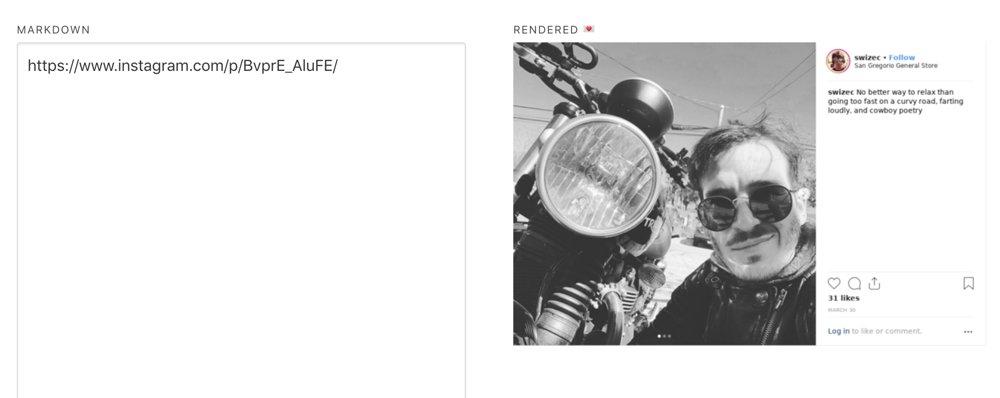
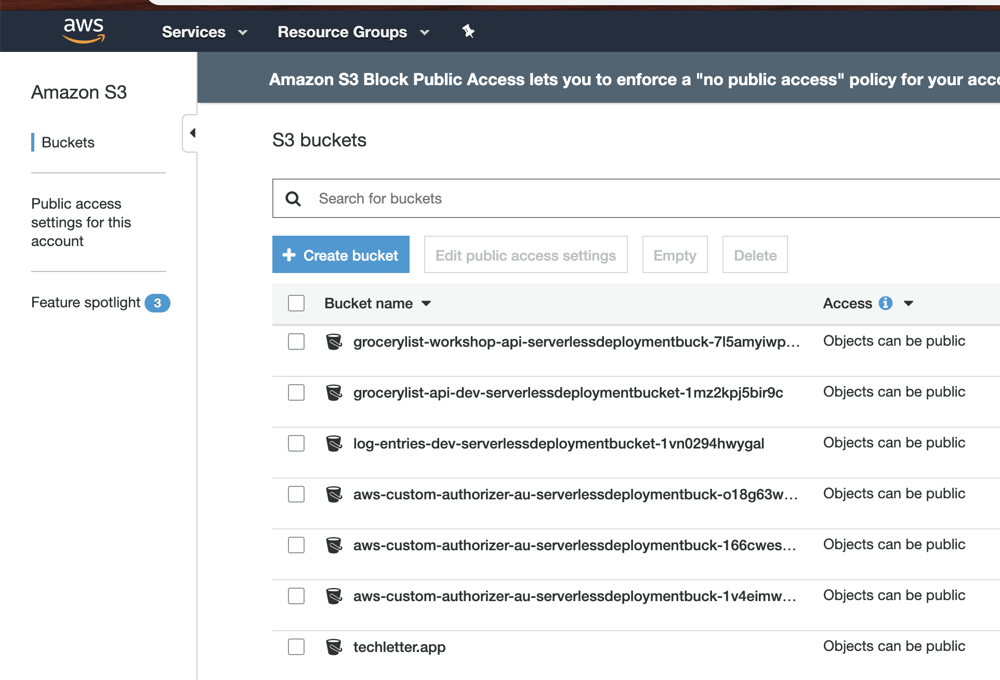
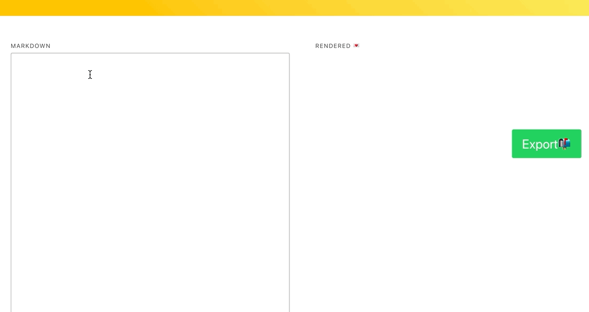

Getting Chrome and Puppeteer to work on AWS Lambda is ... tricky. There's many guides, many blogs out there and they're all broken in subtle little ways you won't realize until it's too late.

Outdated versions of Chrome, build packages too big for an AWS Lambda, or silently breaking with an infinite timeout. When you end up trawling through old Github issues looking for clues you know something's wrong.

That was me.

https://twitter.com/Swizec/status/1115300975349121028

I'm writing this guide as a love letter to my future self. Never again will I fall into this trap. Maybe it helps you too :)


## The objective

We're building a serverless screenshot service. It's the TODOapp of the headless serverless Chrome world. Every other guide uses this example :D

You can see my [final repo on Github](https://github.com/Swizec/lambda-screenshot-as-a-service). Disregard the README. A long time ago I used a starter kit that no longer works. Chrome version too old, hangs on `newPage`.

We'll take screenshots of Instagram posts. Convenient for embedding in emails. You could use a similar setup for testing or to make social sharing thumbnails. Whatever your heart desires.



I built my screenshot Lambda for [TechLetterApp](https://techletter.app/). A tool that converts markdown into newsletters.

You will learn about:

- serverless
- AWS Lambdas
- headless Chrome
- Chrome Puppeteer
- uploading to S3

Our Lambda is going to take an Instagram URL, take a screenshot, upload the file to S3, and return the URL.

## Init new project

Start a new project. We're going raw, no init scripts. Don't need 😇

```
$ mkdir screenshot-lambda
$ cd screenshot-lambda
$ yarn/npm init
```

Yarn or npm will ask you a bunch of questions about your new project. Answer them and you'll end up with a `package.json` file.

This is also a great opportunity to run `git init`.

## S3 bucket

Before we begin, you'll need an S3 bucket as well. There is surely a way to create these via Serverless, but I don't know it.

Go into your AWS console, search for S3, create a new bucket and give it a name.



## Serverless.yml

We start our project with serverless.yml – the Serverless configuration file. Handles all our AWS setup so we can avoid Amazon's confusing dashboard and avoid clicking around. Also means your configuration and server setup becomes part of your code so it's repeatable and always the same.

Version controlled too 👌

I'm assuming you already have Serverless and have [set up your AWS credentials](https://serverless.com/framework/docs/providers/aws/guide/installation/).

Create a `serverless.yml` file and add this stuff 👇

```yaml
service: screenshot-lambda

provider:
    name: aws
    runtime: nodejs8.10
    memorySize: 2536
    timeout: 180
    iamRoleStatements:
        - Effect: "Allow"
          Action:
              - "s3:upload"
          Resource: "arn:aws:s3:::<your s3 bucket>/*"

functions:
    screenshot-function:
        handler: src/index.handler
        environment:
            DEBUG: 0

package:
    exclude:
        - node_modules/puppeteer/.local-chromium/**

plugins:
    - serverless-plugin-chrome

custom:
    chrome:
        flags:
            - --window-size=1280,1696 # Letter size
            - --hide-scrollbars
            - --ignore-certificate-errors
        functions:
            - screenshot-function
```

Here's what it means

- **service** gives your service a name. Used when constructing endpoints for your Lambdas and such
- **provider** tells Serverless that we're using AWS and sets some basic config. Which `node` version we're using, how much memory we want for Lambdas, the default timeout.
- **provider/iamRoleStatements** configures permissions for our service. Our service needs upload access to S3. Permissions are the most common source of weird bugs and failures in my experience. Best copy from somewhere else :)
- **functions** specifies our Lambda functions. We have a `screenshot-function` handled by the `handler` method in `src/index.js`
- **package** specifies service packaging instructions. We're telling Serverless to exclude the local Chromium build just in case it's there.
- **plugins** Serverless comes with a rich ecosystem of plugins. This is where we specify them. We need `serverless-plugin-chrome`
- **custom** lets us add a bunch of configuration. Usually for our plugins. Here we specify some runtime flags for Chrome and tell `serverless-plugin-chrome` to make Chrome available to the `screenshot-function` Lambda

Other guides will show you different ways of running Chrome. Those are outdated and bad. This is the best approach.

Using `serverless-plugin-chrome` means you're running a remote cloud version of Chrome instead of packaging the entire binary into your Lambda. Makes deploys faster, the Lambda smaller, and your costs lower. I think.

Don't quote me on the costs 😅

## Install dependencies

Next we need to install some libraries.

```
$ yarn add @serverless-chrome/lambda gm puppeteer-core superagent aws-sdk url
$ yarn add --dev serverless-plugin-chrome
```

**@serverless-chrome/lambda** will let us talk to Chrome **gm** is ImageMagick, we'll use it to resize and optimize images for size **puppeteer-core** is a minimal version of Puppeteer so we can drive Chrome with JavaScript **superagent** is a JavaScript library for making requests. We're using it because I copied that part of the code from [another guide](https://nadeesha.github.io/headless-chrome-puppeteer-lambda-servelerless/) **aws-sdk** has a bunch of utilities for talking to AWS. In our case for S3 uploads. **url** will make it easier for us to parse URLs **serverless-plugin-chrome** handles all the Chrome stuff for us. We don't have to care 👌

## handler.js

Our `handler.js` file takes care of one thing: Accepting an HTTP request, setting CORS headers, initiating Chrome stuff, calling our code, and responding with an HTTP response.

Looks like this

```javascript
const getChrome = require("./getChrome");
const puppeteer = require("puppeteer-core");

const { takeScreenshot } = require("./takeScreenshot.js");

// This is the handler function
// gets called when you hit the API endpoint
exports.handler = async (event, context, callback) => {
    // Instantiate a Chrome browser
    context.callbackWaitsForEmptyEventLoop = false;
    const chrome = await getChrome();

		// connect to the browser via a websocket using Puppeteer
    const browser = await puppeteer.connect({
        browserWSEndpoint: chrome.endpoint
    });

		// CORS headers so we can make cross domain requests to our Lambda
    const headers = {
        "Access-Control-Allow-Origin": "*",
        "Access-Control-Allow-Credentials": true,
        "access-control-allow-methods": "GET"
    };

		// Bail out if there's no params
    if (!event.queryStringParameters) {
        callback(null, {
            statusCode: 400,
            headers,
            body: "You need a url"
        });
    }

		// Get the target URL from params
    const targetUrl = event.queryStringParameters.url;

		// Bail out if there's no URL
    if (!targetUrl) {
        callback(null, {
            statusCode: 400,
            headers,
            body: "You need something to do"
        });
    }

		// Take screenshot, return result
    try {
        let result = await takeScreenshot(browser, targetUrl);
        
        callback(null, {
            statusCode: 200,
            headers,
            body: result
        });
    } catch (e) {
        callback(e);
    }
};
```

Check the comments above to understand the code. Easier that way :)

So we've got our `handler`. Let's create the other files.

## getChrome.js

I borrowed getChrome from [another guide](https://nadeesha.github.io/headless-chrome-puppeteer-lambda-servelerless/). Good guide but some details didn't work out for me and lead me straight to a sea of GitHub issues.

`getChrome` makes sure to launch Chrome and return an instance of the browser we can use.

```javascript
const launchChrome = require("@serverless-chrome/lambda");
const request = require("superagent");

const getChrome = async () => {
    const chrome = await launchChrome();

    const response = await request
        .get(`${chrome.url}/json/version`)
        .set("Content-Type", "application/json");

    const endpoint = response.body.webSocketDebuggerUrl;

    return {
        endpoint,
        instance: chrome
    };
};

module.exports = getChrome;
```

Ask `@serverless-chrome/lambda` to run the browser and use superagent to get its webSocket URL. We use it in the next step above to connect with Puppeteer.

Great, that's our browser. Nothing packaged into our Lambda making it fat. Wonderful.

## takeScreenshot.js

Now the fun stuff, taking a screenshot. I'm gonna explain the code in comments so it's easier to follow 🤓

```javascript
const URL = require("url");
const { uploadScreenshot } = require("./uploadScreenshot");

// Async takeScreenshot function. 
// Takes a browser instance and a targetUrl
// Returns image URL uploaded to S3
exports.takeScreenshot = async (browser, targetUrl) => {
		// Open a new browser page
    const page = await browser.newPage();
    // Set browser size to something decent, mobile mode often tricks websites into loading faster
    await page.setViewport({
        width: 1920,
        height: 1080,
        isMobile: true
    });
		
		// navigate to targetUrl page
		// wait for the page to load and stop making requests
		// The latter is important for modern SPAs that render after document is loaded
    await page.goto(targetUrl, {
        waitUntil: ["domcontentloaded", "networkidle2"]
    });


    let element = null;

		// Get the exact DOM node we want to screenshot
		// This is where you can keep adding any website you want :)
    switch (URL.parse(await page.url()).hostname) {
        case "www.instagram.com":
            element = await page.$("article");
            break;
    }

		// Get the element's dimensions
    const { x, y, width, height } = await element.boundingBox();

		// construct a new filename
    const imagePath = `/tmp/screenshot-${new Date().getTime()}.png`;

		// Ask Puppeteer to take a screenshot 
		// save it to imagePath
    await page.screenshot({
        path: imagePath,
        clip: {
            x: x + 2,
            y: y + 2,
            width: width - 2,
            height: height - 2
        }
    });

		// upload screenshot to S3
    const url = await uploadScreenshot(imagePath);

		// return the result
    return url;
};
```

In a nutshell, our `takeScreenshot` function opens a new browser page, navigates to a specific URL, looks for the exact DOM node we want to screenshot, uploads to S3, and returns the result.

I used to try closing the page after screenshotting but that seems to hang sometimes for some websites. Causes problems so it's best to avoid.

Lambdas kill their execution environment, and the browser, after running anyway. Shouldn't be any harm in keeping pages open.

As you can see I wrote this code so it's easy to add other websites. ✌️

## uploadScreenshot.js

Last step in the puzzle is uploading our screenshot to S3. You can't host from temporary Lambda files. Gotta put it somewhere permanent.

Again, I'll explain the code inline. Think that's a good approach.

```javascript
const aws = require("aws-sdk");
const gm = require("gm").subClass({
    imageMagick: true
});
const fs = require("fs");

// Your S3 bucket from earlier. Make sure you use the same name
const BUCKET = "techletter.app";

// uploadScreenshot takes a temporary file path and returns a URL
exports.uploadScreenshot = async function uploadScreenshot(
    path,
    resize = true
) {
		// aws-sdk is all callback-based so we have to wrap in Promises, yuck
    return new Promise((resolve, reject) => {
        const s3 = new aws.S3({
            apiVersion: "2006-03-01"
        });

        if (resize) {
		        // We use ImageMagick to resize files to 640px width
		        // Smaller files open faster and use less space
		        // Still look sharp enough :)
            gm(path)
                .resize(640)
                // make sure we save as png
                .toBuffer("png", async function(err, buffer) {
                    if (err) reject(err);

										// this is the part that actually uploads
                    const { Location } = await s3
                        .upload({
                            Bucket: BUCKET,
                            Key: `screenshot-${new Date().getTime()}.png`,
                            Body: buffer,
                            ACL: "public-read"
                        })
                        .promise();

                    resolve(Location);
                });
        } else {
				    // when not resizing we just read the file and upload
            (async function() {
                const buffer = await new Promise((resolve, reject) => {
		                // reading the file
                    fs.readFile(path, (err, data) => {
                        if (err) reject(err);
                        resolve(data);
                    });
                });

								// uploading the file buffer
                const { Location } = await s3
                    .upload({
                        Bucket: BUCKET,
                        Key: `screenshot-${new Date().getTime()}.png`,
                        Body: buffer,
                        ACL: "public-read"
                    })
                    .promise();

                resolve(Location);
            })();
        }
    });
};
```

We should now have everything in place to use our Instagram screenshot service.

## The very important hack

This is a hack. It's ugly. I found it [in GitHub issues](https://github.com/adieuadieu/serverless-chrome/issues/92). Fixes the "socket hang up" error with Chrome.

Go into your `node_modules/@serverless-chrome/lambda/dist/bundle.*` files. There's two of them.

In each of those files look for a line like this

```javascript
const LOGGING_FLAGS = process.env.DEBUG ? ['--enable-logging', '--log-level=0', '--v=99'] : [];
```

Remove the `--v=99` part

```javascript
const LOGGING_FLAGS = process.env.DEBUG ? ['--enable-logging', '--log-level=0'] : [];
```

**_You have to do this every time you run Yarn or reinstall anything for any reason_**

Yes it sucks. Yes I should make an upstream PR. But doing it yourself unblocks you and makes your Lambda work _right now._

I have no idea why that breaks it.

Another option might be to remove the `DEBUG` flag in your serverless.yml ... but then how will you debug?

## And, deploy :)

```
$ sls deploy
```

Serverless packages your lambda, deploys to AWS, sets everything up for you, and returns a URL.

That URL is your API endpoint. Call it with an Instagram URL and behold your wonderful screenshots.



I wrapped mine in a nice UI. You can try it at [TechLetter.App](https://techletter.app)

PS: I'm working on new education materials, workshops, course and such for serverless, lambdas, full stack React, GraphQL, and Gatsby. Hit reply if you're interested or [ping me on Twitter](https://twitter.com/swizec).
