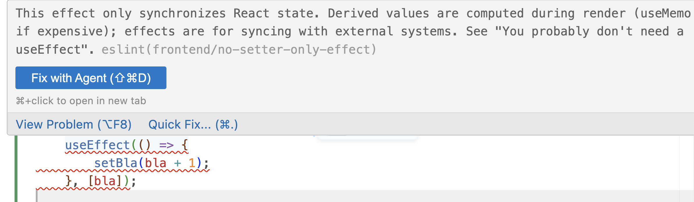

I've been experimenting with different approaches to build a system where humans and agents can ship fast safely. Think I've found something that works – custom linters.

Engineering teams produce more code than ever. I'm sure you've noticed. But you [can't ship faster than you can validate](https://swizec.com/blog/theory-of-constraints-ai-and-code-review) and [keeping the slop cannons safe is the architect or principal engineer's job](https://swizec.com/blog/how-to-be-useful-as-a-software-architect). Or whatever you call the designated adult in the room :)

Here's what you need: Guardrails and feedback loops. They should be fast and cheap and apply to everyone writing code. Agent and human alike.

Custom linters give you both.

## AI code review was too expensive

We produce a lot of pull requests (2900 prs last quarter) and the folks reviewing all this code are starting to complain. I'm averaging 10 reviews per day and it leaves little time for anything else.

A while back we enabled Cursor's BugBot and it's pretty okay.

BugBot likes to

- point out edge cases that are not a big problem,
- freaks out over invented security concerns,
- adds a lot of fluff to pull request descriptions (risk assessment etc),
- but _once in a while_ it catches a missing business requirement or cross-team dependency and those are gold.

In a way it adds review burden because now I have to review the code _and_ BugBot's comments to flag which ones are worth following. But you can [`@cursor fix this`](https://swizec.com/blog/just-fix-their-pr/) in a comment and that's nice.

This costs about $1000/week. It doesn't catch any of the architectural and code structure guidance we care about and actively steers less experienced engineers to write more convoluted overly defensive code. I can't decide if we're faster or slower because of it.

### BugBot doesn't find what we want, can we write our own?

BugBot is tuned to be mildly useful in lots of teams. We wanted something that's useful in _our_ team on _our_ approach to crafting code. We have strong opinions informed by years of practice. I've [written books about structuring code to move fast](https://www.scalingfastbook.com).

Our engineers have built Claude code review skills. `/backend-review`, `/frontend-review`, `/tests-review` look for architectural patterns we agreed upon and push back when you forget.

These skills work great when you run them on your machine. You get comments, fix what's worth fixing, and move on.

Then we tried running these skills in github actions. And my dude, it was so bad. The noise was overwhelming. Sometimes I spent more time reviewing Claude's comments than reading the code.

It was like asking your most pedantic stick-up-their-arse colleague to review your code, assume you're an idiot, and back every comment with a mini essay. _"It says here in section 3.6.17 subsection 5 that you shall count to the number three and the number of the counting shall be three. No more, no less."_

And it cost ... I think we hit $1000 in one day when the SwizThisWasADumbIdeaPleaseStop hammer came down 😅

## Custom linters are the perfect balance

The review skills flagged exactly what we cared about – weird house rules that work great for us but a generic code review tool like BugBot wouldn't even think of. This part was great.

But how do you get that without burning a bunch of tokens or painstakingly fine-tuning a generic tool?

Linters! Linters can analyze the syntax of your code in seconds and make suggestions based on rough rules. They won't catch as much as an LLM and maybe that's okay?

I tried with our design guidelines first: _"Hey Fable, look at DESIGN.md and turn the deterministic parts into a linter"_.

It worked!

We got rules like `no-raw-color`, `no-hardcoded-mono`, `no-outline-none`, a script that confirms we're using valid semantic classes, and a thingy that checks we're not mixing design systems [while we transition to ShadCN and BaseUI](https://swizec.com/blog/agents-change-the-math-on-big-bang-migrations).

Then I tried pointing Fable at our other `*.md` files. We got a bunch of cool rules:

- `descriptive-test-names` uses basic natural language checks to nudge better test names
- `no-interpolated-console` pushes you to use structured logs
- `no-swallowed-errors` enforces re-raising or logging
- `no-render-helpers` makes sure we create React components for JSX functions
- `no-setter-only-effect` catches a common useEffect misuse
- `require-assertion-reason` encourages us to use TypeScript well
- `check_no_mock` asks us to avoid hiding problems with mock and patch testing
- `check_no_factories` pushes us to use parametrized fixtures
- `check_service_purity` looks for presentational code at the service layer
- `check_except_log_level` makes sure we use appropriate logging levels
- `check_app_logger` makes sure we use the instrumented logger
- `check_test_names` asks us to spell out actor/action/effect in test names
- `check_import_direction` ensures the service layer doesn't import from presentation files
- `vale-de-blab` based on [Vale](https://vale.sh) forces us to de-blab comments, docstrings, and MD files.

There's a lot more. These are a few of my favorites. I am embarrassingly excited about the de-blab linter. It catches passive voice, convoluted wording, AI tells, navel gazing, history lessons, and watching it fix our existing prose made my heart sing.

## Why linters are perfect

Claude and BugBot take 10, 15, even 30 minutes to post comments. So instead of coming to a PR full of resolved comments, I now have to review both the AI feedback and the code. Original author wandered off to do other work 💩

Linters run their checks in seconds. Our slowest takes 27 seconds to run a full sweep and add comments on Github.

Comments are deterministic so you can skim fast. Always the same words for the same issue.

Even better, linters can run in your editor and add squiggly lines. Write something you're not supposed to, get a comment right there.

Shift the leftest – see issues as soon as you write the code.

And it gets better! Linters run on pre-commit hooks so your agents never even push bad code to Github. I've seen an agent go _"Okay now I commit oop the check failed yeah I hardcoded that color that was my bad let me find the semantic token okay great now ..."_

🤩

Yes linters are an old technology, but writing custom rules was never easy enough to do. Now you can.

Cheers, 
\~Swizec
