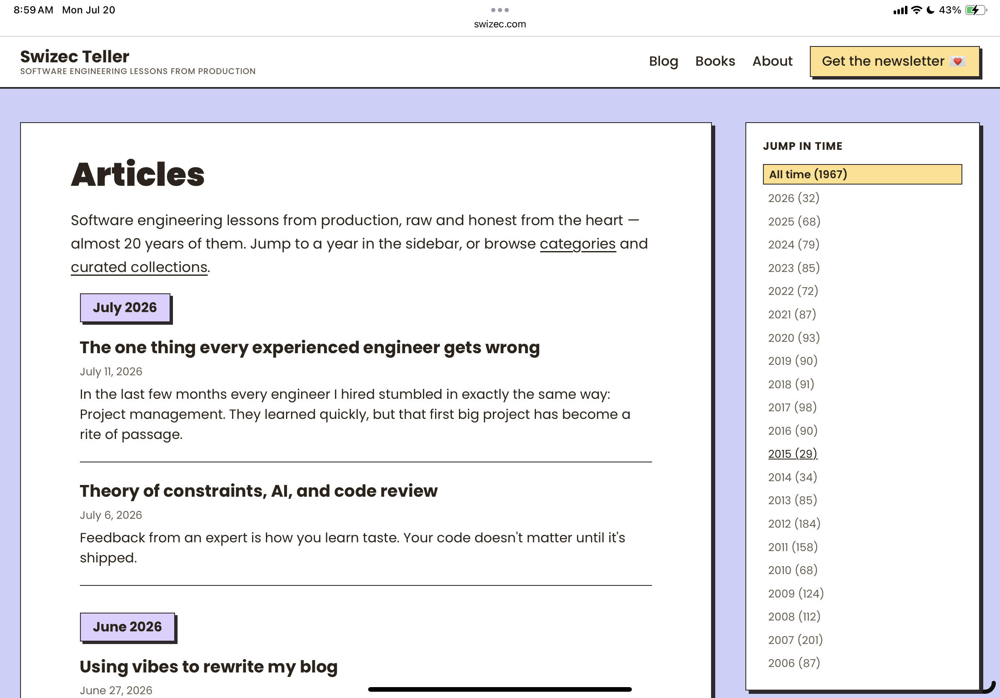
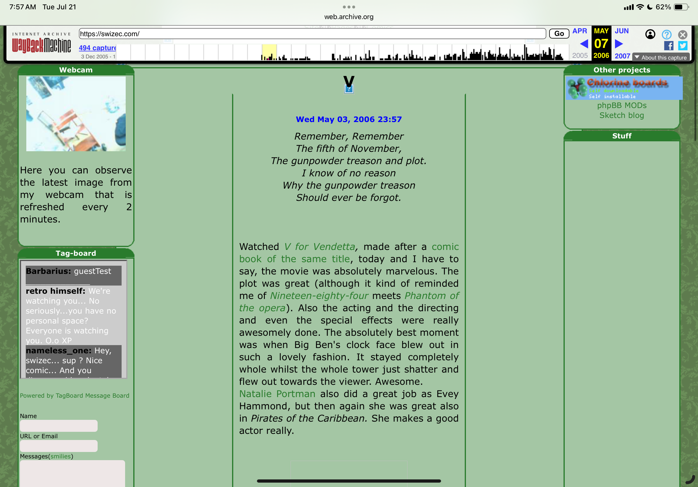
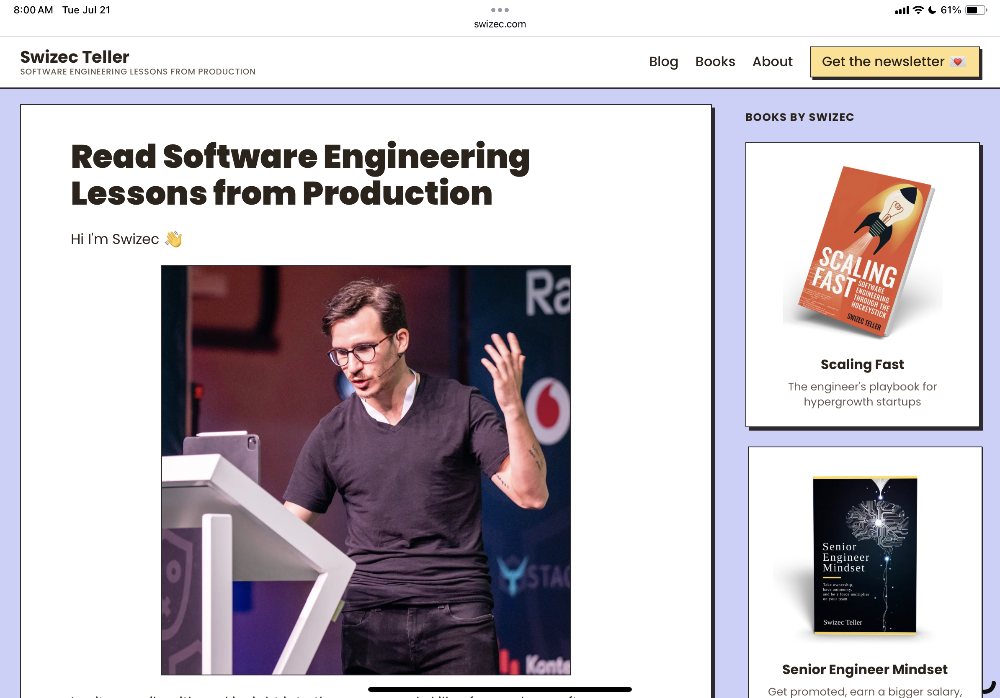
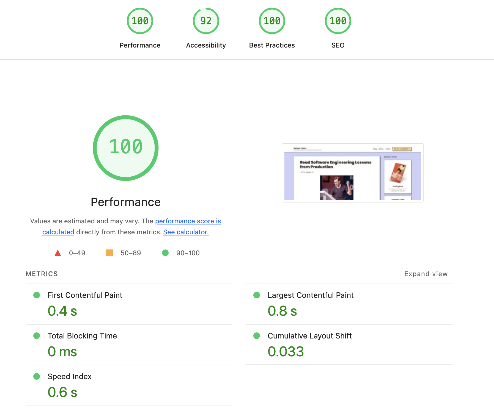
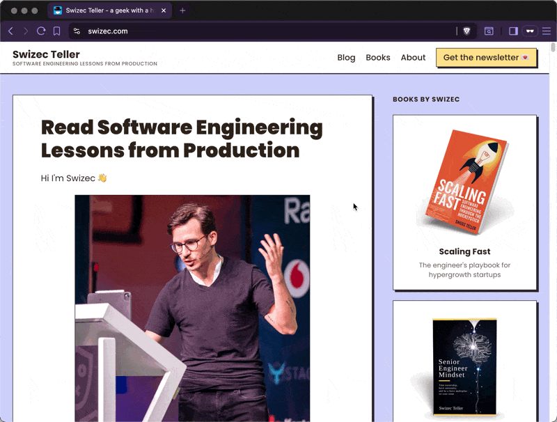
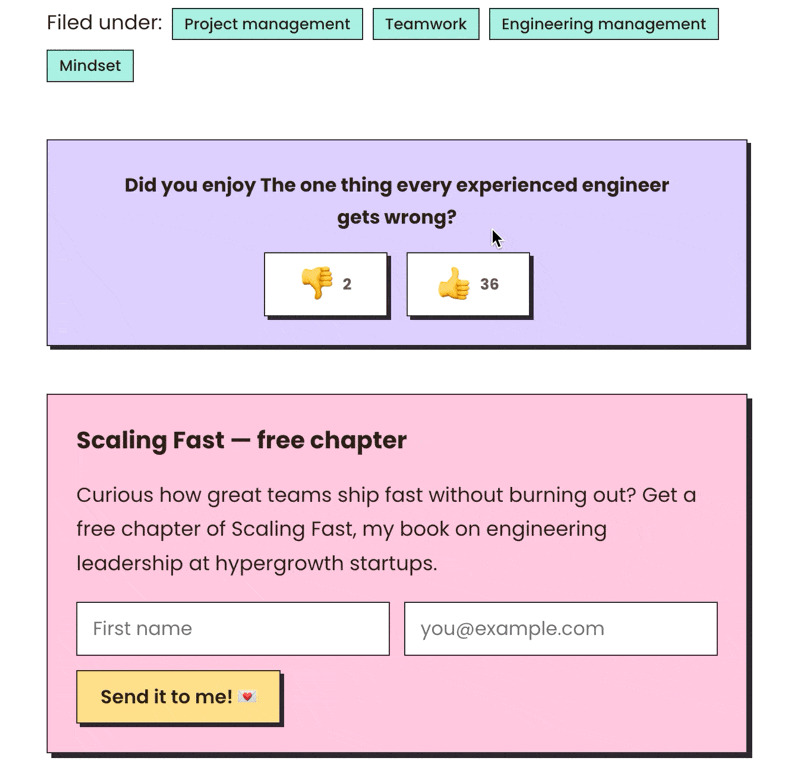

Can you believe I've been writing on swizec.com for 20 years? The blog started back when "have a website" was social media 🤯

Before that it was a webcomic site. Those posts do not survive but I recently found the sketches in my mom's basement and brought them to San Francisco. Little memento of a different path :)

## It's been a while

I got swizec.com in 2005 and started hosting websites on the linux machine in my bedroom, which was also my only computer and everyone's web router. Fun times. Gentoo was my distro of choice and yes compiling from stage0 on a 1GHz overclocked Athlon takes forever.

Back when an ISP would give you, a random kid, your very own static IP for life just because you asked. Good old `193.77.212.100` I'll never forget you. My mom lost it a few years ago.

I graduated high school in 2007, which means I should add a disclaimer about being young and dumb to some of the old posts in case anyone finds them. But they deserve to stay. Cool URLs don't die 🤘

As an old website, swizec.com has gone through many rewrites. It started as one of the first websites I cobbled together by hand. Probably in PHP using [Kate, a KDE text editor](<https://en.wikipedia.org/wiki/Kate_(text_editor)>) or something like that.

Here's the oldest screenshot from the wayback machine I can find

I love the little webcam view straight into my bedroom. Different times.

## The latest rewrite

And now here's the latest and greatest, you should [check it out](https://swizec.com) if you're reading from email.

It's been 6 years since [the last rewrite](https://swizec.com/blog/lessons-from-migrating-a-14-year-old-blog-with-1500-posts-to-gatsby/) \[name|], I've been meaning to do this for years. Gatsby just didn't scale to my size of website. It took 45 minutes to deploy a new post.

Now deploys take 4 minutes 🤘

And check out these vanity metrics!

## Benefits of TimberJS and React Server Components

The website feels fast and snappy thanks to a new architecture from [TimberJS](https://timberjs.com), based on react server components. Navigation and interactive elements cause neither a full page reload nor a complex re-render in the client.

As you navigate, layout chrome stays put and TimberJS replaces the article HTML with content coming from the browser. But there's no compute in JavaScript – rendering happens on the server.

This extends to new interactive elements like the thumbsup/down widget that used to take you to a separate page. With the new rendering approach I can even show vote counts, this would've killed the Gatsby site.

The voting and newsletter subscribe both leverage server actions to do the work. Click buttons in a client component (with `'use client'`), dispatches an action to the server, server responds, and you update the UI.

Means you have an interactive island in the middle of a mostly static website. You write React the same way you're used to and TimberJS figures out the rest.

That's been the challenge with NextJS's take on server components – you have to re-learn how to think. I like that TimberJS feels more familiar. Similar to TanStack/Start but leaning into the server-side paradigm as default.

I like it. [Switz](https://saewitz.com) is onto something. Tanner went with "spa by default". Both fix the mess that is NextJS (I never liked its API), but for content heavy largely static sites like a blog, I think Switz's approach is a better fit.

## Why finally rewrite?

Honestly \[name|], I thought I'd do this as a paternity leave project because babies are boring and you have plenty of time. You do not have plenty of time.

But! The whole [thing was vibe engineered](https://swizec.com/blog/using-vibes-to-rewrite-my-blog/). Claude Code on auto-mode using Fable or Opus is the perfect way to build cool shit while holding a baby. You have half a brain available in bursts of 5 minutes to write the next prompt, then focus back on the baby.

My partner hated it. She called me "distracted" and "always on my phone" 😂

It's okay we're done now. The new swizec.com has shipped. Let me know what you think.

Cheers, 
\~Swizec

PS: the theme and UI is based on [Astryx](http://astryx.atmeta.com), a new component library from Meta
