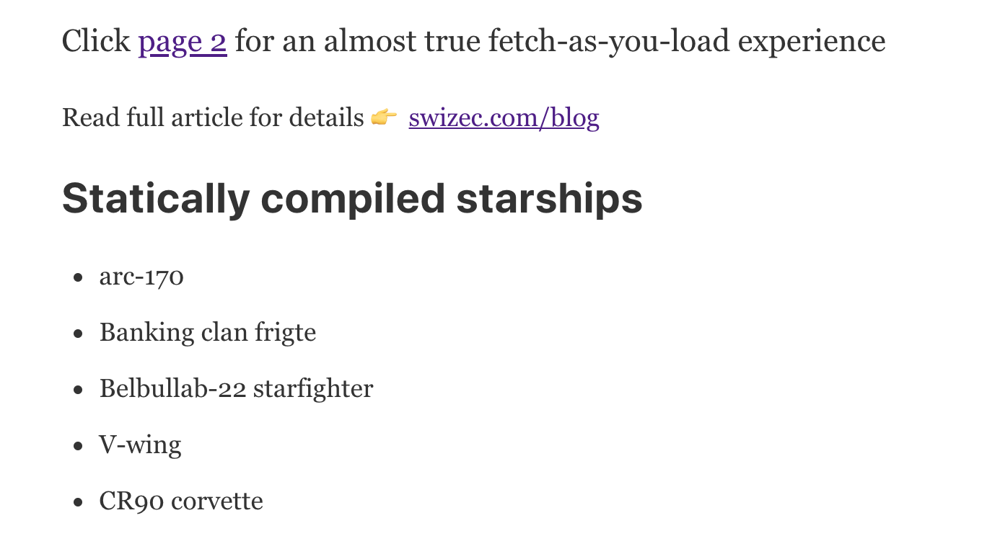
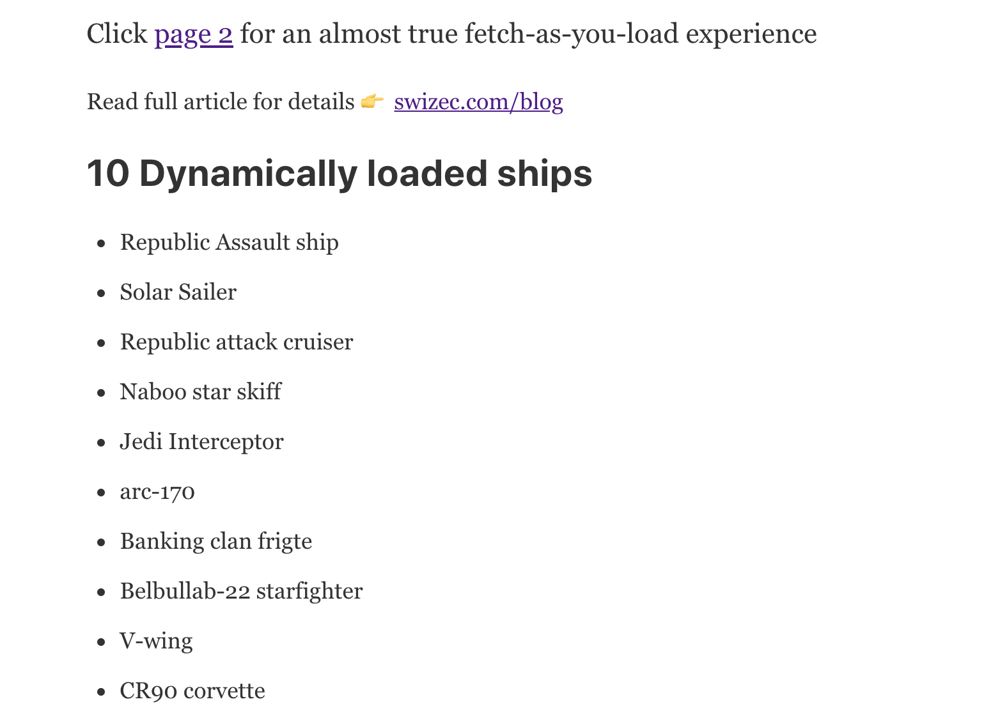
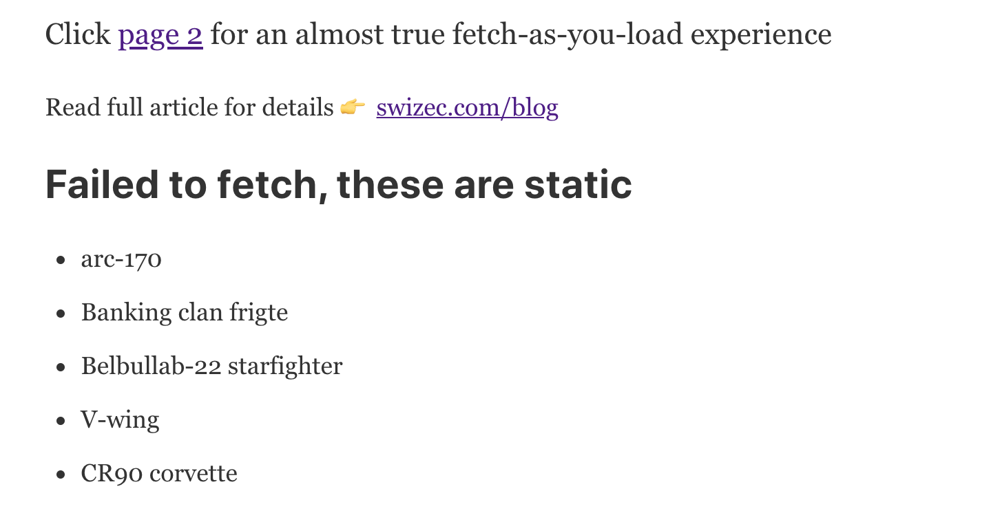
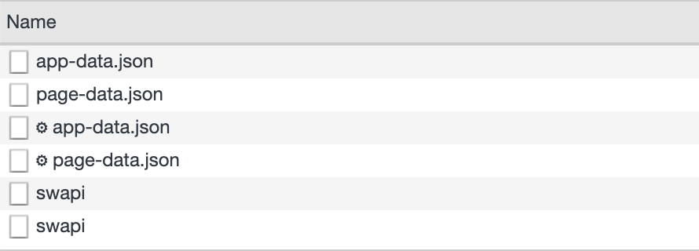

Messing around with React Suspense gave me a great idea: What if you could fallback to preloaded data instead of a loading spinner? 💡


You could leverage Gatsby's approach with React Suspense for a smooth user experience. Load partial data at build time, bake it into the static HTML, then load the rest when a user renders your page.

Initial experiments look great, where I'm stuck is loading data for subsequent pages. Let me explain

You can see it in action here 👉 https://gatsby-suspense-poc.now.sh/

Code on GitHub 👉 https://github.com/Swizec/gatsby-suspense-poc

## Gatsby with dynamic data, some background

Let's start with background on using Gatsby for dynamic pages.

Gatsby is a static site builder. You build a website in React, use GraphQL to connect to data sources, and compile a static HTML page.

Your GraphQL queries run at compile time and bake data into your static HTML via hardcoded props. Not quite hardcoded props but close enough.

The result is a page that can work offline and loads without API requests. This makes it fast.

When your site loads in a browser, however, it becomes a React single page app. [React hydration](https://reactjs.org/docs/react-dom.html#hydrate) means there's no flash of blank content and no need to re-render the HTML.

You can add Apollo Client for GraphQL support or use `fetch()`. It's just a JavaScript app at this point.

I like to wrap the root node in ApolloProvider and use [react-apollo-hooks](https://github.com/trojanowski/react-apollo-hooks) for the rest.

```javascript
// gatsby-browser.js
// gatsby-ssr.js

import { client } from "./src/apollo"

export const wrapRootElement = ({ element }) => (
  <ApolloProvider client={client}>{element}</ApolloProvider>
)
```

That gives my entire app access to GraphQL for a specific server. Using [Star Wars API](https://swapi.co/) for this example.

```javascript
// src/apollo.js

import ApolloClient from "apollo-boost"
import fetch from "isomorphic-fetch"

const SERVER_URI =
    "https://api.graphcms.com/simple/v1/swapi"

export const client = new ApolloClient({
    uri: SERVER_URI,
    fetch,
})
```

## Loading additional data on render

Once you have "cached" data baked into your HTML and the ability to load fresh data on render, you're presented with a dilemma.

> How do I show static data, communicate that more data is loading, and show fresh data when I've got it? If the user is offline, what then?

Those are tough problems. Traditionally, you'd render a component, show a spinner, fetch more data after render, then re-render once done.

Something like this (this is pseudocode):

```javascript
const STARSHIP_QUERY = gql`
  query starships($count: Int) {
    allStarships(last: $count) {
      name
    }
  }
`

function StarshipList({ data }) {
	const { loading, data } = useQuery(STARSHIP_QUERY, {
		variables: {
			count: 15
		}
	})
	
	return <div>
		{loading ? "Loading more" : null}
		<ul>
			{data.list.map(ship => <li>{ship.name}</li>)}
		</ul>
	</div>
}
```

`STARSHIP_QUERY` is a GraphQL query that returns a list of `$count` starships from StarWarsApi, `swapi` for short.

`useQuery` runs the query and returns a loading state and data.

Component renders the loading notification and a list of starships from props. Those were baked in at build time. When fresh data arrives from our API call, the component re-renders.

You can tell this is pseudocode because I'm re-defining the `data` constant and that won't work :)

## Using React Suspense instead

With React Suspense, you can make that API call preemptively. While the page is loading.

Some background on how that works in last week's [Experimenting with the new React Concurrent mode](https://swizec.com/blog/experimenting-with-the-new-react-concurrent-mode/) article ✌️

Here's how you might set it up for Gatsby. Or at least how I did.

```javascript
// pages/index.js

import { starshipQuery, ErrorBoundary } from "../util"

// Export static query for Gatsby
export const query = graphql`
  query {
    swapi {
      allStarships(last: 5) {
        name
      }
    }
  }
`

// Run query on browser hydration
const starshipQuerySuspender = starshipQuery(10)

// The component that suspends with a data load
const Starships = () => {
  const starships = starshipQuerySuspender.read()

  return <StarshipsList list={starships} title="10 Dynamically loaded ships" />
}

// Wrapper component with a title and a list
const StarshipsList = ({ list, title }) => (
  <>
    <h2>{title}</h2>
    <ul>
      {list.allStarships.map((ship, i) => (
        <li key={i}>{ship.name}</li>
      ))}
    </ul>
  </>
)
```

All this goes in the `index.js` page. The first page you see in a Gatsby app.

We start with a static page query for Gatsby. This one runs at build-time and bakes data into our HTML. I tried having a shared query between Gatsby and Apollo, but the `graphql` (gatsby) and `gql` (apollo) tags are not compatible.

Then we've got the `starshipQuerySuspender`, which runs in the browser when Gatsby turns this page into a JavaScript app.

The `<Starships>` component suspends with a data load and renders `<StarshipsList>` when data shows up. The static page is going to render this same component with its data.

### Page render with suspendering

In the `IndexPage` component we can then use `<Suspense>` to coordinate loading and error states.

```javascript
// pages/index.js

const IndexPage = ({ data }) => (
	// ...
	<Suspense
      fallback={
        <StarshipsList
          list={data.swapi}
          title="Statically compiled starships"
        />
      }
    >
      <ErrorBoundary
        fallback={
          <StarshipsList
            list={data.swapi}
            title="Failed to fetch, these are static"
          />
        }
      >
        <Starships />
      </ErrorBoundary>
    </Suspense>
)
```

Our Gatsby page gets static data via the `data` prop. This works offline too, [you can try, here](https://gatsby-suspense-poc.now.sh/) 👌

Here's where the fun starts:

`Suspense` sees that we're running a GraphQL query (the suspender.read()) so it renders the `fallback` render prop. But that prop uses our static data to render a list of 5 starships. It's not all of them, but it's better than nothing.



Even if it all goes to shit, our user gets the most important data they're looking for.

Once our query finishes, Suspense renders the main list. Now with fresh data from the API.



That `<ErrorBoundary>` gives us an extra feature: We can show something useful even if the user is offline and our query fails.



Same fallback to static data, now with a warning that you're offline ✌️

## Where I'm stuck: subsequent pages

Now that approach works great, if your site has a single page. Where it breaks down are multi-page sites. Which is most of them.

I tried replicating the same code on `page-2.js` and this happens:



Two `swapi` requests on initial page load. Makes subsequent pages crazy fast with no hint of data loading, but means that you're _loading data for your whole website on initial load_.

That just won't do. We need to hook into the router's lifecycle. Gatsby uses [@reach/router](https://github.com/reach/router) by the way.

And that's where I'm stuck. Tried a few things, none worked.

### Suspend on render, nope

Loading on render was slow as heck:

```javascript
dataSuspender = () => starshipQuerySuspender(15)
<Starships data={dataSuspender()} />
```

Worked but just as slow as running a query without Suspense.

### Pass suspender as link state, nah

Reach Router lets you pass state to pages with a `state` prop in your `<Link>` component. Whatever you pass shows up in the `location` prop on the target component.

Works great for static values, but did not work with this approach:

```javascript
<Link
  to="/page-2"
  state={{
    starshipQuerySuspender: () => starshipQuery(15), // didnt work
  }}
>
```

Not sure why, but trying to pass a function made the whole state value `null`.

### Hook into onPreRouteUpdate, nyet

Another approach I tried was using Gatsby's browser APIs. You can hook into various parts of the page lifecycle with special methods in `gatsby-browser.js`.

```javascript
export const onRouteUpdate = ({ location }) => {
  // this feels brittle
  if (location.pathname === "/page-2") {
    // this works but data shows up in location prop _after_ the page is rendered
    location.dataSuspender = starshipQuery(15)
  }
}
```

Thought I could manipulate the `location` prop passed into a page and I can, sort of.

When you console.log that value, it shows that you successfully passed the `dataSuspender`. This was great news until I realized that data shows up _after_ the page renders.

How do I know?

Because `console.log(location)` shows the value, but `console.log(location.dataSuspender)` prints undefined. Means the value isn't there when you're printing, but does show up later. Hooray for console.log being dynamic and always showing current object state.

## I tried


I tried everything I could think of. Some of this stuff is either a bug in Gatsby, a bug in [@reach](https://twitter.com/reach)/router, or just not meant to work this way by design.

Next step: bug people online to find out 😛

Happy Monday,<br/>~Swizec
