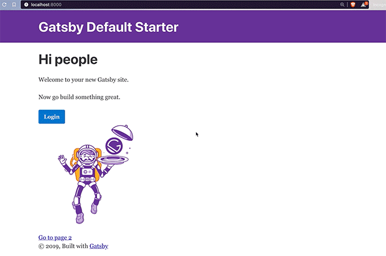

> Omg I just built the simplest way to add authentication to your React app. Should seriously open source it
>
> Handles everything for you. Users, login forms, redirects, sharing state between components. Everything

https://twitter.com/Swizec/status/1156446593874157569

So I did 😎

## Announcing useAuth

[`useAuth`](https://github.com/Swizec/useAuth) is the simplest way to add authentication to your React app. Handles everything for you – user management, cookies, sharing state between components, login forms, everything you need to get started.

A lot of that is handled through Auth0 right now and I'm very open to adding other providers. I like Auth0 because it's free for way more users than I'll ever have and it isn't Google 😛

You can try it out here 👉 https://gatsby-useauth-example.now.sh/

See the code here 👉 https://github.com/Swizec/useAuth

Example code here 👉 https://github.com/Swizec/useAuth/tree/master/examples/useauth-gatsby

[](https://gatsby-useauth-example.now.sh)

## How to use useAuth

[`useAuth`](https://github.com/Swizec/useAuth) is designed to be quick to setup. You'll need an Auth0 account with an app domain and client id.

### 1. Install the hook

```
$ yarn add react-use-auth
```

Downloads from npm, adds to your package.json, etc. You can use `npm` as well.

### 2. Set up AuthProvider

useAuth uses an `AuthProvider` component to configure the Auth0 client and share state between components. It's using React context with a reducer behind the scenes, but that's an implementation detail.

I recommend adding this around your root component. In Gatsby that's done in `gatsby-browser.js` and `gatsby-ssr.js`. Yes `useAuth` is built so it doesn't break server-side rendering. ✌️

But of course server-side "you" will always be logged out.

```javascript
// gatsby-browser.js

import React from "react"
import { navigate } from "gatsby"

import { AuthProvider } from "react-use-auth"

export const wrapRootElement = ({ element }) => (
	<AuthProvider
	  navigate={navigate}
	  auth0_domain="useauth.auth0.com"
	  auth0_client_id="GjWNFNOHq1ino7lQNJBwEywa1aYtbIzh"
	>
	  {element}
	</AuthProvider>
)
```

`<AuthProvider>` creates a context, sets up a state reducer, initializes an Auth0 client and so on. Everything you need for authentication to work in your whole app :)

The API takes a couple config options:

1.  `navigate` – your navigation function, used for redirects. I've tested with Gatsby, but anything should work
2.  `auth0_domain` – from your Auth0 app
3.  `auth0_client_id` – from your Auth0 app
4.  `auth0_params` – an object that lets you overwrite any of the default Auth0 client parameters

_PS: even though Auth doesn't do anything server-side, useAuth will throw errors during build, if its context doesn't exist_

#### Default Auth0 params

By default `useAuth`'s Auth0 client uses these params:

```javascript
const params = {
    domain: auth0_domain,
    clientID: auth0_client_id,
    redirectUri: `${callback_domain}/auth0_callback`,
    audience: `https://${auth0_domain}/api/v2/`,
    responseType: "token id_token",
    scope: "openid profile email"
};
```

`domain` and `clientID` come from your props.

`redirectUri` is set to use the `auth0_callback` page on the current domain. Auth0 redirects here after users login so you can set cookies and stuff. `useAuth` will handle this for you ✌️

`audience` is set to use api/v2. I know this is necessary but honestly have been copypasting it through several of my projects.

`responseType` same here. I copy paste this from old projects so I figured it's a good default.

`scope` you need `openid` for social logins and to be able to fetch user profiles after authentication. Profile and Email too. You can add more via the `auth0_params` override.

### 3. Create the callback page

Auth0 and most other authentication providers use OAuth. That requires redirecting your user to _their_ login form. After login, the provider redirects the user back to _your_ app.

Any way of creating React pages should work, here's what I use for Gatsby.

```javascript
// src/pages/auth0_callback

import React, { useEffect } from "react"

import { useAuth } from "react-use-auth"
import Layout from "../components/layout"

const Auth0CallbackPage = () => {
  const { handleAuthentication } = useAuth()
  useEffect(() => {
    handleAuthentication()
  }, [])

  return (
    <Layout>
      <h1>
        This is the auth callback page, you should be redirected immediately.
      </h1>
    </Layout>
  )
}

export default Auth0CallbackPage
```

The goal is to load a page, briefly show some text, and run the `handleAuthentication` method from `useAuth` on page load.

That method will create a cookie in local storage with your user's information and redirect back to homepage. Redirecting to other post-login pages currently isn't supported but is a good idea now that I thought of it 🤔

**_PS: Make sure you add `<domain>/auth0_callback` as a valid callback URL in your Auth0 config_**

### 4. Enjoy useAuth

[](https://gatsby-useauth-example.now.sh)

You're ready to use `useAuth` for authentication in your React app.

Here's a login button for example:

```javascript
// src/pages/index.js

const Login = () => {
  const { isAuthenticated, login, logout } = useAuth()

  if (isAuthenticated()) {
    return <Button onClick={logout}>Logout</Button>
  } else {
    return <Button onClick={login}>Login</Button>
  }
}
```

`isAuthenticated` is a method that checks if the user's cookie is still valid. `login` and `logout` trigger their respective actions.

You can even say hello to your users

```javascript
// src/pages/index.js

const IndexPage = () => {
  const { isAuthenticated, user } = useAuth()

  return (
    <Layout>
      <SEO title="Home" />
      <h1>Hi {isAuthenticated() ? user.name : "people"}</h1>
```

Check `isAuthenticated` then use the user object. Simple as that.

---

You can try it out here 👉 https://gatsby-useauth-example.now.sh/

See the code here 👉 https://github.com/Swizec/useAuth

Example code here 👉 https://github.com/Swizec/useAuth/tree/master/examples/useauth-gatsby

---

Hope you like it :)

Cheers, <br/>
~Swizec

PS: we'll be using and talking about useAuth in more depth at my [Barcelona workshop in September](https://swizec.com/blog/come-hang-out-in-barcelona-and-learn-graphql-serverless-gatsby/)
