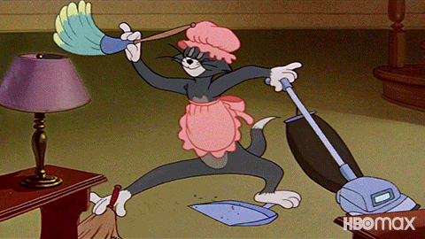

I've been on a quest lately to reclaim my sanity at work. The latest advancement is a bot that auto-approves and merges low risk PRs with no oversight 😈

https://twitter.com/Swizec/status/2093478262639046864

Back in July I wrote that [code review is the bottleneck to your velocity](https://swizec.com/blog/theory-of-constraints-ai-and-code-review). If you can't get your code verified and deployed, you're just building a large backlog of work-in-progress, which slows you down further as you keep all that context in mind for every new feature.

You can't solve this by working harder.

An army of slop cannons will overwhelm even the most dedicated code janitor. This is a [common architect/lead/principal failure mode](https://swizec.com/blog/how-to-be-useful-as-a-software-architect). Ask how I know 🥲

You have to build a better system so that's what I've been doing. One hand to keep up with code review, one hand to write my own code, one hand to manage the team, one hand to build a better socio-technical system of software production.

## Building a better socio-technical system of software production

Sounds like a PhD thesis title innit? Maybe one day.

A lot of this work is boring and not at all splashy. You might not even feel like you're doing anything much. The work is pure gardening:

- Build things,
- watch for edge cases,
- ask for feedback,
- observe,
- make a little snip shear or prune.

When you do it right everything feels natural and obvious and individual contributors get all the glory. When you get it wrong you're the bad guy in everyone's way.

### Verification

For code quality, I built [custom deterministic linters](https://swizec.com/blog/stop-burning-tokens-on-code-review) that cover all the common comments I used to make. Code structure, basic architecture, good tests, design guidelines, anything we could think of really. We have dozens of rules and keep adding more.

These lint rules can get quite complex. A few hundred lines of AST-parsing logic is not uncommon.

For behavior, we improved our test coverage to include a basic set of end-to-end UI tests where a browser automation goes through core user flows and ensures they're not broken. You don't need much, just a handful of critical flows.

We don't aim for 100% test coverage and we constantly fight our bots from adding more. Bad tests are worse than no tests.

### Risk scores

We've been tagging our PRs with low/mid/high risk scores for a while. Mainly to help reviewers decide how much effort to put into code review.

A lot of low-risk PRs were a rubber stamp. Yep I know this engineer produces good work and they're diligent and I can blind approve a low-risk PR. This trust takes time to build.

If there are PRs that we can rubber-stamp, why even wait for a human?

### Auto-approve and merge

On Tuesday I merged a new github action that sweeps our codebase every few minutes and merges anything low risk that passes all our checks.

https://twitter.com/Swizec/status/2099665407263354993

We've auto-merged 22 pull requests out of 143 total (19 contributors) and nothing blew up. It's been totally fine. I may expand the rules so we auto-merge even more code 😈

Not gonna lie it feels super weird and every engineer cringed a little when this went live. WHAT DO YOU MEAN CODE WILL GO INTO OUR CODEBASE WITH NO REVIEW WHAT

Then a few minutes later _"Holy shit this is awesome it merged a PR we forgot about"_ and I think we all appreciate fewer rubber-stamp reviews. It's nice to feel useful when you review someone's work.

Cheers, 
\~Swizec

PS: our rules for low-risk are no public interface changes, no migrations, human-authored, all checks green, no touching finance, and no code-level comments from humans or bots
