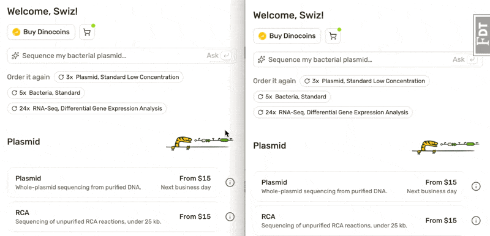

Check this out – how fast Jev vs Claude find a product recommendation.



Both make an API call based on your query, both are just prompt engineering on our end. No training, no piles of evals, no months of collecting data, huge difference in speed and cost.

Jev is even fast enough that it can \[poorly] play a game in real time. Each key press here is an API call with the observation of current game state and a choice for what key to press.


You can [try the game here](https://dino-jumping-game.vercel.app), but it's bring-your-own jev key because internet.

_PS: you can [read and share this online](https://swizec.com/blog/why-im-excited-about-jev-like-classifiers)_

## Classifiers are solved what's the big deal

Classifiers are the oldest kind of AI this is true. From the first perceptrons in the 80's to social media machine learning algorithms and recommendation engines in the 00's and 10's it's almost all been classifiers.

A classifier takes fuzzy unstructured inputs and maps them to a set of distinct choices. Yes/no, a-b-c, or point on a range.

You start with a dumb neural network that gets everything wrong, throw lots of data at it, and hillclimb your way to a trained neural network that answers your question with enough precision and recall to be put in production. Slow to train, fast and pretty cheap to run on modern hardware.

This is where the adage _"data is the new oil"_ comes from. Your proprietary data is the moat that prevents others from copying your product. They can have all your algorithms and techniques and it helps them zilch without your distribution and private data.

Just don't leak the trained classifier.

Jev (and all its copycats) take that formula and turn it into a zero-shot prompt engineering exercise.

## Zero-shot classifiers

Jev immediately got a bunch of copy-cats because it's a good idea. Even if people on HackerNews don't get why you'd need a product when you can just \<5 minute explanation>.

That's how you know something is a good product. When a nerd says _"that's a dumb product, they're just ..."_ and starts a 5 minute rant about how you can build this in your garage over the weekend.

I don't know how Jev works, but I grok the principle: Take an LLM and post-train it to make decisions from a set. Instead of predicting the next token in a long loop, predict _just one token_ and output that.

So a game playing AI becomes [a prompt like this](https://github.com/Swizec/dino-jumping-game/blob/main/src/selfPlay/jev.ts):

```javascript
questions: {
        key_press: choice('Which key should be pressed?', {
          none: 'Do not press any key; coast forward',
          Space: 'Press the Space key to jump',
          ArrowLeft: 'Press the ArrowLeft key if all jumps would hit the obstacle',
          ArrowRight: 'Press the ArrowRight key to accelerate forwards',
        }),
```

And a product recommendation engine is a series of `(product, what it's good for)` pairs.

You get no blab, no text to interpret, no chain of reasoning, just `ArrowRight` and then you press that. In my gaming test, Jev was able to make a decision every 100ms or so.

## Roadmap to build an AI product

I don't know yet if Jev is good for production use, here's my current thinking on how you prototype your way towards a solid production agent doing useful work in a real business.

1. Build it with an LLM. Iterate on the prompt
2. Start building a real-world dataset
3. When the prompt works, turn it into a clear rubric for Jev or similar
4. Keep iterating until desired accuracy achieved
5. Use the real-world evals you've built to train a custom classifier fine-tuned to your needs

At each step you get a faster more accurate system fine-tuned to your needs. LLM when you don't yet know the question you're asking, Jev-like once you learn the question and a working rubric, custom classifier when you need speed scale and precision.

Cheers,<br />
\~Swizec
