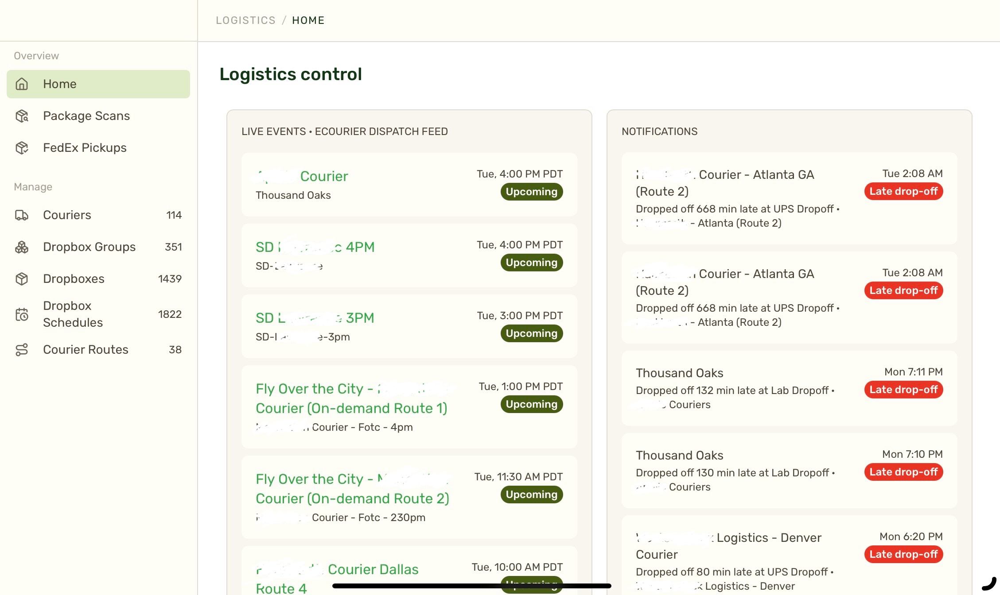

Hiring engineers is like deciding what kind of system you'll have. This seems obvious but surprised me to see first-hand.

If you hire a distributed systems person, you'll get a distributed system. A React dude will build you a frontend app. Pythonista gets you a traditional server-client app, maybe with HTMX for the fancy bits. Database wizard and all the interesting stuff happens in the database, CSS and fonts wizard and you'll solve everything with custom kerning rules and modern CSS you didn't even know existed.

They all have good arguments. Yes of course the problem fits a typical single-page-app, _obviously_ this one requires deep database triggers and fancy indexes, and yeah of course doing it all in CSS is best.

## Every engineer loves their hammer

You nod along and think yeah makes sense. Your engineers are closest to the problem, have done their research, and know what they're talking about. The team wouldn't steer you wrong.

But everyone loves their favorite hammer.

I recently asked two engineers to solve a similar problem – build a dashboard for logistics to do their jobs. Both solved the problem, wrote decent code, and built a working system that people use every day.

The outcomes were completely different.

## Backend builds a dashboard

My backend-leaning pythonista built this:

The dashboard shows in-flight shipments. As you can see there are thousands and that's why we needed tooling. Hard to keep track of all this manually with a spreadsheet.

You have many filters that let you drill into the data and find what you seek. Each row can expand to show more info. Every filter change requires a form submit and page reload.

This was a backend-heavy project.

We heard a lot of opinions on how our Python code is structured, how hard it is to write extendable filters (query engines are hard), that we lack UI tooling to make dashboards easy, and that our data is a mess. All true. A lot of the backend code got fixed.

The end result works but our logistics team complains that with this many filters it feels like writing SQL, couldn't we make it easier? I've done a poor job product managing this and the engineer built everything logistics asked for.

## Frontend builds a dashboard

My frontend-leaning React native built this:

The logistics control center has a homepage with critical info about on-the-ground couriers, sidebar to view other pages, and a whole set of pages to manage CRUD operations. Classic React approach with self-contained components that load their own data, can be remixed, and follow a themable design system.

This was supposed to be a backend project – we needed insights on couriers and an easier way to CRUD – but the React guy turned into a frontend project. We heard less about the backend challenges and ho boy did we talk a lot about systematizing the frontend and improving our internal UI.

For much of the project logistics said *"This looks great but it doesn't *do* anything"*. All the backend pieces that make it work came at the end 😆

## Two projects, two developers, two outcomes

Point is, you get what you hire. Give the project to a backend dude and he'll fix your backend. Give the project to a frontend dude and he'll fix your frontend.

We now have both a good backend and a good frontend. I'm happy.

\~Swizec

PS: if you give the problem to a manager, they'll hire more people. An engineer will build you a system, product person will create a product, VC will find you a startup, grinder will buckle down and do the work, talker will rally the troops, dreamer will build a vision, ... people are funny like that. They love their hammer.
