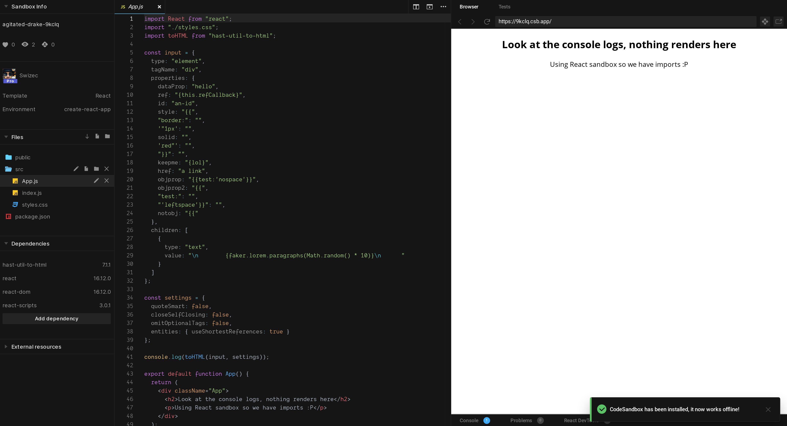
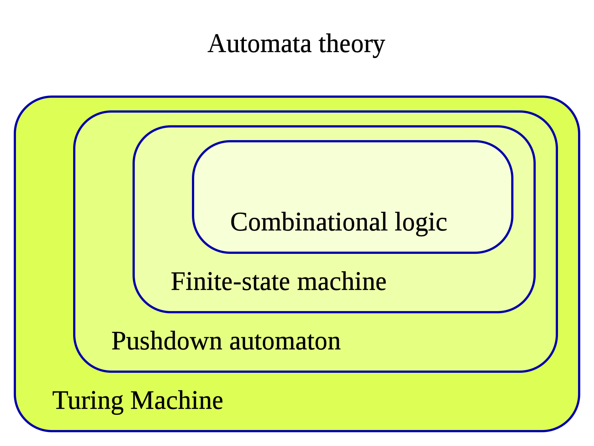
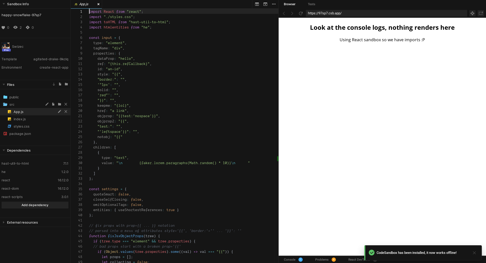

Friend, you don't often get to show off your leetcode skills at work. They get you through the whiteboard interview and vanish forever.

Yesterday I ran into a rare challenge that let me use those skills. Thought I'd share ✌️

You've got this string of buggy JSX.

```
      <div data-prop="hello" ref="{this.refCallback}" id="an-id" style="{{" border:="" &#34;1px="" solid="" red&#34;="" }}="" keepme="{lol}" href="a link" objprop="{{test:&#39;nospace&#39;}}" objprop2="{{" test:="" &#39;leftspace&#39;}}="" notobj="{{">
        {faker.lorem.paragraphs(Math.random() * 10)}
      </div>
```

JSX confused an HTML parser–stringifier and this is what happened. You can't put it back through a parser because now it's neither valid HTML nor valid JSX. 😅

Here's the data model – part of an abstract syntax tree – that produces the above result:

```javascript
    {
      type: 'element',
      tagName: 'div',
      properties: {
        dataProp: 'hello',
        ref: '{this.refCallback}',
        id: 'an-id',
        style: '{{',
        'border:': '',
        '"1px': '',
        solid: '',
        'red"': '',
        '}}': '',
        keepme: '{lol}',
        href: 'a link',
        objprop: "{{test:'nospace'}}",
        objprop2: '{{',
        'test:': '',
        "'leftspace'}}": '',
        notobj: '{{'
      },
      children: [
        {
          type: 'text',
          value: '\n        {faker.lorem.paragraphs(Math.random() * 10)}\n      ',
        }
      ]
    }
```

And here's the output you want:

```javascript
  <div data-prop="hello" ref={this.refCallback} id="an-id" style={{ border: "1px solid red" }} keepme={lol} href="a link" objprop={{test:'nospace'}} objprop2={{ test: 'leftspace'}}>
    {faker.lorem.paragraphs(Math.random() * 10)}
  </div>
```

The tools to stringify your AST exist 👉 `toHTML(tree)`

But you need to:

1.  avoid quotes around JSX props denoted by `{}`
2.  avoid breaking JSX object props denoted by `{{ }}`

Looks like the parser takes every space as a new attribute. The stringifier wraps every attribute in quotes.

Have fun ❤️

Here's a codesandbox I prepared, if you want to play around.

[](https://codesandbox.io/s/agitated-drake-9kclq)

Give it a shot before you read on, at least a little think.

---

Did you finish the challenge? Had fun?

I did :P

[](https://xkcd.com/356/)

You can solve this challenge in 2 parts.

1.  fix quotes around JSX props denoted by `{}`
2.  fix JSX object props denoted by `{{ }}`

Each issue falls on a different level of computational solvability. That's a bad phrasing for a 2 semester class I took in college.

In computer science you have [automata theory](https://en.wikipedia.org/wiki/Finite-state_machine). It teaches you the classes of approaches that can solve different classes of computational problems.

[](https://en.wikipedia.org/wiki/Automata_theory)

The other side of this coin are languages. [Regular languages](https://en.wikipedia.org/wiki/Regular_language), [context-free languages](https://en.wikipedia.org/wiki/Context-free_language), [context-sensitive languages](https://en.wikipedia.org/wiki/Context-sensitive_language). It goes on.

Math gibberish for:

- you can use finite state machines to parse regular languages
- you can't for context-sensitive languages

Easiest way to know which you're facing 👉 if you have to match open/close parentheses, you're dealing with context.

## Fix quotes around `{}`

You can solve the first part by [summoning Cthulhu](https://stackoverflow.com/questions/1732348/regex-match-open-tags-except-xhtml-self-contained-tags/1732454#1732454).

https://twitter.com/Swizec/status/1296481223859146752

Here's the bit that summons Cthulhu and solves our problem:

```javascript
while (html.match(/\<(.+\w+)="\{(.*)\}"(.*)\>/)) {
    html = html.replace(/\<(.+\w+)="\{(.*)\}"(.*)\>/, "<$1={$2}$3>");
}
```

This code uses regex to fix HTML even though HTML is not a regular language and is therefore not parseable by regex.

Why does it work then? 🤨

It works because it doesn't rely on matching open/close tags. Looks like it does, but it doesn't.

This part here `/\<(.+\w+)="\{(.*)\}"(.*)\>/` asks for: _"Give me any pair of `"{ }"`, matched or not, that appears between any pair of `<>`, matched or not_

The regex returns 3 matched groups:

1.  everything before the pair
2.  everything inside the pair
3.  everything after the pair

We use those groups to replace with a fixed string:

```javascript
html = html.replace(..., "<$1={$2}$3>");
```

Open `<`, first group, `={`, second group, `}`, third group, close `>`. Then repeat in a loop until no more candidates are found.

Matching never matters and that's why this works.


## Fix broken `{{ }}` props

The broken object props are harder. Here you _are_ dealing with a contextual language – you have to match the open `{{` to its nearest closing `}}`.

If you don't, you'll get the wrong result.

That means you have to solve this one _before_ stringification. When you still have access to the underlying AST.

My idea was to iterate through the props and collect them into a new object. When you hit `{{`, start collecting values into a new prop, add to new object as full prop when you hit `}}`.

Here's how:

```javascript
function fixJsxObjectProps(tree) {
    if (tree.type === "element" && tree.properties) {
        // bad props start with a broken prop='{{'
        if (Object.values(tree.properties).some((val) => val === "{{")) {
            
            // loop through props to fix

            tree.properties = Object.fromEntries(props);
        }
    }

    if (tree.children) {
        tree.children = tree.children.map(fixJsxObjectProps);
    }

    return tree;
}
```

This code sets up a method that recursively visits all children in a tree. Makes it useful in a more general case.

Start the algorithm if you encounter an element with `{{` in its properties.

```javascript
let props = [];
let collecting = false;
let prop, propVal;
            
for (let [key, val] of Object.entries(tree.properties)) {
    if (val === "{{") {
        // the next several props are part of the object
        collecting = true;
        prop = key;
        propVal = [val];
    } else if (collecting) {
        // collect props
        propVal.push(`${key} ${val}`);

        if (key.includes("}}") || val.includes("}}")) {
            // stop collecting when done
            props.push([
                prop,
                propVal
                    .join(" ")
                    .replace(/[ ]{2,}/g, " ")
                    .trim(),
            ]);
            collecting = false;
        }
    } else {
        props.push([key, val]);
    }
}
```

Prep a value for new props, a flag that says when you're collecting, and 2 variables to collect into.

Then you iterate and:

- if `{{` is encountered, start collecting
- if you're collecting, add values to the current prop
- if `}}` is encountered, stop collecting and create a new prop
- push unchanged prop to new object normally

Final `Object.fromEntries` call takes the generated array of `[key, value]` pairs and turns them into a properties object.

Upon stringification, this gets wrapped in `"` quotes, but the Cthulhu summoning code fixes that.

And you get the correct result. Here's a codesandbox for proof

[](https://codesandbox.io/s/happy-snowflake-97sp7)

And you thought computer science was useless in web development. Ha!

Cheers,  
~Swizec
