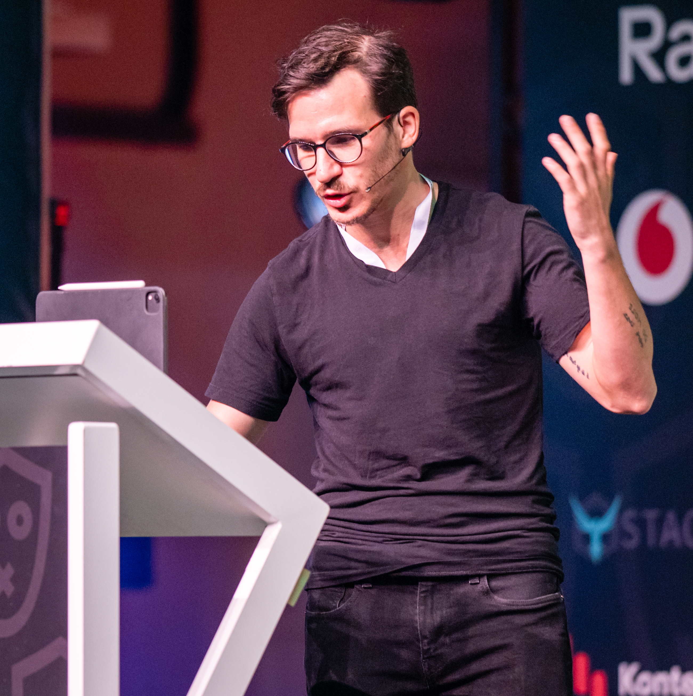

import { NewsletterSignup } from "@/components/newsletter-signup"
import { LatestArticles } from "@/components/article-listing"
import Workshops from "./workshops.mdx"
import Courses from "./courses.mdx"
import Talks from "./talks.mdx"
import Books from "./books.mdx"
import About from "./about.mdx"
import { SmartLink } from "@/components/link"

# Read Software Engineering Lessons from Production

Hi I'm Swizec 👋

I write emails with real insight into the career and skills of a modern software engineer. **_"Raw and honest from the heart!"_** as one reader described them. Fueled by **lessons learned over 20 years** of building **production code** for side-projects, small businesses, and hyper growth startups. Both successful and not.

> your emails are one of the few resources I've found that go much farther than, like, all the resources I'm accessing on a regular basis. I find the emails help guide my self-teaching approach to make choices that produce meaningful engagement
>
> ~ A Reader

Subscribe below 👇

<NewsletterSignup />

## Latest articles

<LatestArticles limit={5} />

<SmartLink className="button" href="/blog/">Read more latest articles 👉 /blog</SmartLink>

## Or explore by category

Learning from tutorials is great! You follow some steps, learn a smol lesson, and feel like you got this. Then you go into an interview, get a question from the boss, or encounter a new situation and o-oh.

I aim to bring you the good stuff you only learn by doing. To expose the seedy underbelly of production code. The good bits that take months and years to find.

### Learn the mindset of a true senior engineer

Getting that senior title is easy. Just stick around. Being a true senior takes a new way of thinking. Do you know it?

<LatestArticles pattern="Senior Mindset" limit={3} />

<SmartLink className="button" href="/categories/senior-mindset/">Read more Senior Mindset essays 👉</SmartLink>

### Ship fast without breaking things

Every team slows down as it grows. More people, more code, more meetings, less shipping. But you don’t have to slow down. These essays are the thinking behind my book [Scaling Fast: Software Engineering Through the Hockeystick](https://scalingfastbook.com).

<LatestArticles pattern="Scaling Fast Book|Velocity|Teamwork|Complexity" limit={3} />

<SmartLink className="button" href="/scaling-fast/">Read more essays on shipping fast 👉</SmartLink>

### Use AI without losing the plot

Coding got easy with AI but the engineering remains. You have to know what to build, recognize when the machine is wrong, and design systems that work at scale. Here I share lessons from using AI in production.

<LatestArticles pattern="\bAI\b" limit={3} />

<SmartLink className="button" href="/categories/ai/">Read more AI essays 👉</SmartLink>

### Read JavaScript and TypeScript lessons from production

JavaScript has been my programming language of choice since 2005 when it was called DHTML. Since 2019, I'm full into TypeScript — the perfect balance between flexibility and correctness.

<LatestArticles pattern="JavaScript|TypeScript" limit={3} />

<SmartLink className="button" href="/categories/javascript/">Read more JavaScript and TypeScript lessons from production 👉</SmartLink>

### Take your React beyond the tutorial

React is here to stay. It solves problems you may not even know existed. These essays are the good stuff I learned over the years.

<LatestArticles pattern="React|Frontend" limit={3} />

<SmartLink className="button" href="/categories/react/">Read more React lessons from production 👉</SmartLink>

### Find insights into Serverless and modern backends

I've been building web backends since ~2004 when they were just called websites. With these essays I want to share the hard lessons learned about serverless, databases, APIs, and the ops that keep them alive.

<LatestArticles pattern="Serverless|Backend" limit={3} />

<SmartLink className="button" href="/categories/backend/">Read more serverless and backend articles 👉</SmartLink>

### Lead without becoming a manager

Teams, mentoring, feedback, hiring — the people skills that turn a strong engineer into a force multiplier. No MBA required.

<LatestArticles pattern="Leadership" limit={3} />

<SmartLink className="button" href="/categories/leadership/">Read more Leadership essays 👉</SmartLink>

### Grow your engineering career

Your code gets you to senior. To go further you need more than code — interviews, negotiation, picking the right problems, and knowing what the business actually pays you for. These essays cover the career side of software engineering.

<LatestArticles pattern="Career|Interviewing|Salary|Compensation|Hiring" limit={3} />

<SmartLink className="button" href="/career-growth/">Read more career essays 👉</SmartLink>

### Go straight to the source

Blogs and hot takes are fun but the good stuff hides in primary sources. I like to read computer science papers and books cover to cover and write about what holds up in production and what doesn't.

<LatestArticles pattern="Papers|Books" limit={3} />

<SmartLink className="button" href="/papers-and-books/">Read more papers and books analysis 👉</SmartLink>

### Read about indie hacking from the trenches

Indie Hacking has been near and dear to me for over a decade. Diversifying your income is a wonderful habit. I don't write about running a side business as much as I used to, but many of these lessons permeate my approach to software engineering and the Senior Mindset.

<LatestArticles pattern="Indie Hacking|Business|Side Project" limit={3} />

<SmartLink className="button" href="/categories/side-project/">Read more essays about running an indie business 👉</SmartLink>

## What others are saying

[Read the full list of testimonials](/testimonials/)

> Swizec, I love your way of writing these newsletters. Often very relatable and funny perspectives about the mundane struggles of a dev. Lightens up my day.  
> ~ Kostas

> Great insights. Completely loved it.
> ~ Yannik

> It's extremely valuable on a daily basis, I didn't even know I needed it so much.
> ~ Bruno

> It’s inspirational, the examples you chose are simple enough to give me ideas and make it feel possible
> ~ Bestio

> Never really thought about the value of my engineer mindset since we've been conditioned to only care about the low level code. Thanks for the reminder to take a bigger picture view of our work.
> ~ l0cam0chaa

> Something that I needed to hear today :)
> ~ Elisa

> You inspire me Swizec. I love getting your emails. +1
> ~ Anthony

> Good lessons summarized neatly in a quick read
> ~ Nesim

> I enjoy your writing style. You make the content enjoyable and very readable!
> ~ Paula

> It had depth and story telling to relay the important message.
> ~ Bahit

> Its positive and infectiously so.
> ~ Toni

<NewsletterSignup />

## About

<About />

Here's how I help beyond the newsletter 👇

## Workshops

<Workshops />

## Books

<Books />

## Courses

<Courses />

## Talks

<Talks />
