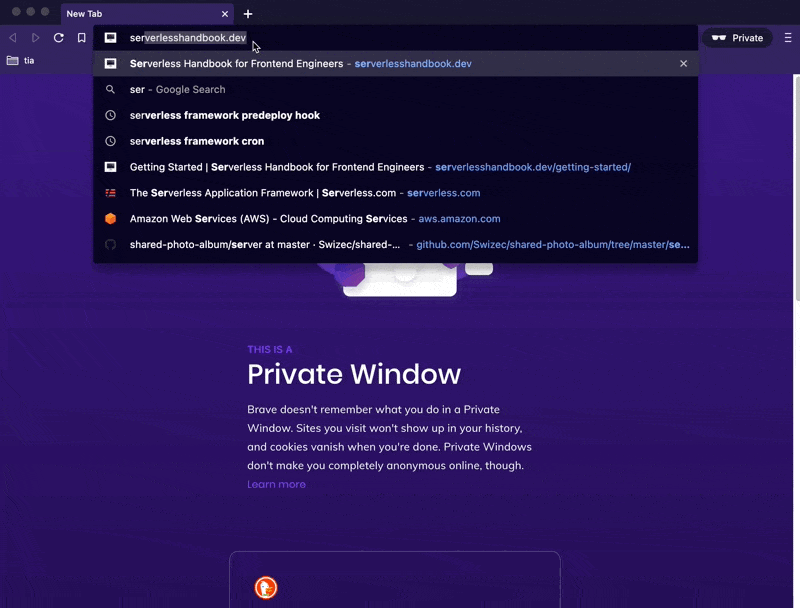
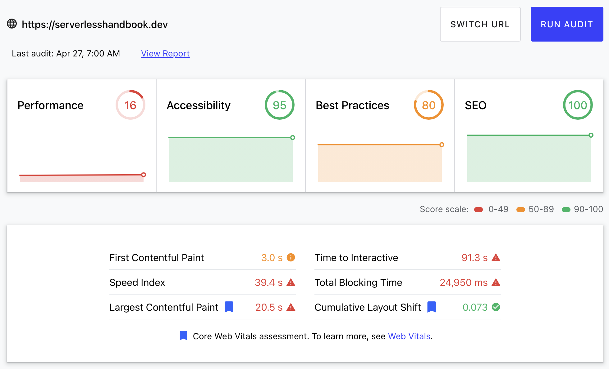
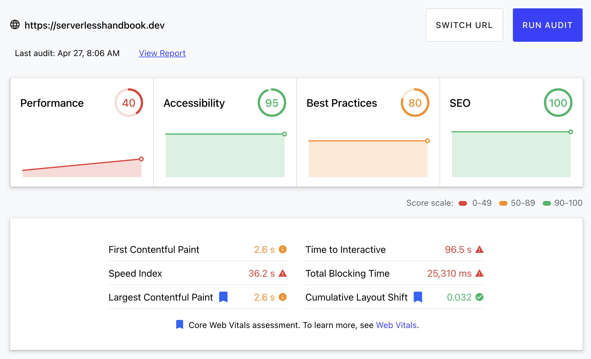
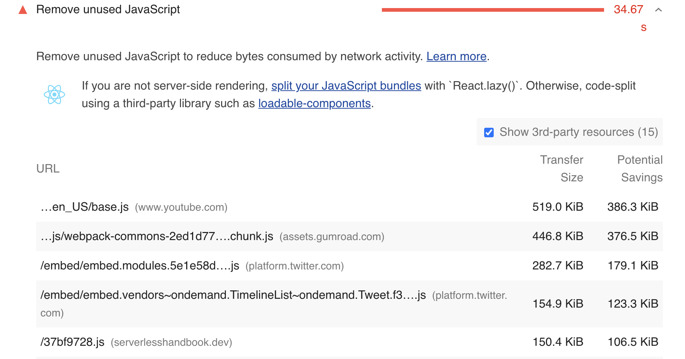

Your site may be fast for users, but Google don't care. Official metrics or bust.

_CodeWithSwiz is a weekly live show. Like a podcast with video and fun hacking. Focused on experiments and open source. [Join live Tuesday mornings](https://youtube.com/swizecteller)_

https://www.youtube.com/watch?v=xl9yyWh8Sj4

When you go to [ServerlessHandbook.dev](https://serverlesshandbook.dev) it feels fast. Even with a cold cache.



Vercel's edge network loads HTML fast, the CDN loads assets quickly, and Gatsby is great at quick renders and hydration. Static site – optimized for speed – turns into a React webapp optimized for interaction. Wonderful 👌

## The problem

Your [lighthouse scores](https://web.dev/measure/) tell a different story – the story that matters to Google and SEO.



16 sucks for a performance score. Google has been hammering down on slow sites and that means you have to care.

You and I know the page doesn't take 90 seconds to become interactive and Google don't care. If they can't measure it, they can't see it.

## 250% improvement with a bit of fiddling

An hour of fiddling gave us a 250% boost in measured performance. 🤘



Plenty of room for improvement, but 40 is much better than 16. Although time-to-interactive became worse 🤨

There must be a bug with how Lighthouse measures Gatsby sites, surely?

## Fix 1: Kill Youtube embeds

Despite Google's waxing poetic about web performance and how your site must be fast in the remotest of African villages, they're the worst code you can put on your site.

Check this out:



_"Oh hey you have unused JavaScript and maybe you don't know how to write decent code. Here are the files you should look at_

- youtube
- gumroad
- twitter

Right.

You _can_ remove Youtube from your site _and_ keep Youtube embeds. Using a facade.

[Facades](https://web.dev/third-party-facades/) let you load 3rd-party resources by showing a static preview first. When the user interacts, it turns into a full embed.

The [lite-youtube](https://github.com/justinribeiro/lite-youtube) plugin by @justinribeiro implements this pattern as a web component.

```javascript
// import anywhere globally
// gatsby-browser.js for me
import "@justinribeiro/lite-youtube"
```

```html
<!-- use in a page -->
<lite-youtube videoid="udqyBqCgLrU" autoload></lite-youtube>
```

You get a native-looking Youtube embed with perfect lighthouse scores.


## Fix 2: Kill big images

Gatsby and NextJS come with optimized image components these days. You render an image, transform into fancy formats on deploy, and make your site fast.

I forgot to use that for the cover image. Loaded 6MB of data 💩

Like this:

```javascript
import coverImg from "../images/cover.png"

// ...
;
```

That works. You can import images like they're code in every modern JavaScript environment.

And it leads to terrible performance.

Here's what you can do since Gatsby v3 – a new image component with a fantastic API.

```javascript
import { StaticImage } from "gatsby-plugin-image"

// ...
;<StaticImage
  src="../images/cover.png"
  alt="Serverless Handbook cover"
  loading="eager"
  objectFit="cover"
/>
```

`StaticImage` loads your image at build-time, optimizes into different formats, resizes to fit your container, and handles rendering in the browser.

The final result is an `` tag like this:

```html

```

Notice how many different sizes there are. That's so your phone loads the 469px image and your computer loads 1877px. Huge difference in file size.

`eager` and `lazy` loading supported out of the box 🤘

If you need dynamic images, you'll have to reach for the `<GatsbyImage>` component and fiddle with GraphQL. You can read more about Gatsby's new [gatsby-plugin-image](https://www.gatsbyjs.com/docs/reference/built-in-components/gatsby-plugin-image) on their docs.

## Tips for running Lighthouse

Lighthouse can be fiddly.

1.  Official score on [web.dev/measure](https://web.dev/measure)
2.  Dev score in Chrome devtools
3.  Ignore your JavaScript sizes when using localhost (they're unoptimized)
4.  Use incognito, browser extensions may impact your score

And if you know of a facade for Twitter embeds please let me know. That's the next area I gotta fix

Cheers,<br/>
~Swizec

PS: there's a Gatsby plugin I can't wait to try called [gatsby-remark-video-embed-lite](https://www.gatsbyjs.com/plugins/gatsby-remark-embed-video-lite/) which will turn _every video on all my sites into a facade_ 😍
