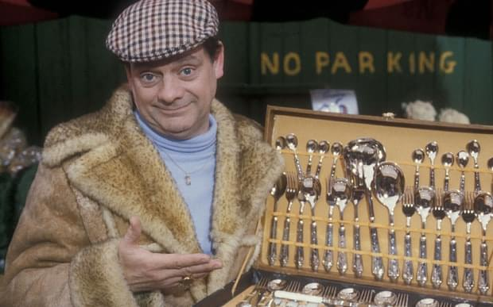

In [Only Fools and Horses](https://en.wikipedia.org/wiki/Only_Fools_and_Horses) Del Boy was a successful businessman with a cashflow problem. Always up to some scheme or another, always on the verge of _&quot;This time next year, we&#x27;ll be millionaires!&quot;_

That&#x27;s how I feel at the start of 2018. Many irons in the fire, not much happening.

Sidehustle is down to half a month&#x27;s runway. About \$900 in the bank.

Thanks to some luck in timing, it&#x27;s going to last a month. Already paid everything for this month.

Book sales are tanking, mind is preoccupied with other projects, day job startup is growing in needs. It&#x27;s starting to take off and I gotta keep things running on my end. Stressful.

I think the sidehustle made around \$1800 in sales for January. Haven&#x27;t had time to count. Thank god for marketing automation.

People don&#x27;t usually write articles about this point in their business. That&#x27;s why I am. It&#x27;s a roller coaster, ups followed by downs.

## Cashflow kills businesses

Did you know [cashflow kills 25% of small businesses](http://time.com/money/3888448/cash-flow-small-business-startups/)? This stuff gets real tricky real fast.

So here I am, a month of money in the bank, a few huge expenses coming down the pipe\[^1], and enough outstanding-but-not-yet-cash things to make your eyes water.

Oh yeah, I didn&#x27;t mention those before did I?

You know how [I did that workshop in December](https://swizec.com/blog/teaching-backend-devs-react-redux-stubhub-boston/swizec/7952)? Still no cash. Corporations are hard. After 50 days the invoice has entered processing. Now what happens I don&#x27;t know, I&#x27;m not even the point person on this. I just wait.

And you know how [I published Data Visualization With D3.js ](https://www.packtpub.com/web-development/data-visualization-d3js)through Packt a few years ago? Some of my words got used for a [subsequent edition](https://www.packtpub.com/web-development/d3js-4x-data-visualization-third-edition) last year and I&#x27;m credited as coauthor.

I get royalties for all of that.

Except I don&#x27;t because Packt has had the wrong bank details and that money never reached me. I didn&#x27;t notice for 2 years! 2 years!

Packt sent royalty statements. _&quot;We will pay you thiiiiiis much&quot;_. Packt sent money. Money bounced and went back to them. They didn&#x27;t tell me. 2 fucking years and not a word.

It&#x27;s a few thousand dollars and they assure me it&#x27;s coming February 15th for sure.

¯\\\_(ツ)\_/¯

Then there&#x27;s the [Big Deal I alluded to in a recent vlog](https://www.youtube.com/watch?v=k5wayr6tYzY&t=1s). I don&#x27;t wanna jinx it before money hits account but, damn.

There&#x27;s a word to describe this situation. It&#x27;s called stressful.

## Wait, didn&#x27;t you just brag about making bank last year?

It&#x27;s a roller coaster. Things go up. Things go down. Observers don&#x27;t notice because ups get likes, downs do not.

Algorithms then hide the downs because of low engagement and everyone thinks everyone is always crushing it. We&#x27;re not. Nobody is _always_ crushing it.

No matter what GaryVee wants you to think.

I did write about [having a damn good year](https://swizec.com/blog/how-i-sidehustled-72167-last-year-and-what-i-wanna-do-next/swizec/8016). But I got excited with my accounting and I&#x27;m still waiting to get some \$10,000 of that. Oops.

As my first ever freelancing client used to say: _&quot;I don&#x27;t believe in money until it&#x27;s in my bank account&quot;_

He was right. Don&#x27;t count your money before it&#x27;s yours.

On top of that, the sidehustle was living large in December. Got a [nice new monitor](https://swizec.com/blog/new-5k-monitor-lg-ultrafine-5k/swizec/7955), spotted the girlfriend some cash for a new laptop, gave my freelancers nice Christmas bonuses, prepaid a bunch of stuff for 2018, paid some taxes in advance ... it adds up.

You might think that was stupid, but it wasn&#x27;t. Just aggressive.

You see, spending &quot;excess&quot; money in one tax year on things that benefit you in the next year is a cashflow management strategy. You invest in the business and it lowers your taxes for this year and lowers your operating expenses for next year.

Spend the money when you have it, not when you don&#x27;t.

If you keep it, then next year you&#x27;re going to both pay a lot to the IRS _and_ still have to pay for the things you need. Double whammy.

Wouldn&#x27;t you rather just have the things you need? I would.

## So whatchu gonna do?

Well, there&#x27;s two ways a product business makes more money.

1. Get more leads.
2. Build new products.

Time to clean up the distractions and focus on those two. The money will come. Follow the process. 🙏🏻

Not much I can do about the money that&#x27;s already on the way. I can wait, maybe send some emails. Good thing I put some money away when times were good so I can cover the cashflow hole while I wait.

Ever heard of [the grasshopper and the ant](https://en.wikipedia.org/wiki/The_Ant_and_the_Grasshopper)? Save for a rainy day. It _will_ come.

\[^1] Maybe not huge for you but huge for me, a few thousand dollars are gonna go _poof_ for some important things. I&#x27;ll talk about it when that story concludes.
