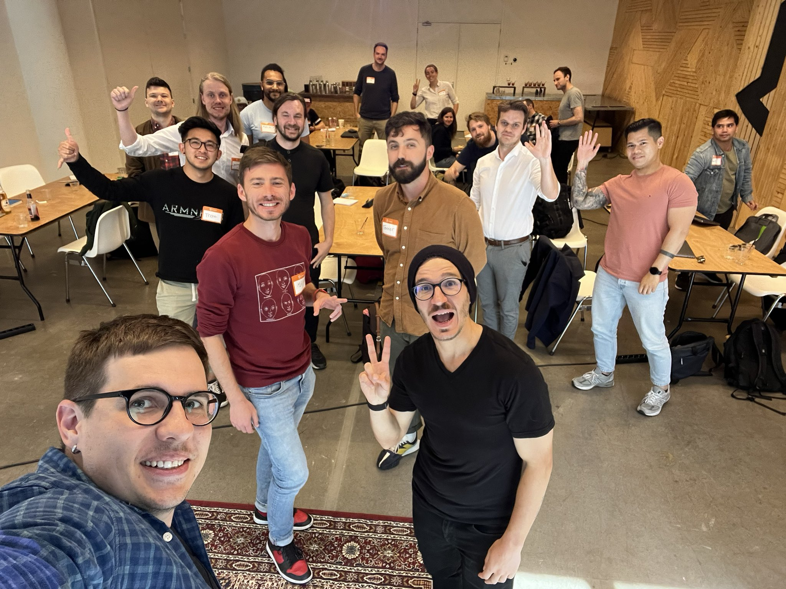
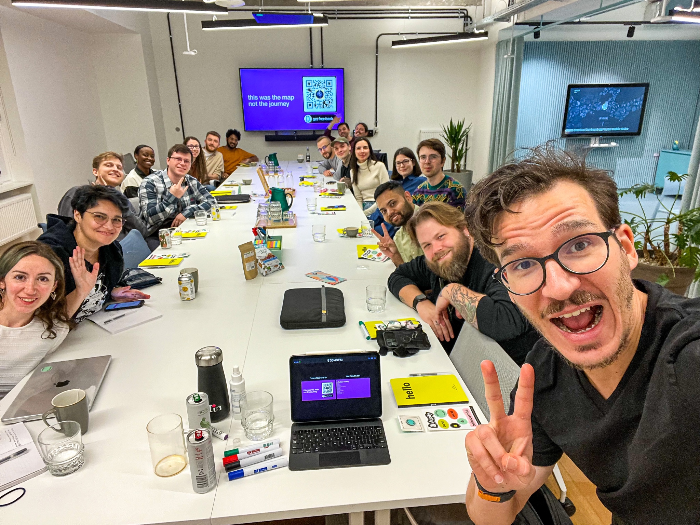
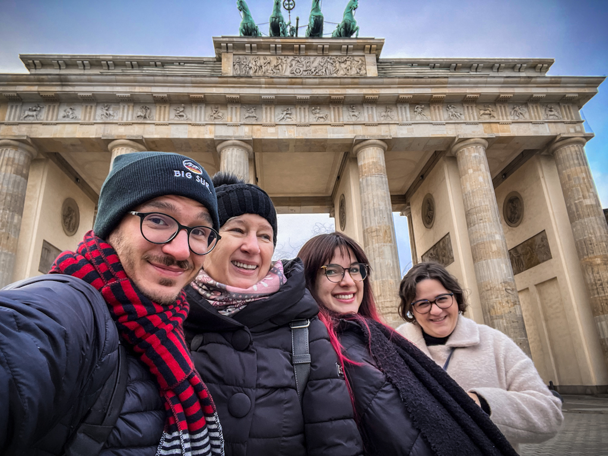

The days are long, but the weeks are short. In the wash of our daily grind, you lose sight of what a year can bring. Or a decade!

A [smart fella once said](https://fs.blog/gates-law/) _"Most people overestimate what they can achieve in a year and underestimate what they can achieve in ten years."_

That's why I like to take a moment around the new year to reflect and make plans. An arbitrary line in the sand, I agree, but it's the one way I know to combat [moving goalposts](https://en.wikipedia.org/wiki/Moving_the_goalposts). You know how it is: the year starts, you make a plan, get halfway there, then the goal moves because it suddenly doesn't feel ambitious anymore _because you're halfway there_.

Here's my highlights, I'll expand below:

- greencard
- tech lead
- 2 new products
- book deal with Manning
- $46,000 on the side
- 2 marathons
- covid
- see family after 3 years

## Greencard

https://twitter.com/Swizec/status/1520247297056993281

This April I finally got my greencard 🥳 No more "Will they let me in this time?" anxiety at the border, no more expensive lawyers, no more renewing documents every 2 years. I'm here.

It took 12 years from [the first time I visited USA](https://swizec.com/blog/some-general-impressions-of-the-us/) and thought _"Wow, Silicon Valley is the place for me"_. The real do-or-die moment came in April 2015 when I [crash-landed in SF with a few thousand dollars and no intention to go back](https://swizec.com/blog/temporarily-homeless-a-story-in-one-dumb-move/).

After 12 years of running hard, it feels like I have reached the start line. Worth it? We'll see.

You can read more about how a schmuck like me got an "exceptional ability" greencard in [How I used indie hacking to sponsor my own greencard](https://swizec.com/blog/how-i-used-indie-hacking-to-sponsor-my-own-greencard/).

## Tech Lead

I'm a tech lead now! Kinda like a baby staff engineer (of which we have none). The industry is still figuring this one out 🤷‍♀️

https://twitter.com/Swizec/status/1581060830581252098

My motivation for taking this step is to work on projects bigger than what I can achieve myself and being in the room when you can shape requirements to fit the time available. That's worth gold my friend.

You can read more about the transition, [here](https://swizec.com/blog/on-becoming-tech-lead/).

I think this proves that my [Senior Mindset](https://seniormindset.com) stuff works.

## 2 new products

This year we launched 2 new products in what is the biggest pivot since I started focusing my nights and weekends on [creating books and courses for engineers](https://swizec.com/blog/5-years-of-books-and-courses-or-how-i-made-dollar369000-on-the-side/).

They're the [Senior Mindset book](https://seniormindset.com) and workshop. My first foray into a more evergreen topic that doesn't expire in 6 months.

Changing the way people approach their work and career feels infinitely more rewarding than talking about the framework du jour. Feedback so far has been great ✌️

The conversations this topic creates in a full-day workshop are amazing! I want to do more this year. Think your company would want to run a Senior Mindset workshop? [Hit me up](mailto:swizec@swizec?subject=Senior%20Mindset%20Workshop).

## Book deal with Manning

In November 2021 I realized that there's a book in me: Things I learned about software engineering while [growing a company 10x in 2 years](https://swizec.com/blog/how-to-rewrite-your-app-while-growing-to-a-dollar100000000-series-b/).

I hope this book makes it big. My dream is to stand next to books like Phoenix and Unicorn Project, The Art of Science and Engineering, and The Pragmatic Programmer.

For that, I needed a publisher. You, the readers, helped me polish the proposal and in spring the deal was signed. Now I'm 20,000 words in (5 of 8 chapters) and polishing the first 3 chapters to be ready for early access launch.

Soon 🤞

As expected, working with serious editors who aren't on _my_ payroll is making this book crazy good. I'm excited.

## $46,000 on the side

The toughest question every indie hacker has to answer is this: _"Do you run a business or a job?"_

A business is something that has value outside _your_ work. A job doesn't. The difference can be subtle.

For the past 2 years, I've been trying to turn my book&courses side-hustle into a business. Hiring help, using money instead of hustle, building evergreen sales funnels.

It's working. After a painfully devastating 2021, we hit 214% year over year growth and a pretty decent ROI 🥳

https://twitter.com/Swizec/status/1609985443201970183

Here's the breakdown (after fees):

- Senior Mindset book: $22,600
- Senior Mindset Workshop: $18,000
- React for Dataviz: $2,600
- Serverless Handbook: $1,800

Not bad for a pivot. I think there's room to go another 2x this year. 🤞

My hourly rate for the 26% ROI comes out to $35/h. Business is a long game. You hope the rate grows later.

## 2 marathons

I ran two marathons this year – Santa Rosa and Sacramento. Got my time down to 3:15:27, which is fast, but not good enough for Boston.

https://twitter.com/Swizec/status/1563936763172622336

https://twitter.com/Swizec/status/1599474280068132864

Gonna try again this year. The goal is pointless but the path to getting there is useful. Lots of thinking time.

## Covid

Got covid in December 2022. Achievement unlocked?

It wasn't very eventful. Landed in Slovenia after a week of Berlin, felt very quite tired, slept until 4pm the next day. Then I felt fine and did a full workday.

Next day I tested positive. Stayed home, didn't see friends, tested negative the morning of my flight out of Slovenia. Perfect timing 🫠

## See family after 3 years

Not once but _twice_ 🥰

Living an ocean and 9 timezones apart made the pandemic a challenge. I'm pretty stoked that I got a chance to visit Europe twice this year. Now it's their turn to visit.

Cheers, 
~Swizec
