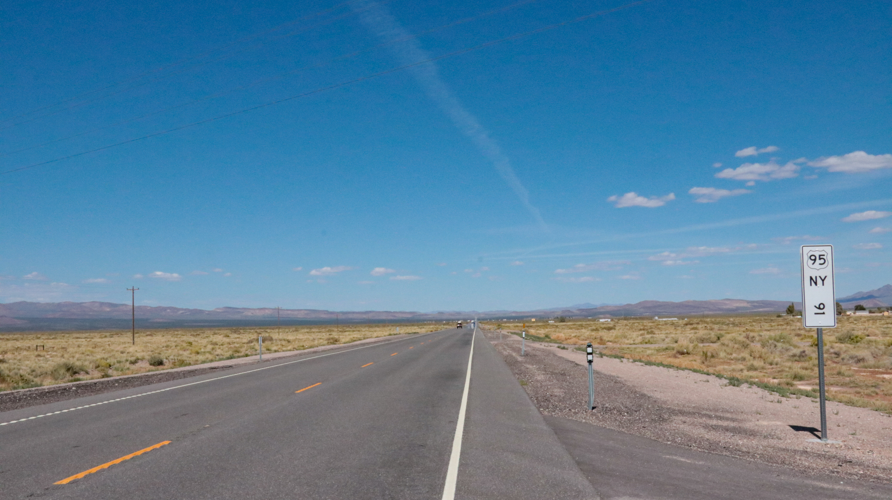

Roadtrips are my favorite adventure. You see epic views, get time to think, and experience parts of a place rarely seen by outsiders.

Like when we stopped in [Benton](https://en.wikipedia.org/wiki/Benton,_California), an old mining town with an intersection, a gas station, and a couple abandoned buildings. You cannot imagine the relief you feel upon finding gas in the middle of the desert when your tanks are running low, night is near, and you hadn't seen a human in hours.

Next gas station: 82 miles 😅

It was an epic roadtrip and I looked damn cool doing it.

There was going to be a vlog about the adventure, but I don't feel like editing that together. It's not so interesting. Not enough drama, not enough camera work. I'm no [Claudio](https://en.wikipedia.org/wiki/Claudio_von_Planta) from Long Way Up/Down/Round.

Instead, you get a photo essay :)

_PS: you'll have an easier time with photo captions, if you [read on the web]()_

## The adventurers

My mom and her boyfriend flew in from Slovenia and rented a GS 1250. I took my gently modified Street Twin.

For those of you who don't know: Europe in summer is full of couples in their 50's touring on motorcycles. A stereotype as strong as Americans buying a big-ass RV.

They wanted to explore USA and see places they've never been. And I wanted to have an adventure. Perfect.

## The route

Our plan was to see a few national parks and two big cities. My mom hasn't explored much of USA and her boyfriend's never been here at all. Wanted to give them a good selection of things to see.

Forgot to record the last day and my app (Gaia GPS) crashed a few times, but here's the route we took:

We drove through 4 states – California, Nevada, Arizona, Utah – and saw:

- Yosemite
- Vegas
- Zion
- Bryce Canyon
- Grand Canyon
- Los Angeles
- Carmel

Had to skip Death Valley due to flooding. Whole park's closed.

The route was a bit much for 9 days. We all got tired of packing and unpacking our bikes every day. Next time I'll plan for a few double days like we had back in 2013 while [driving around Europe for a month](https://swizec.com/blog/a-month-on-the-road/).

## The pictures

I got a lot of GoPro footage from my bike. It's all boring. 😂

Photos from my DSLR came out great though. Here's a few of my favorites passed gently through Lightroom to improve the colors. Remember to read the captions.

No photos from the final day of riding from a random motel in [Santa Maria](https://en.wikipedia.org/wiki/Santa_Maria,_California) to [Carmel](https://en.wikipedia.org/wiki/Carmel-by-the-Sea,_California) to San Francisco. We barely had time to stop and I visit that area plenty so it didn't feel special.

Funfact: We saw an FBI raid on a neighbor's room in that Santa Maria motel. It was just like the movies.

### Day 1: San Francisco to Yosemite

### Day 2: Yosemite to Tonopah

### Day 3: Tonopah to Vegas

### Day 4: Vegas to Bryce Canyon

### Day 5: Bryce Canyon to Grand Canyon

### Day 6: Grand Canyon to ... a desert town

### Day 7: A desert town to Los Angeles

### Day 8: Los Angeles to Santa Maria

## The deep thoughts

You'd think after 8 days of meditation on the high road I'd have deep insights to share. I do not.

Your mind focuses on the present moment. There is no past, and no future. There is only you, the road, and that nagging pain in your knee because you're definitely on the wrong bike for this sort of thing.

https://twitter.com/Swizec/status/1703229903129477617

Then you come home and reality comes crashing back. That's when the insights happen. In that split second before you get back in the groove and you see life with a fresh perspective.

https://twitter.com/Swizec/status/1706321768183398600

Has that ever happened to you?

Cheers, 
~Swizec
