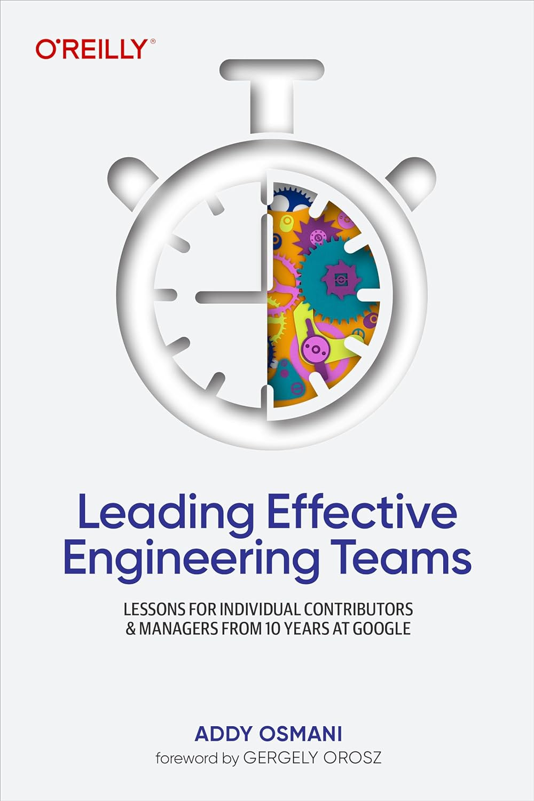
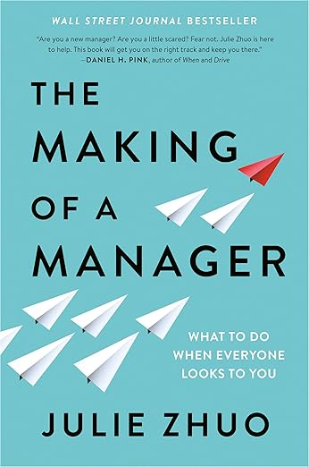

Ever feel like your brain is blended and you can't even keep up with the things you're learning? Me too. But the good shit stays.

So here's the good shit from 3 books I read in recent weeks.

## Leading Effective Engineering Teams

Addy Osmani blends insights from years of practice with studies done inside Google on what makes great engineering teams and effective managers. It's psychological safety.

If people don't feel safe to experiment and challenge each other, nothing else matters. You want a culture where loud voices don't drown out the hard insights.

The sticky idea that shapes Leading Effective Engineering Teams: You have to be effectively efficient.

Efficient is about how you work. Effective is about what you work on. You need to work on the right things to get the results you want. And if you don't know the results you want, start there :)

## The Making of a Manager

Julie Zhou talks about her experience becoming a young manager at a young Facebook and growing from there.

The core sticky insight is that in a growing company everyone feels like they're at the edge of their abilities. You're supposed to feel like you're failing while the people around you say you're doing great.

If you feel comfortable, you're not pushing hard enough. Or the company has stopped growing and there's nowhere for you to go.

Give the comfortable parts to someone else so they too can grow.

## An Elegant Puzzle

Will Larson shares his learnings on software engineering teams across Digg, Stripe, and others. This is the book that clicked with my coding brain the most. I don't know why.

The stickiest idea was that when you're growing 2x every 18 months, you're basically a new company every year. Everything changes, everything breaks.

Your processes are out of date. Your code is out of date.

Your success hinges not on your ability to engineer scalable systems, but on your ability to migrate from one system to another. Because you're always mid-migration. The systems you built last year are no longer fit for purpose.

And you can't just throw people at the problem. If you hire faster than you can train, you'll reach negative productivity growth.

It's normal for marginal productivity gains from each new engineer to diminish (+1 to 100 is less than +1 to 5), but never let it go negative. Streamline.

Cheers, 
\~Swizec
