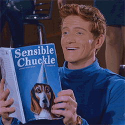

https&amp;#x3A;//twitter.com/Swizec/status/1055664626187173895

31 is a weird age. It&#x27;s so… normal.

If it wasn&#x27;t for my girlfriend and my coworkers, I probably wouldn&#x27;t even have noticed. Just another Thursday trying to get React + D3 2018 wrapped up and perfect.

Of course, React did just announce hooks, so I have to update a bunch of my updates 🤔

But yeah, 31 is weird.

Definitely not a wunderkind anymore. That boat has sailed.

Too old to gripe about never making 30 under 30.

Too old to gripe about anything age/achievement related, really. What&#x27;s done is done. Never again will I ever hear _&quot;Wow, you&#x27;re so X for your age”_.

Got a career, I think, but in your 30’s, you&#x27;re supposed to. Everyone does.

Got okay income, not spectacular, not terrible. But in your 30’s, that&#x27;s expected.

Not living hand to mouth, yay! A few years ago, I was. But in your 30’s, that&#x27;s just normal. No medal. No participation award. No pat on your back.

Yep, definitely too old for anyone to be impressed by what I&#x27;ve achieved in my life.

And yet far too young to complain about old age.

Last year, it was funny. Oh noes I&#x27;m THIRTY that&#x27;s so old I&#x27;m ancient omg! Ha ha, chuckle. Oh you.

At 31, nobody thinks that&#x27;s funny. C&#x27;mon kid, you still call your knees left and right. Wait until they&#x27;re good and bad. Then you can say you&#x27;re old.

But 31 is old enough. You see those first signs of aging.

Hair&#x27;s thinning. Can&#x27;t deny that one anymore. It&#x27;s thinning.

Reflexes aren&#x27;t what they used to be. Can&#x27;t use speed and power in the boxing ring no more. Gotta rely on experience and skill. Punch for punch slugging I get smashed every time.

Sometimes I can still overwhelm less experienced fighters with volleys. But then I&#x27;m gassed and they get me.

Getting harder and harder to keep the fat down, too. I tweak MyFitnessPal to fewer and fewer calories and nothing happens. Pounds stay on, body fat percent remains annoyingly constant.

Running hard and fast and far is getting harder, too.

Little things. A second here. A little more effort there. Just a smidge of my body saying, _&quot;Hey you&#x27;re not 25 anymore&quot;_. If I wasn&#x27;t training every day, I wouldn&#x27;t even notice.

But I know my body, and I can tell it&#x27;s slowing down. Even though I&#x27;m in the best shape of my life.

Brain too.

Brain needs more rest than it used to. Nights are getting longer. Mornings are getting earlier. I can&#x27;t stay up all night hacking away and being productive anymore.

I could. But it&#x27;s not as productive as it used to be. And I feel it the next day more than I used to.

I could push through. Work through the tiredness and the brain fog and all the mistakes you spend fixing the next two days. But part of 31 is that I&#x27;m not sure I want to.

And that&#x27;s the biggest shame of turning 31. I&#x27;ve lost some of the foolishness. Lost some of the fuck it let&#x27;s try it. Gained more of the eh I don&#x27;t know if that&#x27;s worth the effort.

31 is weird.