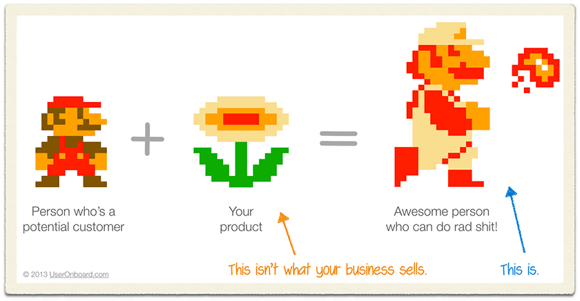
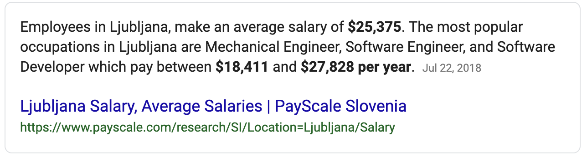

> Your code doesn&#x27;t matter. Your tools are irrelevant. Shipped beats perfect.

https&amp;#x3A;//twitter.com/Swizec/status/1106450826308939778

That&#x27;s the biggest lesson I learned working in the heart of Silicon Valley. Outside your team, nobody cares about your code.

Your line breaks don&#x27;t matter. Your single quote, double quote, or backtick debate is a waste of time. Named arguments or not, short functions or long, fat views or models, single file or many, React or Vue, NoSQL or Postgres, ...

None of it matters.

You know what matters?

Did you find customers? Do they enjoy your product? Are they paying? Are you improving the lives of hundreds of people or thousands?

That&#x27;s what matters.

How many lives has your code improved?

Until you work on that, nothing else matters.

## Your code won&#x27;t matter if you&#x27;re dead

My former CTO once explained to me when I huffed and puffed into our 1-on-1 that our codebase is terrible and hard to work with and that if we don&#x27;t do something quick, we soon won&#x27;t be able to ship features anymore! What would the engineering team come to, if all we ever do is trip over ourselves and our shitty code?

_&quot;Look mate, we don&#x27;t even know if we&#x27;re gonna be alive in 6 months. What code quality? What impending doom? Just do your best, work around the issues, and let&#x27;s survive first&quot;_

He was right.

You are a talented engineer. You&#x27;re paid a lot of money. Your job is to keep the duct tape and chewing gum charade going long enough for the business people to even figure out what they want.

Companies and products go through stages.

At first everything is a prototype. You build it. Try it out. See if it works.

Then you rip it out and try something else.

How well must you engineer something you&#x27;re throwing away 3 days after deploy because customers hate it?

## You die a prototype or become that code everyone hates to work with

Sometimes your prototype survives, hits its stride, and you&#x27;re left dealing with your own mess for the next 3 years.

That&#x27;s a good thing!

If you don&#x27;t feel bad looking at your old code, you&#x27;re not growing. Fact. Your old code always looks like crap.

Old code that isn&#x27;t shitty was over-engineered the first time around. You _want_ to ship prototype code. Faster iterations, faster learning, company/department/team more likely to survive.

You&#x27;ll fix the code later, if it proves itself.

That&#x27;s a platitude. You won&#x27;t have time. You&#x27;ll be working on a million other things :P

## Don&#x27;t fix it until it breaks

https&amp;#x3A;//twitter.com/Swizec/status/1049786180483477504

So when _do_ you fix old code?

When it breaks. When it tells you where it hurts.

Would you put a cast on your leg just in case? Maybe you&#x27;ll get in a car crash and break it. Good thing the cast is already there!

Sounds silly right?

Yet we do that with code all the time. An article made the rounds recently: [You are not Google](https://blog.bradfieldcs.com/you-are-not-google-84912cf44afb).

_&quot;Oh noes I better build for scale! I need Hadoop and a million microservices, and I better engineer this real good. What if we get a million users all at once and our Ruby On Rails app buckles?&quot;_

You won&#x27;t.

To quote [Rob Pike&#x27;s 5 Rules of Programming](https://users.ece.utexas.edu/~adnan/pike.html): N is usually small.

> Fancy algorithms are slow when n is small, and n is usually small. Fancy algorithms have big constants. Until you know that n is frequently going to be big, don&#x27;t get fancy. (Even if n does get big, use Rule 2 first.)

Build it the most obvious simplest way first. When that breaks, make it more complicated, if you have to. Simple systems are easier to fix and they break less often.

Optimize for simplicity, not speed or scale.

## Relax constraints

You can often make an unsolvable problem solvable by relaxing constraints. When the business people say &quot;the best&quot;, they often mean &quot;good enough&quot;. When they say &quot;guaranteed&quot; they often mean &quot;unlikely&quot;.

There is a world of difference between writing software that works well enough in the real world and software that is provably always correct in the mathematical sense.

You likely don&#x27;t need perfection. Ask.

## If your code doesn&#x27;t matter, what does?

Can you ship on time?

Does it work when you ship?

Do your customers love it?

Do you _have_ customers?

Can you add features?

Can you fix it when it breaks?

Not if, when.

Can your team work on your code when you can&#x27;t?

Optimize for those and you&#x27;ll be fine. Write code anyone can understand, write code that&#x27;s easy to expand, write code that&#x27;s easy to fix.

However you and your team get there, it&#x27;s all good. React, Vue, Reason, JavaScript, Java, or FORTRAN. Whatever floats your team&#x27;s boat and gets the software shipped and in user&#x27;s hands.

## San Francisco is expensive but worth it

https&amp;#x3A;//twitter.com/Swizec/status/1116735066216919040

When I first moved to San Francisco a lot of friends back home poked fun at me. It&#x27;s too expensive they said. It&#x27;s not worth it. It&#x27;s covered in shit. Literally. There&#x27;s too many homeless people. It&#x27;s too tech bro.

Yeah, it&#x27;s covered in poop. There&#x27;s heroin needles everywhere. You get used to the homeless people. They mean you no harm.

Don&#x27;t bother them, they won&#x27;t bother you. It&#x27;s like you&#x27;re living past each other. Two people stuck on different sides of the class divide, rarely interacting.

It&#x27;s like a cyberpunk movie.

And yeah ... it&#x27;s expensive. But San Francisco is expensive for a reason.

I work in and with startups. That caps my salary at Not Very High. And even that makes my life cushy enough.

Engineers back home don&#x27;t make much

Back home a well paid engineer with a local job makes around $25,000/year.

In San Francisco I can save almost that much every year even without my side hustle. You need about $5000/month for a normal life with an SO. You won&#x27;t take Uber all the time and maybe you can stick to just 1 latte per day, eat out only a few times per week, and keep it to 1 maybe 2 vacations per year.

Wait ... that sounds pretty cushy!

With a normal software engineer at a startup salary, you&#x27;ll still have way more than $1000 left over every month. Maybe that doesn&#x27;t sound like a lot to you. To me it was unimaginable just 5 years ago.

Only people back home I know who pull that off are engineers playing the income arbitrage game. Live in a cheap country, work remotely for a rich country.

But that makes you lazy.

And I have friends here who work with big companies. They make upwards of $300k per year. More cash left over than they know what to do with.

## The environment pushes you 🔥

That&#x27;s my favorite part of San Francisco. The fire under butt.

In San Francisco you never feel like you&#x27;re making it. You never feel like you&#x27;re crazy successful. You never feel like you&#x27;re out of the woods.

One bad month or two and you&#x27;re digging into your long term savings. You have short-term cash buffers because d&#x27;oh.

You don&#x27;t want to dig into long term savings. Those exist for 70 year old you and for any Life Stuff that comes up.

Everyone in San Francisco is always crushing it. Or says that they are.

And that&#x27;s a good thing.

You are the average of the 5 people you spend most time with. You can&#x27;t fight your environment. But you can change it.

That said ...

## SF is not an entrepreneurial mecca

This one surprised me.

I always thought San Francisco was an entrepreneurial mecca. But it isn&#x27;t. San Francisco is a careerist mecca.

People don&#x27;t come here to start companies. People come here to get rich _in_ companies. It&#x27;s too expensive to be on your own.

Come here, make a bunch of money, leave. 5 to 10 years.

Switch a bunch of jobs, play the career game, climb the startup ladder, and get the hell out. Catalyst for leaving is often kids or a good liquidity event.

Some just get tired of the grind.

Fire under butt is great when you want to grow, terrible when you need some rest.

## ✌️

And that&#x27;s what I learned about San Francisco in my 4 year stint so far

1. Your code doesn&#x27;t matter
2. Shipped beats perfect
3. Everything&#x27;s a prototype
4. Play the career game
5. It&#x27;s expensive for a reason

Happy Monday ~Swizec