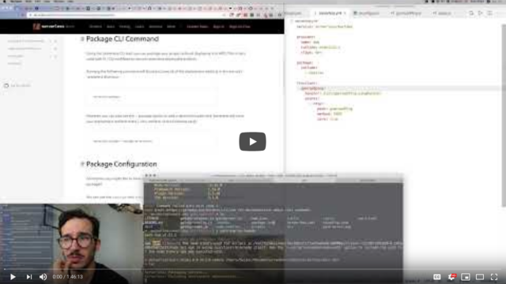
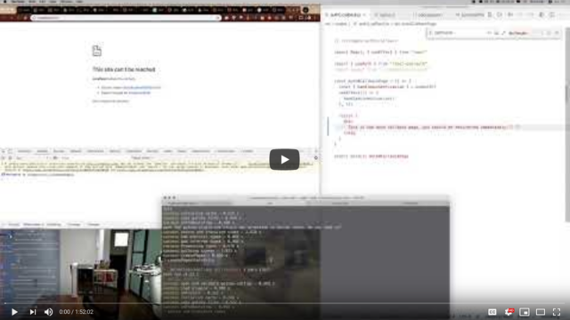
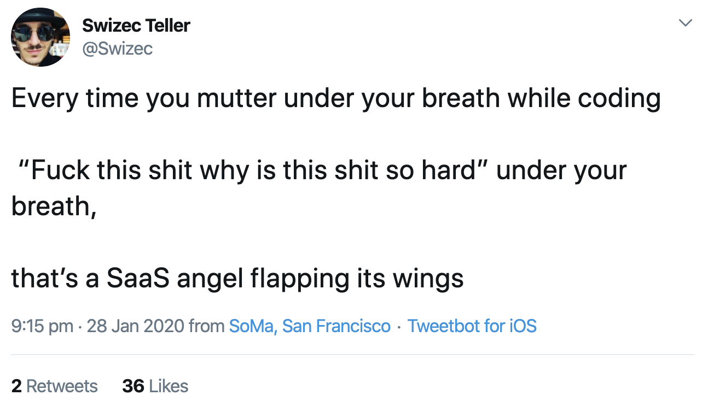
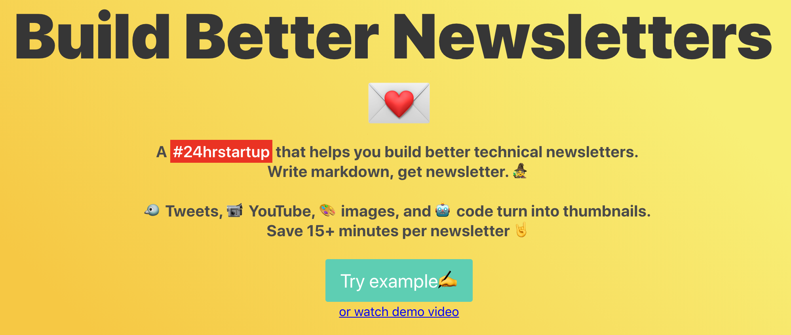
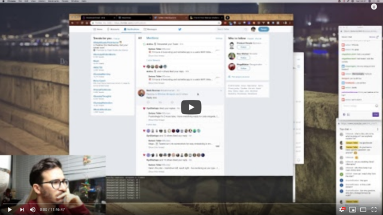
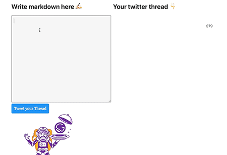
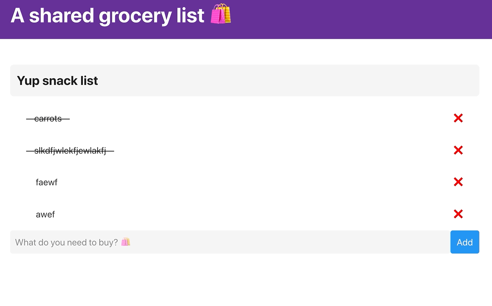
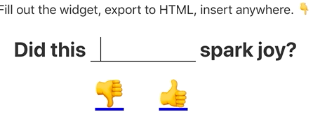

We've been talking about the hyper productive modern web stack and let's be honest: It needs a better name.

Naming is hard, my friend. One of the 2 most difficult things in software engineering: Naming things, cache invalidation, and off-by-one errors.

Today I wanted to show you some apps I built while researching this new stack for over a year. Best practices are still changing and we're just starting to see what's possible, but patterns are beginning to emerge.

That's the perfect time to [jump into the future](https://serverlessreact.dev) ✌️

## ServerlessReact.Dev course platform

Starting with my new course platform – great example of _feeling pain_ and **solving the problem**.

My ebooks used to live on Gumroad. Great checkout experience, just enough tools for creators, poor UX for consuming.

So I switched to Teachable. You buy on Gumroad and a Zapier integration gives you a Teachable account with the right permissions.

Teachable's authoring UX is _terrible_.

Markdown is my jam so I spent thousands of dollars on engineering to make Teachable work with markdown. Yes I legit hired an engineer to help me.

The thought of making another course on Teachable filled me with dread.

Looked around and Podia made me 😍 ... until I learned it doesn't do markdown, supports only 1 video per lesson, can't embed CodeSandbox, doesn't support random iframes (for graphql playgrounds :P), etc.

_"Hey wait a minute, we just built an amazing platform for Serverless Handbook! Why don't we use that?"_

[Serverless Handbook](https://serverlesshandbook.dev) started life as the Rebass Docs. I love Rebass and I love their docs. So I ~~stole~~ borrowed their open source Gatsby code.

MDX support (markdown with React), fast loads, mobile design, static builds, even has themes for different colors 😍

I CAN DO EVERYTHING THE POWER IS MINE

What does a course platform need that a free book doesn't have?

Authentication and authorization.

Sat down over a couple livestreams ... **and it worked**

You buy on Gumroad.

Gumroad pings a serverless lambda function.

Lambda function creates an Auth0 account. Gives you the Student role.

You go to [ServerlessReact.Dev](https://serverlessreact.dev) and click Student Login.

useAuth redirects you to the Auth0 login page.

You come back and voila, access to the course.

And THAT's what I want to teach you with [ServerlessReact.Dev](https://serverlessreact.dev)  {{ subscriber.first_name | truncatewords: 1, "" | capitalize }}  my friend . **Spot a problem 👉 create the solution.**

## TechLetterApp

You've seen this one before. It's the 24hrstartup challenge app that first made me excited about this modern new stack.

Pat Walls posed a challenge in November 2018:

_Can you build & launch a startup in 24 hours? Do it live on stream!_

Pat is crazy. There's no way.

Fuck it let's try.

12 hours later [TechLetter.App](https://techletter.app) was born. 😳

Write email in markdown as usual. Paste into box on the left, get rendered HTML on the right. Nothing special, just some markdown parsing and rendering.

Now here's where it gets cool 👇

This app uses an AWS Lambda to take screenshots of tweets, make youtube and instagram thumbnails, and make beautiful screenshots of code samples.

I used to pay someone $500/month to do that for me.

You see the power of TechLetter.App every time you read my emails 😉

Yes I've fixed many bugs and added tiny little features since that first 24hr challenge. Even bought a domain to fully productize, but haven't.

## ThreadCompiler

This one died a prototype. You either die a prototype or become that code everyone hates to use.

I realized I was playing catchup with Twitter's UX and that's a losing proposition right there. You can still try it out tho 👇

ThreadCompiler is an offline-first React app built with Gatsby. UI renders at compile time and becomes static. On page load the React app takes over and you can do whatever you want.

In this case that's a combination of markdown parsing and rendering, talking to Auth0 to authenticate users with Twitter, and using another AWS Lambda to publish tweets.

All built with JavaScript front and back. No databases, just Auth0.

## Shared grocery list

Yawn, a grocery list right? It's just a TODOapp.

BUT THIS ONE IS REALLY COOL!

Check it out 👇

- Gatsby-based offline-first React UI
- Initial list compiled into the app at compile time with GraphQL
- On page load, uses GraphQL to ask a Serverless Lambda for current state
- Refreshes the UI
- All interactions sync right back to the Serverless Lambda with GraphQL
- Global list stored in a simple DB

Server with user data, accessible by all, without writing a single specific API. No REST routes to manage, no servers to keep up, just a Lambda that responds to GraphQL queries.

This was the example app for my sold-out workshop at Reactathon in March 2019. I'm doing [another one this march](https://ti.to/real-world-react/modern-app-with-react-workshop-2020).

## Spark Joy

Spark Joy is where I really pushed this stack. _We_ pushed this stack. It was built during a live video series experiment mid 2019.

You can try it out with the thumbsup/down buttons at the end of this email 😛

I like feedback. I really like feedback. _On everything_.

That's why any time you [buy something from me](https://serverlessreact.dev/) the first thing you get is a question: _"Why did you buy this?"_

And why my emails used to have ugly typeforms: "Hey did you enjoy this?"

That shit got tedious so I built Spark Joy. A simple thumbsup/down widget that gets all the info with much less friction.

Where emails used to get 10, maybe 20, responses, they now get 60 and more. That's hella more feedback I can use to improve.

It's also where the prototype for [useAuth](https://github.com/Swizec/useAuth) was born. ✌️

Spark-joy creates a new static page for every type of widget you create and triggers a Netlify build+deploy.

So when you vote the page loads fast. None of that slow TypeForm crap.

And this is just the beginning my friend. This hyper productive new stack blows my mind. _So much is possible that wasn't before_

I'm excited to see what you build.

Cheers,  
~Swizec

PS: you can learn behind-the-scenes lessons of these projects and others in [ServerlessReact.Dev](https://serverlessreact.dev). The $100 launch discount ends on Friday.

PPS: much of my excitement for this stack comes from lessons learned while building a 7-figure business from scratch on Rails, moving towards SinglePageApps, now JAMStack and Serverless at my day job. ServerlessReact.Dev really does include lessons from practice :)
