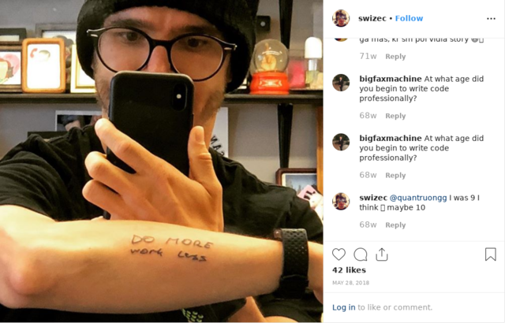

import { ContentUpgrades } from "@swizec/gatsby-theme-course-platform"

5 years ago I moved to America to chase a dream 👉 stop selling time.

Back then I was a freelancer with an okay business. Focused on early stage startups in USA, kept up to 2 clients in parallel, and couldn't grow. Charging more was tough, selling more time impossible, business model hard to iterate. Cycles long and unpredictable.

You can read more about my freelance journey [in this series of articles](https://swizec.com/categories/freelancing/).

After a few shorter stints in USA (visa issues) in April 2015 I packed my 2 suitcases and left Slovenia for good. America or bust.

https://twitter.com/Swizec/status/1281244272264507392

My business visa allowed a 6 month stay.\[^1]

A former client raised a seed and moved to SF proper. When they heard I was back in town they offered a full-time job, a raise, and help with the visa.

I said yes, fired my clients, and got to work.

This helped on two fronts:

0.  My freelance income was not enough to live in SF like an adult. Sharing an apartment with my girlfriend and 5 room-mates, mehhhh
1.  Visas are expensive and hard to get without a sponsor. Especially the O-1 visa I wanted because it doesn't involve lotteries. More of that story in [How I got a visa normally reserved for Nobel laureates](https://swizec.com/blog/how-i-got-a-visa-normally-reserved-for-nobel-laureates/)
2.  A job provides stable income for stable time. You show up, do the work, get paid. No chasing clients, no marketing, no fuss.

Building a product business is hard enough. You don't need to build a freelancing/consulting business at the same time.

With life sorted out, I could now lean into info products on nights and weekends and chase initial traction from before.

First goal 👉 get to $20k in the bank and stop living paycheck to paycheck. It took 2.5 years.

<ContentUpgrades.IndieHacking />

## Why info products

Products are how you move away from selling time. You create an asset and it sells while you sleep. That's the goal.

The problem with selling time is that it doesn't compound. You do a week of work, get paid lots, and that week never pays again.

With products, you do a week of work, get paid a little, and it keeps paying. Week after week, month after month.

Takes luck and orthogonal assets, but that's the idea.

Info products are like playing products on easy mode. Easier to develop and faster to ramp up than a SaaS business. You're selling information to people who want to learn a thing better faster.

But unlike a SaaS business, info products have a reverse growth curve. Splash at first then taper off. SaaS is slow at first then ramps up.

Look around. Many successful entrepreneurs start with info products to make fast money then switch to SaaS to get off the treadmill.

Also I'm better at destructuring ideas and writing than I am at product management.

## Why America

Growing up in the 90's and 00's, America was _the_ land of opportunity. The place where anyone can go and make it with hard work and a bit of luck.

Economic prospects back home felt meh.

When everyone says you're either making less than $40k or you're a crook, that's not a great environment to push harder. You can't fight your environment forever.

Best find people who push you.

Slovenia is full of folk like that, but they get lazy. Reach up above the average, make more than anyone says is reasonable, and you stop striving.[^2]

That doesn't happen in San Francisco. There's always more.

And people are more encouraging here. _"Hey I made $X with this thing"_ is met with _"Wow cool, why not $2X??"_

Fire. Under. Ass.

## Assets going in

Going into the info product business, I had a few things going for me. Assets I could leverage to help me succeed.

_An asset is anything you have that can be used to make money or increase opportunity._

### I knew how to business.

Nothing extraordinary, but I knew that you need leads, you need to sell to those leads, you need to talk about benefits not features, you need to charge for work, and I knew how to do basic accounting.

All things I learned by being a self-employed freelancer and reading everything I could from [Brennan Dunn](https://brennandunn.com), [Amy Hoy](https://stackingthebricks.com), [Patrick Mckenzie](https://www.kalzumeus.com/greatest-hits/), [Ramit Sethi](https://www.iwillteachyoutoberich.com), and [Nathan Barry](https://nathanbarry.com).

Yes that includes paying thousands of dollars for their courses over the last few years :)

### I had tried info products before

By April 2015 I had spent a few years trying to turn my famous [Why Programmers Work at Night](https://swizec.com/blog/why-programmers-work-at-night-2/) essay into a business as a book. 👉 [nightowlsbook.com](http://nightowlsbook.com)

It didn't work but I learned a lot. Lifetime sales of about $6000.

### I had an audience

After almost 10 years of consistent blogging – yes I started in high school – I had built an audience. People were subscribed to my RSS, there was a few thousand followers on Twitter, and I knew how to write an article that people read.

What I didn't have was an email list. Because I was dumb and thought email was dead. RSS is gonna win! Social is best! Who even reads email???

Adults read email that's who. Adults with money and problems to solve.

### I had initial traction

I published the first version of [React for DataViz](https://reactfordataviz.com) as a $10 ebook on Leanpub in March 2015.

https://twitter.com/Swizec/status/577401306429685760

It made a couple thousand dollars. Great success!

React was on the rise and _everyone_ wanted to give it a whirl. Combining React with data visualization gave my material an edge, an angle different than the rest.

**You have assets too**

Anything can be an asset. Look around. Know people? Got skills? Have ideas? All those can be assets if you use them like assets 😉

## The mindset hacks

The biggest obstacle to success, I've found, is yourself. Hidden beliefs you might not know you have.

For example I grew up knowing that having money is bad and makes you a bad person. This had to go. Reading [Ramit Sethi](https://iwillteachyoutoberich.com) helped.

### Your expertise is worth big cash

Another common belief among programmers is that information is free, code is open source, and charging for either makes you a bad person.

And that's why you have billion dollar companies relying on free hobby work from opensourcerers. Fuck that shit.

Watch this talk: Fuck you pay me.

https://www.youtube.com/watch?v=jVkLVRt6c1U

Watch until you get it.

**Modern society uses 💰 to signal value.** We pay for what we value. If you work for free, that's on you. Find someone who values what you got or change what you offer.

Reading [Patrick McKenzie](https://www.kalzumeus.com/greatest-hits/) and [Kai Davis](https://kaidavis.com/) helped here. [Jonathan Stark](https://jonathanstark.com/) came later with Hourly Billing Is Nuts.

Why do work that society doesn't value? Ain't nobody got time for that. Charge.

### Time is value

You can always make more money, learn more things, or buy more crap. But you can't get back your time. Once gone it's gone.

That means you have to value your own time. Use money to buy time as soon as you can. More on this later.

### Work for value not effort

Many of us grow up thinking that _effort_ is what you're paid for. Nobody gives a shit how hard you work, mate. They care how much value you bring.

You can work really really hard, toil for months, to polish a turd. Make it real shiny and smooth.

But it's still a turd. I'm not buying that shit.

That's why big companies pay more than small companies. Why San Francisco pays more than Ljubljana. Why site reliability engineers make more than CSS wizards.

And why you should quit any job at a failing startup.

### Think in assets

Lastly, you have to start thinking in assets.

What can you build today that will produce returns beyond the time you spend cranking the crank?

Is it a marketing funnel? An article with good SEO? A relationship with a client? A relationship with your boss or coworker? A product? An audience?

Build assets.

### My secret mental super power

This is a mindset I learned from 2 sources: my mom and Jack Sparrow.

> It doesn't matter how you feel, you either get it done or you don't.

That's it. Shut up and work.

## Market trends and landscape

> A rising tide lifts all boats.

Find a rising tide, put your boat in the water, and swim. That's all the wisdom I have here. 😅

Build your business in a growing market. For a growing audience at least. If you don't, your life will be hard.

That way you don't need to steal market share from your competitors. You can work _with_ your competitors. You all win!

I benefitted from this by going after React and D3.

React grows absurdly fast – [r/reactjs doubled its size this year](https://www.reddit.com/r/reactjs/comments/dzuy8h/this_sub_has_grown_50_since_july/). That's the kind of market you want to attack.

D3 has gone from a niche library when I published [Data Visualization with D3.js](https://www.packtpub.com/web-development/data-visualization-d3js) in 2013 through Packt, to _the_ library you use for dataviz.

## The core info product strategy

The core info product playbook is simple:

1.  Find a growing audience
2.  Build authority in that audience
3.  Create a product
4.  Sell
5.  GOTO 2

You can extend the life of your products by growing your audience and selling to new folks. You're chasing that moment of most excitement and highest need.

Nobody buys information 6 months after they figured it out themselves.

## What worked

Business is a [multivariate optimization function](https://swizec.com/blog/these-19-words-are-the-only-selfhelp-and-business-advice-you-need/). That's nerd talk for 👉 You try things and if it works, you do more of that. If it doesn't, you try something else.

You're searching for a working formula in a sea of unknown possibilities.

Here's what worked.

### Hiring help

You can't do everything yourself. Focus on what you alone are best at.

[**Do more, work less.**](https://swizec.com/blog/do-more-_work_-less/)

Remove all work others can do.

Important if you have a day job. That means using services, open source libraries, hired help. Anything that lets _you_ focus on doing _you_.

My first 2 hires were an editor and a virtual assistant.

**Editor** helped polish my articles, posted on Facebook and on Medium, even set up my emails for a while. It was fantastic while it lasted, but he got busy and I wasn't big enough.

**Virtual assistant** is crucial to keep my sanity. Thanks Jamie ❤️ Her job is _"swizec force multiplier"_. She does everything I hate doing myself – sort my inbox for importance, deal with little life tasks, lots of scheduling ...

Recently I hired a part-time marketing person to help me do the things I've been putting off for months and years. Marketing funnels, optimizations, consolidating articles, syndication, SEO ...

And I like to hire freelance programmers even though I'm a programmer myself. How many landing pages can you build before you get sick of the same old 😅

### Mailing list

[Rob Walling](https://robwalling.com/) was instrumental in learning about mailing lists.

The idea is simple: You need a distribution channel that _you_ control. A place where you can reach your leads\[^3] without playing to somebody else's algorithm.

A good engaged mailing list is your best bet. Build a relationship, make friends, _be valuable_. The more valuable you are, the more likely people are to open your emails.

And when it's time to sell, they will click.

After years of writing, 25% of my readers open an email even if I forget to write a subject. Love you guys ❤️

### Marketing funnels

I'm new to thinking in funnels. I've used them before by accident.

Here's how it works:

- 2,000 visitors on your landing page
- 100 email subscribers
- 80 read the full sales sequence
- 40 click through to sales page
- 10 buy

With that in place you can focus on traffic. Go out there and make noise. Without that in place, noise is vanity, traffic is useless.

That was my biggest mistake back when I first started blogging successfully. Lots of noise, nothing to sell. Not even a mailing list to subscribe.

### Email-gated content

You'll see creators offer goodies in exchange for your email address. Sign up here and we'll send you X.

That's called a lead magnet.

Email-gated content is like a lead magnet but better. You give me your email and unlock great content.

My best are:

- [es6cheatsheet.com](https://es6cheatsheet.com/)
- [ServerlessHandbook.dev](https://serverlesshandbook.dev/)

It's a full high value product I'm giving away.

The handbook converts visitors to leads at 21% right now. Now I need more traffic :)

Business folk sometimes call these "loss leader" products. Like a cheap gaming console – the money's in selling games.

### Think like a SaaS

How can you gain repeatable consistent revenue from one-off product sales?

One way is marketing funnels. Assets that predictably create revenue when you're not working. You don't know who's gonna buy this month, but _someone_ will. You can predict how many

Another is audience building. Have your true fans. Ask them what they want. Build _that_.

Adding a new product to your repertoire that excites past buyers is a lot like adding a new feature to your software. Keeps folks coming back for more.

### React Indie Bundle

React Indie Bundle was a bundle of React books and courses I organized around thanksgiving 2015. It's how I made my first big splash in the broader community.[^4]

We got together as 6 authors, built a landing page, drummed up initial excitement, then went for a big launch. Shouted from the roof tops, emailed everyone's mailing list, ran a bunch of ads, everything.

Worked great. [Made $31,000 in a week](https://swizec.com/blog/react-indie-bundle-report-or-how-we-made-dollar31k-in-a-week/)

Split it 6 ways and donated to open source. Made about $6,000 for me 💪

The underlying tactic is _partnering_. Reaching other people's audiences is a great way to build your own.

<ContentUpgrades.IndieHacking />

## Experiments that failed

Part of the _"Try things, see what works"_ strategy is that you fail a lot. It's hard every time.

### React Indie Bundle 2, 3

After that initial success, we tried again the next few Thanksgivings.

But ~~our~~ my heart wasn't in it. The process was rushed, the build-up was weak, and the sales were meh.

We made money but not a lot.

### Learn While You Poop

https://www.youtube.com/watch?v=JnMXuWy2t8A&list=PLF8WgaD4xmjWuh7FTYTealxehOuNor_2S

Learn While You Poop was great. Loved it.

My goal was to create bite-sized videos with 2 minutes of learning per day. Short and entertaining. With a twist that they feel like I'm talking to you during my morning routine.

And I wanted them to build up in sequence to a full short 1 hour course that I could then sell.

That's where it all failed.

People missed a day or two and stopped watching. Felt like they can't catch up.

They didn't buy the full courses, but they did buy subscriptions to daily videos. 💪

But when I plugged conversion and retention rates into a [SaaS Growth Ceiling Calculator](https://www.nickelled.com/saas-resources/growth-ceiling-calculator/) I realized Learn While You Poop tops out at $9000/month.

With the amount of work, daily grind, and how crabby this made me ... yeah nah.

### Being an influencer

For a while I tried to build myself as an influencer with video. Here's my best video by views:

https://www.youtube.com/watch?v=8kCd4w4kc68

Making weekly videos was fun. Loved it.

And in a way it was terrible. Lots of work, little reward, and my life isn't that interesting.

Weekly videos were great for audience building. Creating a connection with fans. Giving my work that human touch.

And they taught me how to be on camera. How to edit quickly. How to act like myself\[^5]. How to produce video.

All that helped with how I create video courses now.

But a weekly schedule is hard to sustain. I spent so much time making videos that I ran out of time to make products. What's all your marketing worth if there's nothing to sell?

### Video tutorials

Similar deal with video tutorials. They're too much work to do regularly and then you have nothing to sell.

Better use those skills to make products. But then you aren't attracting leads who like video.

This is a tough nut I'm working on 🙃

### Repeatable evergreen launches

This works. I know it works. I haven't figured it out yet.

The tactic is that you create a big \[email] launch for your product. And instead of throwing it all away after launch, you _reuse the same launch a few months later._

Works great. You'll make sales every time.

But you need enough new leads. Every time you launch, you cut your mailing list in half. People who said _"Nah, don't need it"_ aren't likely to change their mind next time.

## Time and lifestyle

It's simple – there is no time and there is little life. I'm working on fixing this.

My daily schedule looks like this: [^6]

- wake up (around 6:30am)
- get ready (~45min)
- sidehustle for 2 hours
- dayjob from 9:45 to 6-ish
- workout
- hang with The Girl, 7:45-ish 'till sleep

Then repeat.

Sundays are more sidehustle focused, Saturdays are more girlfriend and home focused. Sometimes I run in the morning and do extra work in the evening.

That's my life and that's the biggest cost. The constant pressure and endless task list takes a toll on you.

It's like working 2 jobs.

Time tracker says I've spent **3885 hours** on roughly sidehustle activities the past 5 years. That's an average of **2h/day** every day.

## How much it costs

Running a business isn't cheap and I hate it when people share their revenue and don't say what went into it.

Outside time and opportunity cost, my biggest expenses were the freelancers I hire and the services I pay for. And taxes 😅

Here's a rough break down of the past 5 years:

- ads: $23,000
- assistant: $19,000
- \[former] editor: $17,500
- programmers: $23,000
- design: $4,000
- SaaS services: $39,000
- tech gadgets: $28,000

Taxes not included because they're mixed with my freelance/consulting/contracting income. Hooray for pass-thru LLC taxation.

That makes a margin of about 22%. Which is less than I thought 🤨

## The info product dirty secret

Okay you saw the title – $369,000 in 5 years – and the Gumroad sales screenshot – $200,000 – and then I said 22% margin before tax and without paying myself. What the fuck gives??

That's the dirty secret of info products. Product sales aren't the money maker.

Many info product creators have what's called The Product Ladder.

https://twitter.com/Swizec/status/1269719496832413696

You offer free resources. You offer cheap resources. You offer okay-priced great resources.

And then you sell coaching. In-person workshops. Seminars. Consulting. _That's_ the money.

After Gumroad fees I made $156,000 in product sales. And $48,000 in workshops ... from 10 workshops.

I experimented with coaching ($6,000) and I had one fat whale of a consulting/coaching/workshop client 👉 $130,000.

Add a few other experiments here and there and that adds up to $369,000 on top of my day job.

You can think of my day job as the top level of that product ladder. That's a $175,000/year consulting gig right there. 😉

## Was the adventure worth it?

Yes, I think the hard work was worth it. I moved countries, pushed hard as shit, and made it to the start line.

https://twitter.com/Swizec/status/1272284311551524864

After all this hard work, I'm financially and salary-wise at the same place as a 26 or 27 year old software engineer who grew up in USA and worked in Silicon Valley their whole career.

I'm tired, man.

With luck 5 years from now I'll write an email about this:

https://twitter.com/Swizec/status/1251528297248243713

Thanks for reading. I owe you a beer next time we meet ❤️

Cheers,
~Swizec

PS: special thanks to all my mentors and inspirers who might not even know that's what they are (in no order) 👉 Amy Hoy, Patrick McKenzie, Ramit Sethi, Brennan Dunn, Kai Davis, Nathan Barry, Mike Julian, Kent C. Dodds, Shawn Wang, Daniel Tenner, Rob Walling, Sherry Walling, Jonathan Stark, Jure Cuhalev, Andraz Tori, Pieter Levels, Kyle Shevlin, Sahil Lavingia, Ken Wheeler, the whole #partytown crowd, and everyone who speaks at MicroConf. Some of them write online and you should read.

[^1] my initial stints in USA were on a visa waiver. You can't be employed, but you can "do business" for 3 months. I upgraded to a B-1, which has the same stipulations and allows 6 months.

[^2] yes making cushy cash and living a good life is nice, but I'm too young to retire like that. Might work in my 40's and 50's. My 20's and 30's are hustle time.

[^3] a lead is any person who has expressed interest in your product and hasn't bought yet

[^4] organizing a bundle is easy, you find everyone in the space and reach out to them. Pitch the idea, explain how it will make them money, do all the work, share the results

[^5] takes a surprising amount of acting to look natural on camera, that was a big surprise

[^6] I recently inverted my schedule to create in the mornings before my mind is full of other people's crap. Used to be in the evenings after The Girl went to bed.
