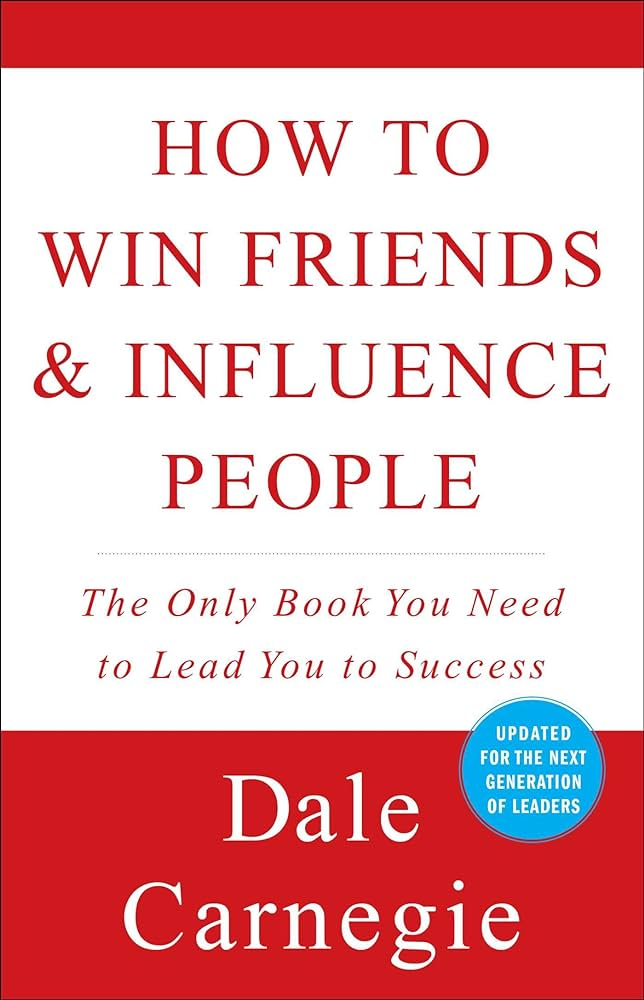
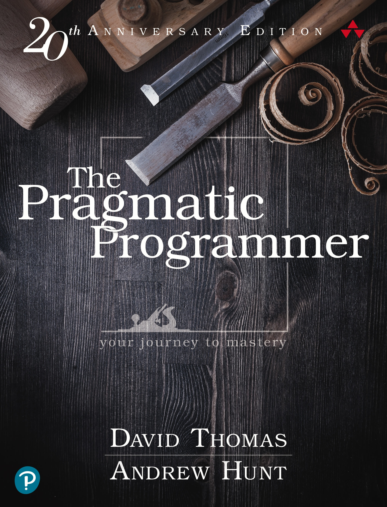
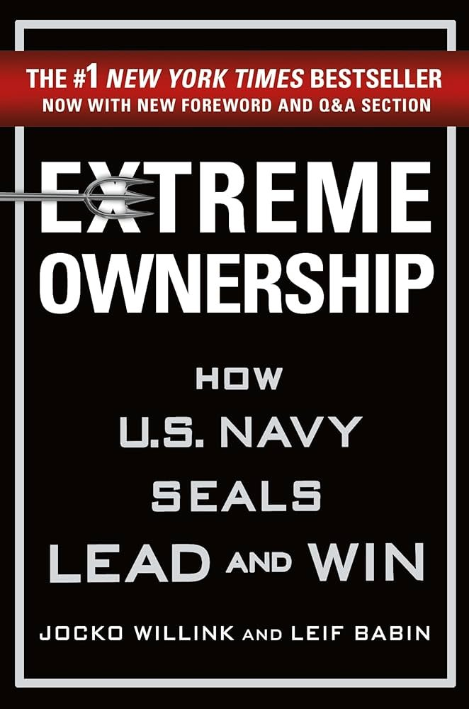
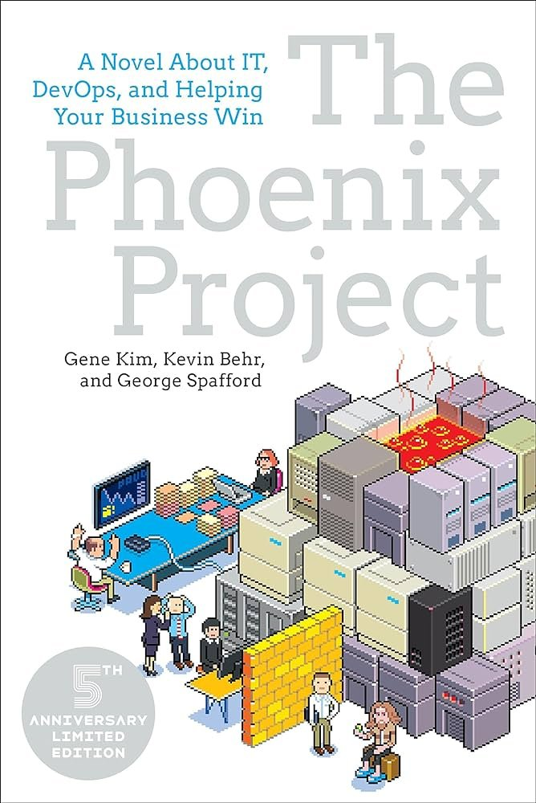
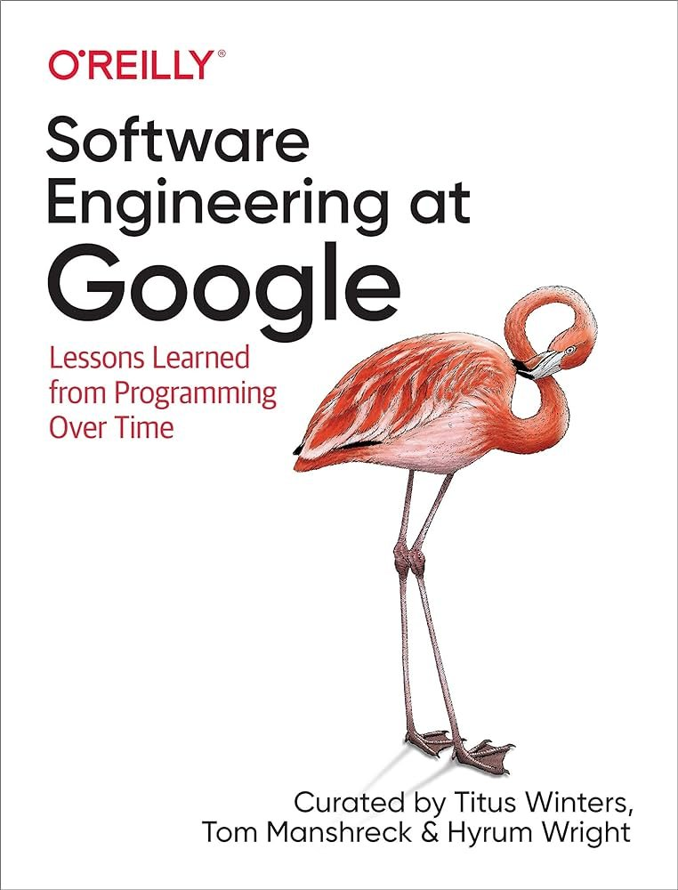
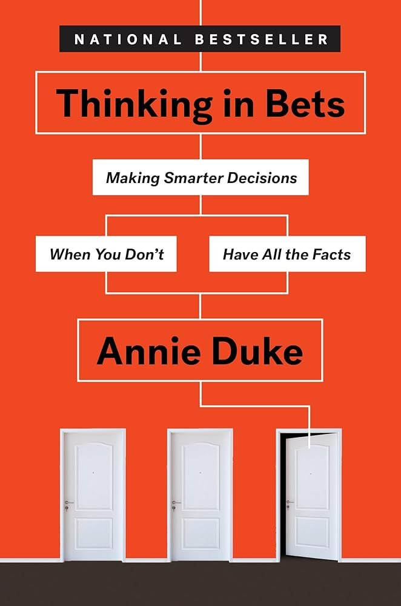

Here are 6 books I'd buy every engineer who joins my team, if I ran a team. You might like 'em too.

Why books? Because books go into a level of depth that I personally haven't been able to find anywhere else. Blogs, videos, and many video courses are too superficial. Papers are too deep and you need to pick those you'll find useful.

The best books join practical experience with academic research. The best authors write books after years of thinking and talking about a field.

## 2 books to read regardless of experience

I'd buy these for everyone. Fresh intern all the way to distinguished principal eldritch horror engineer.

Yes this book has a dumb title. It's a good read because it will help you cut through the bullshit of endless unproductive debates with coworkers and avoid starting fights.

When you start using what Carnegie suggests, it feels kinda slimy and dishonest, but it works.

Pragmatic Programmer is full of timeless to-the-point advice. It's one of those books that made me think _"Wow I should've read this 10 years ago, why did nobody tell me?"_.

I'm telling you now. Go read. If for no other reason than it will validate lessons you've already learned and give you new ways to talk about them.

## 4 books to read if you're senior

I'd buy these books for anyone who's senior+ or wants to get there soon.

Extreme Ownership teaches you how to take responsibility for your outcomes, not just your outputs. [Owning the outcome](https://swizec.com/blog/own-the-outcome-not-the-work/) makes the difference between someone who is delegatable and someone who's just a pair of hands.

Be more than a pair of hands on keyboard.

Everyone who's read The Phoenix Project on my recommendation later told me _"Dude that book saw right into my soul! How did they know I've been on projects just like that!?"_

Then they had a bunch of ideas how we can improve our processes so we never need another death march or deployment from hell again. Those changes need buy-in, that's why everyone on the team reading the book is so useful 😉

And then you too can [start finishing sprints on time, even early](https://swizec.com/blog/how-we-made-the-best-burndown-chart-youve-ever-seen/).

Software Engineering at Google is surprisingly practical. You don't need to be a FAANG-scale company to benefit from the lessons herein.

The quote _"Software engineering is programming over time"_ comes from this book and so perfectly nails what we do. This book is about all that other stuff engineers do on top of writing the code.

There comes a point in your career when the thing slowing you down the most is choosing the right course of action based on incomplete information. This happens earlier than most people realize.

Thinking in Bets helps you embrace that ambiguity and be okay with making the best decision possible, even if wrong, so you're not blocked. If you pair that with Extreme Ownership, people will be pretty okay with making these bets.

Because progress beats perfection.

Cheers, 
\~Swizec

PS: every cover links to a summary of some sort. I recommend reading the books because they go way deeper than a summary ever could and help you really grok the lesson
