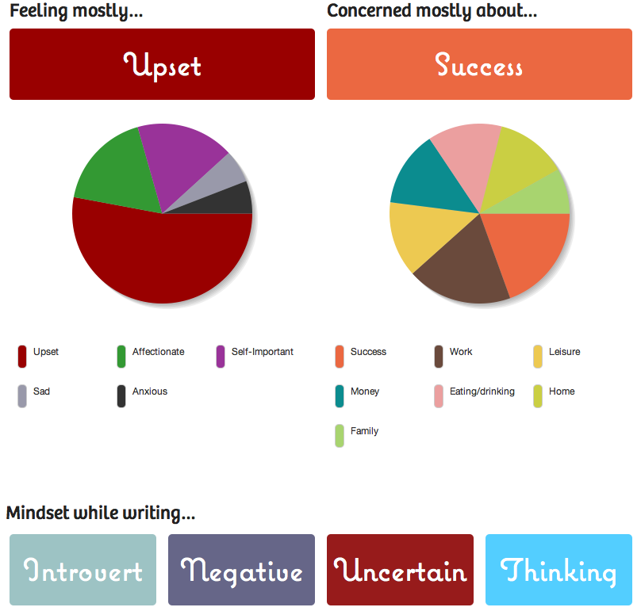

\_\_

###### Related articles

- [Kickstart Your Creativity By Writing 750 Words a Day](http://www.lifehack.org/articles/productivity/kickstart-your-creativity-by-writing-750-words-a-day.html) (lifehack.org)
- [750 words, 100 push-ups in 10 hours, 8 billable hours + morning devotions](http://robinmonks.com/2011/04/02/750-words-100-push-ups-in-10-hours-8-billable-hours-morning-devotions/) (robinmonks.com)
- [Great Website: 750words.com!](http://doingthewritething.wordpress.com/2011/02/24/great-website-750words-com/) (doingthewritething.wordpress.com)
- [750 Words Freakout - Reconsidered](http://inspirationlocation.com/2011/03/06/750-words-freakout-reconsidered/) (inspirationlocation.com)
- [Morning Pages](http://ketik06.wordpress.com/2011/03/11/morning-pages/) (ketik06.wordpress.com)
- [Ridiculous Competitions to Boost your Creativity/Time Management/Tiredness](http://awesomestudy.wordpress.com/2011/03/14/ridiculous-competitions-to-boost-your-creativitytime-managementtiredness/) (awesomestudy.wordpress.com)
- [750 Words.](http://asstochair.wordpress.com/2011/04/20/750-words/) (asstochair.wordpress.com)

