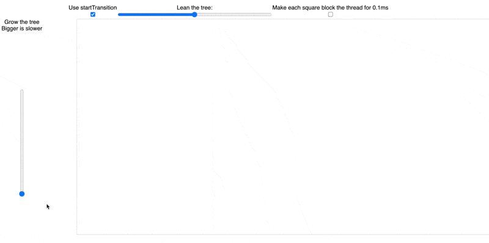
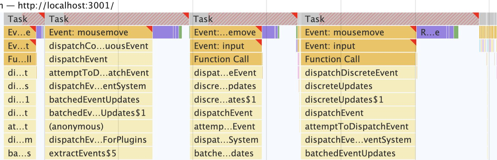
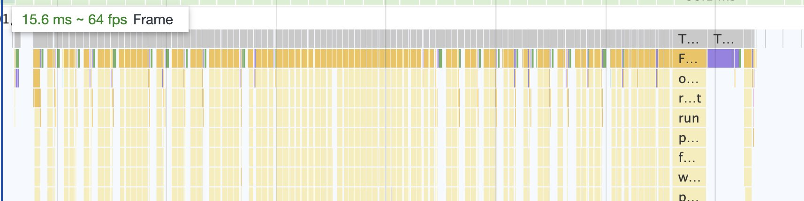
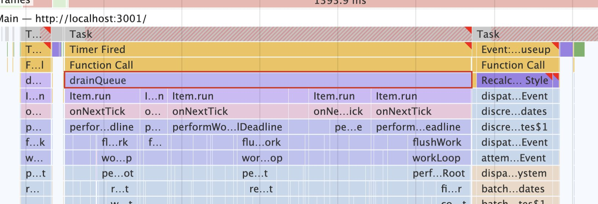

Demoing startTransition is hard. Modern computers are too fast 😅

The [demo I sent you last week](https://swizec.com/blog/trying-out-react-18-alpha/#lets-try-it-out) doesn't work. It's an aberration. A fluke of dev mode.

Further testing showed that every render takes less than 1ms. `startTransition` and time slicing didn't even have time to kick in.

💩

So [I built a better demo on stream](https://www.youtube.com/watch?v=6WRRf2ldixY), but a subtle gotcha got in the way. Dan from the React team helped me figure it out and we even found a bug in the alpha. Great success all around!

You can [try the final React 18 startTransition demo here](https://react-fractals-git-react-18-swizec.vercel.app/)

[](https://react-fractals-git-react-18-swizec.vercel.app/)

The demo shows you what happens when every state change updates 1,000,000+ nodes. Slider on the left grows the tree, makes the problem worse – exponentially. Slider on top leans the tree, updates every node. Use it to see what happens :)

Toggle the `Use startTransition` checkbox to compare behavior with and without the new feature. You should see your inputs laaaaaag without `startTransition`. When it's enabled, the urgent input update happens fast and the slow fractal updates later.

If you don't see slowness, enable the artificial 0.1ms delay. That'll do it.

The [original fractal tree stress test](https://swizec.com/blog/dancing-tree-fractal-with-react/) is code from 2016 and I'm happy to report upgrading to React 18 worked without changes.

You can [see the full code on GitHub](https://github.com/Swizec/react-fractals/pull/15)

## Why it's slow

https://twitter.com/Swizec/status/1404917798527111168

The [pythagoras tree](<https://en.wikipedia.org/wiki/Pythagoras_tree_(fractal)>) is a fractal. A deeply nested data structure that brings any rendering framework to its knees. Drawing to the DOM is the least of your worries.

The left slider sets nesting level. At 20 (max) your computer will slow down for sure. My 2020 top-spec MacBook sure did 😅



Each layer spawns 2 branches. Every update touches every branch. That's `2^20-1 = 1,048,575` updates for every change in lean angle.

That's what makes this a great stress test :)

- user code: calculates all that data
- framework code: propagates the updates
- browser code: redraws the DOM nodes

Yes WebGL or Canvas would make the draw step faster, but this is not a graphics demo. We're showing **something important that React 18 unlocks**.

Think of each square as a separate React component in your app. A user action might update many of them. Each component on its own is fast to render, but the work adds up. And there's no one place to optimize 😱

**`startTransition` enables React to break down this rendering work into small chunks.**

This keeps the slider UI responsive even while your components are executing. Note that this is true even when you toggle the artificial delay (0.1 ms per square)! Even the fastest library that does updates synchronously will freeze when the slowdown happens in your code.

React can pull it off because it breaks up the work instead of doing it all at once. 🤘

[Modern computers are fast, though](https://swizec.com/blog/screw-web-performance-just-wait-a-little/), so you can get away with a lot before you'll need to think about `startTransition`. Here's a comparison from last year:


## How we debugged the demo

You can look at Chrome's performance tab to see what's up. You're looking for large chunks of synchronous work in event handlers – that's an opportunity for `startTransition`.



When you enable `startTransition`, those big chunks of work split into quick urgent updates followed by the computationally heavy work.



Quick way to test you're leveraging `startTransition` ✌️

When I first showed my demo to Dan we found a fun alpha bug. An old Webpack polyfill from react-scripts 0.7 triggered a bug in React 18 alpha. Updates getting batched weirdly. They'll fix this before going stable.



Always remember: realistic timing happens in production.

## A startTransition gotcha

`startTransition` lets you mark calculations and updates as not urgent. React performs them later.

You can use this for expensive data transformation, large computations, or complex rendering. Anything goes.

```javascript
startTransition(() => {
  // do slow work
  // this code executes synchronously
  // but state updates are marked as less urgent
})
```

Sounds easy when you read about it, then you get it wrong on stream 😅

### Use separate state for non-urgent updates

My first attempt looked kinda like this:

```javascript
const [treeLean, setTreeLean] = useState(0)

function changeTreeLean(event) {
    const value = Number(event.target.value);

    // update visuals
    if (enableStartTransition) {
        React.startTransition(() => {
            setTreeLean(value);
        });
    } else {
        setTreeLean(value);
    }
}

// ...
<input type="range" value={treeLean} onChange={changeTreeLean} />

<Pythagoras lean={treeLean} ... />
```

Change input, call `changeTreeLean` as the event handler. Tell React to update state inside a transition.

And everything's laggy 🤔

Because _both components depend on the same state_ ...

You have to split that state:

```javascript
const [treeLean, setTreeLean] = useState(0)
const [treeLeanInput, setTreeLeanInput] = useState(0)

function changeTreeLean(event) {
    const value = Number(event.target.value);
    setTreeLeanInput(value)

    // update visuals
    if (enableStartTransition) {
        React.startTransition(() => {
            setTreeLean(value);
        });
    } else {
        setTreeLean(value);
    }
}

// ...
<input type="range" value={treeLeanInput} onChange={changeTreeLean} />

<Pythagoras lean={treeLean} ... />
```

Looks weird to split state like that, but it makes sense. You're saying it's okay for these 2 components to be visually out of sync.

Now the input field and the tree update separately. `startTransition` makes a big difference.

[](https://react-fractals-git-react-18-swizec.vercel.app/)

### Use React.memo

```javascript
const Pythagoras = React.memo(() => {
  // same component code as usual
})
```

Wrap expensive components in `React.memo` to give `startTransition` a chance to kick in. React needs to know it's safe to split the render step.

## Show transitioning state

I thought this was neat. You can show the user that a redraw is happening.

```javascript
const [isLeaning, startLeaning] = useTransition()

// ...

function changeTreeLean(event) {
    const value = Number(event.target.value);
    setTreeLeanInput(value); // update input

    // update visuals
    if (enableStartTransition) {
        startLeaning(() => {
            setTreeLean(value);
        });
    } else {
        setTreeLean(value);
    }
}

// ...

<svg style={ opacity: isLeaning ? 0.7 : 1 }
```

The `useTransition` hook lets you access transition state. _"Are we done yet?"_

Instead of calling `startTransition`, you call the function returned from the hook – `startLeaning`. Then you can access done-ness with the boolean – `isLeaning`.

You'll [notice the tree fades out](https://react-fractals-git-react-18-swizec.vercel.app/) on big re-renders.

## My biggest surprise?

Take React code from 2016, update to React 18 alpha, touch nothing else ... and it works. No bugs 😱

Had to update `react-scripts` from 0.7 to 4.0 though. An old Webpack polyfill was killing `startTransition`.

That's why we torture alpha versions my friend. For bugs like that ✌️

Cheers,<br/>
~Swizec

PS: [React For Dataviz](https://reactfordataviz.com) is my course on pushing React to the max and fun stuff like this​. I think it's getting a new module or two when React 18 comes out :)
