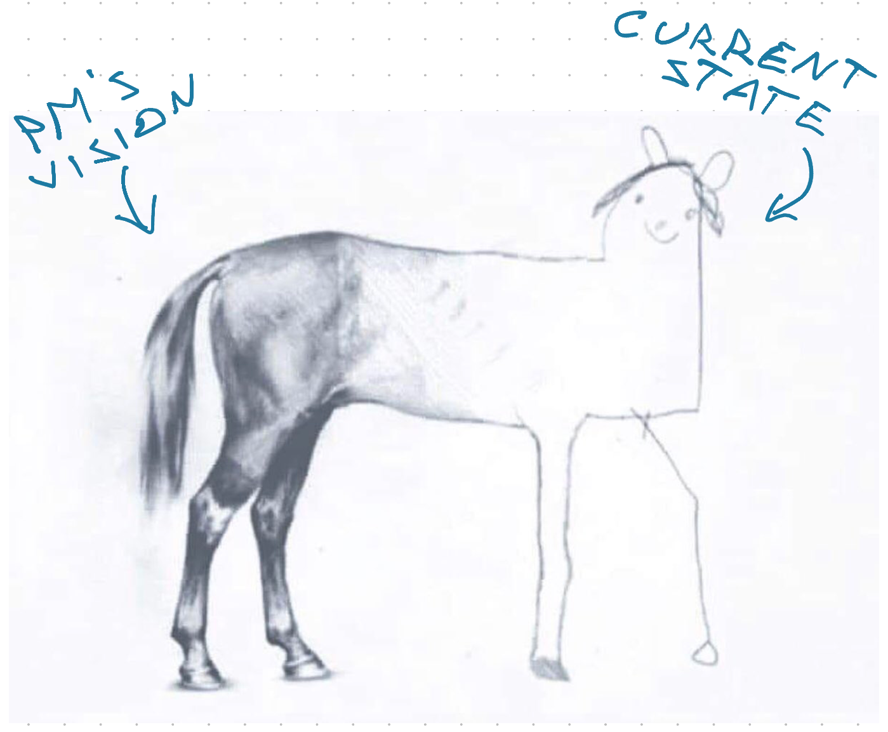

A focus on [getting over the water instead of building a bridge](https://swizec.com/blog/get-us-over-the-water-not-build-us-a-bridge/) unlocks the next high leverage activity for engineers: **Shaping the roadmap**.

Jane, Joe, and Alice talk to their product manager Bob. He's got this grand idea for a new feature that's going to make the company lots of money and drive team OKRs through the roof.

But Alice spots a problem: _"Hey Bob this looks like a lot. Isn't it gonna take like 3 months to build?"_

_"Yeah! And then our metrics go whoosh"_

_"Okay but what if they don't?"_

_"What do you mean of course they will. This feature is exactly what our users want. We've tested prototypes with a focus group, design is excited, and execs all nodded in agreement. This is the way"_

_"Right. But we have to show improved metrics this quarter don't we?"_

_"Yes."_

_"So if a quarter is 3 months and this feature takes 3 months to build, how will we show an improvement in our OKRs? The changes won't take effect until next quarter. Plus we won't know if we're making progress until we're done. Not to mention all the testing it's going to take if we ship this all at once. There's a lot of moving pieces ..."_

_"Oh and don't forget the code we're touching is a mess. We have no idea what we'll find"_, Jane adds.

High risk, high impact. Bob has the right idea, but engineering can't get there in one big step. A better roadmap will make all the difference.

## How roadmaps go wrong

Product managers have a tough job. In their mind is a grand vision of what the product _could_ be. Before them is an ugly child that pooped its pants.

Getting the product from that poopy child to a suave adult is your job. You're responsible for making it happen. Product is accountable for how it impacts metrics. Together you own the outcome.

A bad vision will fail to materialize in your metrics. Users don't use the feature, it's got unintended consequences, or it just doesn't land with your userbase. You never know what's going to happen until you try. If I had a dime for every person who said _"Wow Swiz this is a great product idea!"_ but who didn't hit the buy button I'd be a rich man.

A bad implementation can cause the metrics to not materialize. You took too long and users don't care anymore. Or it's buggy and hard to use. Or you took 3 months to ship a big thing only to find out your core assumption was wrong and users wanted a different thing entirely. Or worse: you missed a hidden dependency and now you've got a bunch of upset users [whose workflows you broke](https://xkcd.com/1172/).

Part of a fruitful product/engineering partnership is enabling your product manager, and yourself, to run experiments and validate assumptions early. The lesson from [Writing software is like kicking a can](https://swizec.com/blog/writing-software-is-like-kicking-a-can/) is that as you ship, you'll learn more, and your vision will change.

The smaller your steps, the more accurate you'll be.

Cheers, 
\~Swizec
