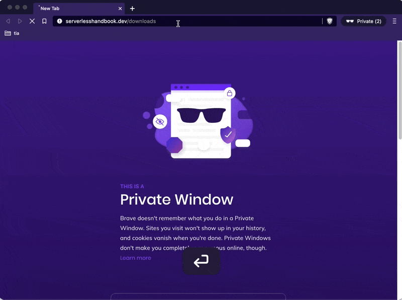
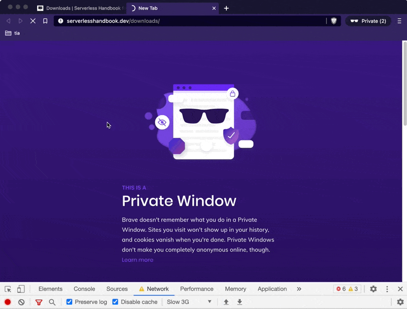
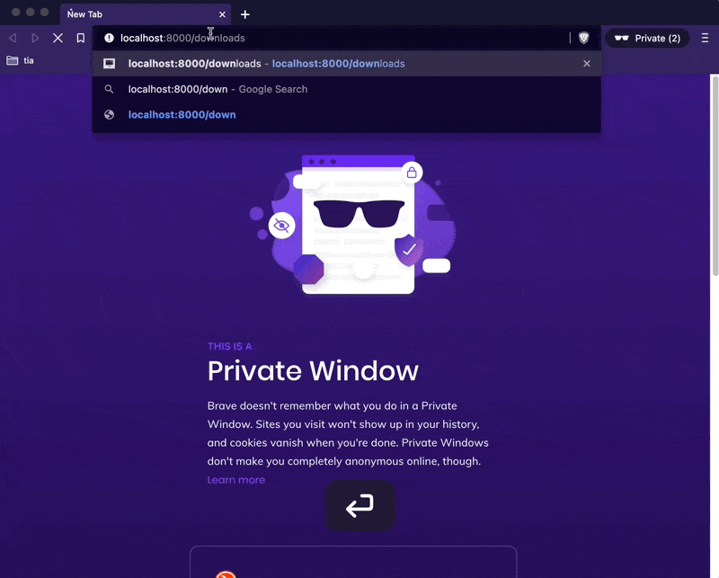

> Hey Swiz, you know everyone can download your book for free right?
> ~ a helpful twitter DM

I knew, but I didn't think anyone else would find it 😅

https://www.youtube.com/watch?v=vZ7bzIkSJoY

_CodeWithSwiz is a weekly live show. Like a podcast with video and fun hacking. Focused on experiments and open source. [Join live most Tuesday mornings](https://youtube.com/swizecteller)_

Here's what /downloads looks like, if you haven't bought [Serverless Handbook](https://serverlesshandbook.dev)



And here's what it looks like if your internet is slow ...



Awkward.

The paywall waits for JavaScript to load, the page to render, then springs into action to look for a `<div id="lock"></div>` element and hide everything below. A clever React effect makes that happen:

```javascript
useLayoutEffect(() => {
  if (typeof window !== "undefined") {
    window.requestAnimationFrame(() => {
      if (unlocked) {
        hidePaywall(paywallDiv);
      } else {
        showPaywall(paywallDiv);
      }
    });
  }
}, [unlocked]);
```

If running in the browser and page locked, show paywall.

## What's the matter, bub?

The Serverless Handbook, like all my sites, uses Gatsby to work faster. Statically rendered when you deploy.

You get to build your whole site in React with all its benefits, serve as fast static HTML, then re-hydrate into a typical React app. Works great when you're not being fancy.

I was being fancy.

_The paywall waits until React runs_ to hide content. That way search engines can see the full content and humans can't.

Unless they disable JavaScript, which normal humans don't. Yes I know, there's dozens of you, dozens!

But when internet is slow this becomes a problem. React takes so long to run that you can casually finish reading a whole chapter or download all the files before the paywall stops you.


## How we fixed it

The solution is obvious in retrospect: _Don't render locked content you doodoo!_

**First** we found the paywall code that decides if a page is locked

```javascript
// Paywall.js
const hasLock =
  typeof window !== "undefined" && document.querySelector("#lock");

// 👇

const hasLock = LOCKED_PAGES.includes(pagePath);
```

Used to work in browser only and look for a special lock div. Static rendering was unlocked by default.

Now looks at a list of configured locked pages.

**Second** we changed how page content renders.

```javascript
// layout.js

{
  props.children;
}
<Paywall />;

// 👇

{
  contentUnlocked ? (
    <main id="content">{props.children}</main>
  ) : (
    <main id="content" dangerouslySetInnerHTML={{ __html: html }} />
  );
}
<Paywall />;
```

Page layout used to render its children and let the `<Paywall>` handle hiding.

Now it renders the full page when it's unlocked and a custom-crafted chunk of HTML when it's locked.

**Third** we build the cut-off HTML.

```javascript
// layout.js

let html;

if (!contentUnlocked) {
  html = ReactDOMServer.renderToString(props.children).split(
    '<div id="lock"></div>'
  )[0];
}
```

`ReactDOMServer` lets you take any React fragment and render to a string. Works on the server, at build time, or in the browser.

You can then manipulate that HTML.

In our case, `props.children` holds the full React fragment for page content with no other fuss. Guaranteed by Gatsby.

That means we can hackily split by `<div id="lock"></div>`, take the head, and render with `dangerouslySetInnerHTML`. Now there's no flash of unlocked content 🥳



The styling is messy because we rendered those children outside a `<ThemeProvider>`.

Then I deployed to production and it failed completely. No paywall. 🥲

Cheers,<br/>
~Swizec
