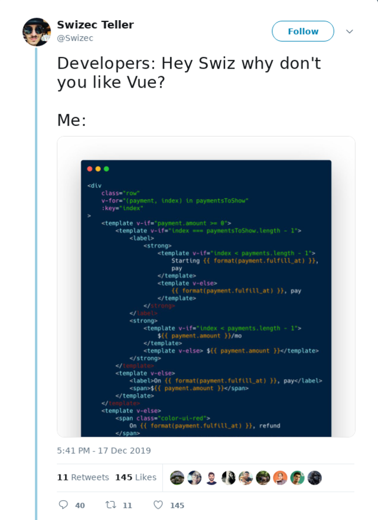

A friend told me that he doesn't read blogs anymore. No more hasty notes by half experts. No more podcasts, no more newsletters, no more thoughtfluencers. He's done with all that crap.

Instead, he reads textbooks and books from experts with decades of experience in a field. Books written at the end of a long and fruitful research career.

And you know what? I'm kind of the same.

As you grow in expertise, finding valuable material to learn from becomes harder and harder. Advice begins to repeat itself. Every blog or article feels like _"Yeah yeah heard that before, and that, yep that too"_

It becomes boring.

Not because the field is boring, not because you aren't passionate, but because you've outgrown the common advice. You need something more.

Here's a fun thought:

> If the number of developers doubles every 5 years, then with 5 years of experience **you're more experienced than half the industry**

🤯

[Quoted from Bob Martin](https://blog.cleancoder.com/uncle-bob/2014/06/20/MyLawn.html), famous for writing Clean Code and others.

Maybe that's why developers love to jump in a new stack or invent a whole new technology every 5 years or so. We get bored and want something new to learn voraciously.

So to be honest, while I _write_ articles, I rarely read them anymore. I prefer to do my own research and follow the raw expert stream of thoughts on twitter. It's like a bazaar of ideas and I love that. Sometimes I read books.

But I don't follow coding podcasts, I don't read coding blogs, I skim documentation, and I read every 3rd paragraph of google search results.

My favorite media these days are long-form audiobooks.

Sometimes this leads to embarrassing moments on twitter where half the Vue community tells me I'm wrong.

All part of learning. ❤️

## So if you're ready for a challenge ...

... here's what I recommend: A holiday reading list.

Computer science papers. The good stuff. The stuff that's stood the test of time. The papers and lectures that people have been quoting for years and decades.

Some of this is [crowd sourced](https://twitter.com/Swizec/status/1207496122303832065) so I haven't read all of them yet. Enjoy :)

1.  [Turing's On Computable Numbers](https://www.cs.virginia.edu/~robins/Turing_Paper_1936.pdf), the birth of the computer era
2.  [Shannon's A Mathematical Theory of Communication](http://people.math.harvard.edu/~ctm/home/text/others/shannon/entropy/entropy.pdf), a paper so good I used it as a textbook in college. Everything we do on the web depends on these ideas
3.  [Hamming's You and Your Research](https://www.cs.virginia.edu/~robins/YouAndYourResearch.html), a collection of life lessons from Richard Hamming that you should read every few years
4.  [Randy Pauschs's Final Lecture](https://www.youtube.com/watch?v=ji5_MqicxSo), an inspiring tale from the end of a wonderful career in computer research. You should watch it every few years
5.  [Feynman: Knowing vs Understanding](https://www.youtube.com/watch?v=NM-zWTU7X-k), an important 5 minute lecture that strikes at the core of this post. Read Surely You're Joking Richard Feynman for wonderful insights into thinking itself
6.  [Why Philosophers Should Care About Computational Complexity](https://www.scottaaronson.com/papers/philos.pdf), a paper I plan to read over the holidays. It explores the importance of computability and complexity in life. A version of this I enjoyed as an audiobook was [Algorithms to Live By](https://brianchristian.org/algorithms-to-live-by/)
7.  [Statecharts: A visual formalism for complex systems](https://www.inf.ed.ac.uk/teaching/courses/seoc/2005_2006/resources/statecharts.pdf), another paper I plan to read. It talks about state machines and how to use them. And most of what we do as a web developers are state machines
8.  [Actor Model of Computation](https://arxiv.org/vc/arxiv/papers/1008/1008.1459v8.pdf), a paper about a different model of programming. We don't use this on the web very often, but it's popular in the gaming industry. I'm excited to learn from it.

That's plenty for a week, have fun. I know I will :)

See you next year. Happy holidays and don't forget to call your grandma.

Cheers,  
~Swizec
