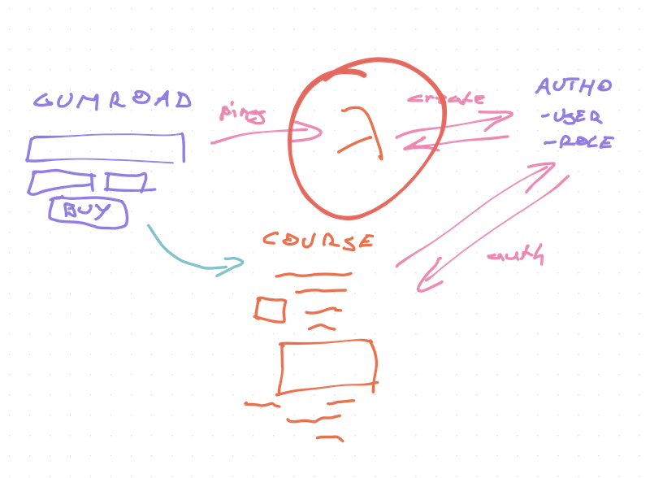

import { ContentUpgrades } from '@swizec/gatsby-theme-course-platform'

Friend, what's the best code you ever wrote?

You can think of the most clever code you ever wrote, or the cleanest. The most fun problem to solve, or the most impactful. The surprise throwaway everyone uses, or the love nobody noticed.

Like that time [deleting 11 lines of left-pad code](https://qz.com/646467/how-one-programmer-broke-the-internet-by-deleting-a-tiny-piece-of-code/) broke the internet. Talk about little code big impact 😅

For me, it's a toss-up between 2 projects.

## The coolest piece of code

The most fun, clever, and whoa, was a 1500+ line PHP function I wrote back in high school. It was horrible, hard to maintain, kinda slow, and amazing as heck.

A compiler.

This gigantic-ass method could take a file written in a custom templating language – inspired by Django and Smarty – and turn it into PHP. It replaced the interpreter from the first version of my templating engine.

And the results were amazing. Pages loaded 10x faster than with the interpreter. Even without caching.

Yep, it was 10x faster to compile code on every request than it was to interpret (execute step by step).


My custom language supported variables, loops, nested loops, conditionals, and even functions. All before I learned anything about how compilers, parsers, or interpreters work.

Wrote it over Christmas break one year. A 1500 line switch statement. ✌️

<ContentUpgrades.ServerlessHandbook />

## The _best_ piece of code

While impressive for an 18 year old, my little compiler never accomplished much. Supported 2 or 3 websites in production and caused months of debugging headaches.

Here's a piece of code far more impactful:

```typescript
export const pingHandler = async (
  event: APIGatewayEvent
): Promise<APIResponse> => {
  const ping: GumroadPing = qs.parse(event.body!) as any;

  console.log("ping for", ping.product_permalink);

  if (ping.product_permalink in PRODUCTS) {
    const user = await upsertUser(ping);

    if (user) {
      const auth0 = await getAuth0Client();
      const roleId = PRODUCTS[ping.product_permalink];

      await auth0.assignRolestoUser(
        { id: user.user_id! },
        {
          roles: [roleId],
        }
      );
    }
  }

  return response(200, {});
};
```

Since going live in January, that code has made over $40,000 in revenue, cost $2 to run, and took 2 hours to write while reading docs.

Typical glue code: easy to write, simple to run, high impact.

### What's it do?

This little function connects Gumroad to Auth0.

You make a purchase, Gumroad pings a URL, AWS Lambda runs my code, code creates a new user on Auth0, gives the right permissions, and you get access to the course.



Works great. Changed it once in 8 months to add new products. ✌️

Oh yeah, products are hardcoded in a dictionary. No need to get fancy, nobody's using this code but me.

```typescript
const PRODUCTS: { [key: string]: string } = {
  "https://gum.co/IeDvq": "rol_uhLv74dIEcoIExRn", //SRD Professional
  "https://gum.co/WTeMS": "rol_yOuRBy7Yaw50bwb9", //SRD Indie Hacker
  "https://gumroad.com/l/IeDvq": "rol_uhLv74dIEcoIExRn", //SRD Professional
  "https://gumroad.com/l/WTeMS": "rol_yOuRBy7Yaw50bwb9", //SRD Indie Hacker
  "https://gum.co/Fqwwi": "rol_zpnkaVy2LcZtaKZL", //RDV_Basics,
  "https://gum.co/KDLxE": "rol_j0hosj3n5mFTwkhu", //RDV_Full,
  "https://gum.co/Hnbtz": "rol_j0hosj3n5mFTwkhu", //RDV All extras,
  "https://gumroad.com/l/Fqwwi": "rol_zpnkaVy2LcZtaKZL", //RDV_Basics
  "https://gumroad.com/l/KDLxE": "rol_j0hosj3n5mFTwkhu", //RDV_Full
  "https://gumroad.com/l/Hnbtz": "rol_E0XpXwtbt1wezjIS", //RDV All extras

  "https://gum.co/fKfYf": "rol_2Ipay6fbQzcWZ59A", // FindYourIdea
  "https://gumroad.com/l/fKfYf": "rol_2Ipay6fbQzcWZ59A", // FindYourIdea
};
```

You can read more details in [Connecting Gumroad to Auth0 for paywalled JAMStack apps](https://swizec.com/blog/connecting-gumroad-to-auth0-for-paywalled-jamstack-apps/)

## Why this code is great

What I like about this code is that it's a JavaScript function. Nothing more, nothing less.

Sure it runs on the web, handles API requests, lives in the cloud, has its own URL, runs on-demand, wakes up as a full server, scales up to 1000 simultaneous requests, handles errors, uses distributed logging, _and_ has basic monitoring built-in ...

... but I didn't have to think about any of that. All I did was:

```
serverless deploy
```

And the platform handled the rest 😍

What's your favorite piece of code my friend? hit reply

Cheers,<br/>
~Swizec
