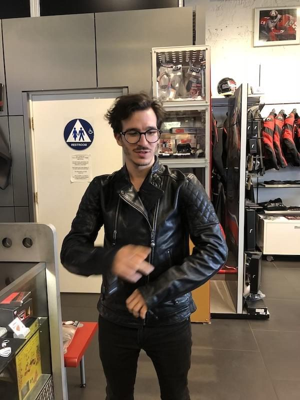

_&quot;Hi, I need a pair of gloves for my motorcycle class in 2 weeks. Maybe some boots too&quot;_

_&quot;Congratz! Motorcycling is awesome; welcome to the club. Do you have a helmet?&quot;_

_&quot;No, they offer loaners at the class. I just need a pair of gloves.&quot;_

_&quot;Oh, those are sweaty and smell bad. I like to start a new rider from the top down. Your helmet is the first and most \\important piece of equipment you&#x27;re going to bond with. It&#x27;s like the living room for your face.&quot;_

_&quot;Sure, but I don&#x27;t need it yet. Really, I just need gloves and maybe boots. I don&#x27;t have any boots sturdy enough to pass inspection&quot;_

He looks at me for a second, head crooked, squint in one eye.

_&quot;Listen, have you done this before?&quot;_

_&quot;Err… no?&quot;_

_&quot;Good. Now that&#x27;s settled, let me take care of you.&quot;_

Guy giving him shit from the back: _&quot;Don&#x27;t be so sassy, Kyle!&quot;_

_&quot;What, me, sassy? I guess I&#x27;m sassy.&quot;_, looks back at me, _&quot;I just want to make sure your first riding experience is great. I had some great folks taking care of me when I was starting out, and I want to pay it forward. Now, let&#x27;s look at some helmets. That&#x27;s the most \\important. You can buy any gloves any time._&quot;

He looks at me and says _&quot;You look like a regular oval. That&#x27;s gonna make this easier&quot;_

He conjures a measuring tape, makes me look at the wall, mumbles some numbers, jumps behind the counter, and produces 3 helmets.

_&quot;You&#x27;re a small. These helmets are your size and range from cheap to expensive. Put them on and I&#x27;ll explain how you identify a good helmet. You don&#x27;t have to buy anything right now, but at least you&#x27;ll know what fits and how to identify a good helmet. You can use that skill to buy a helmet anywhere you want.&quot;_

I put on the cheapest helmet. He asks how it feels and I say very comfy.

_&quot;First thing you have to know about helmets: DOT regulation is crap, hasn&#x27;t been updated since the 50&#x27;s, and measures only single impacts to the top of your head. You want SNEL. Updated every 5 years, safe for multiple impacts, race track certified&quot;_

I nod. This matches [a FortNine video I watched on YouTube](https://www.youtube.com/watch?v=0BUyp3HX8cY). Kyle knows his shit.

Then we go through the testing procedure.

He grabs the helmet, can I turn my head? No, good. He pushes down on the chin guard. Helmet doesn&#x27;t cover my eyes, good. Pushes up on the chin guard. Can&#x27;t wedge more than the small pinky knuckle between forehead and helmet, good. Pushes back on the helmet. It doesn&#x27;t move, good.

In 60 seconds, he taught me how to identify a safe helmet, how to make sure it fits, and explained the most \\important bonus feature: A visor lock.

We tried the same spiel on the other helmets. The cheapest and most expensive fit best. Middle option felt weird on my cheeks. Cheap and expensive helmet are just as safe (SNEL 2015), so I picked the cheapest.

I don&#x27;t have enough experience to know which of the $700 worth of extra features makes a helmet better than the $200 option and why. He congratulated me on picking a safe helmet and made fun of people who come in looking for cheap helmets. Says he doesn&#x27;t sell those.

He just sold me a helmet. An item I wasn&#x27;t even shopping for.

Because I&#x27;m gonna need one anyway and why not get it now and have a clean helmet for my class? Smart. And I picked a safe one. Double smart.

Feeling good about myself and my purchasing prowess.

_&quot;Next most \\important and biggest purchase is a good jacket. That&#x27;s gonna keep you safe in a fall, make sure you don&#x27;t end up in a hospital.&quot;_

_&quot;But… gloves?&quot;_

_&quot;Honestly, gloves are the least \\important part of your gear. They&#x27;re all pretty much the same, survive no more than 1 crash, and you&#x27;re gonna go through them like underwear&quot;_

I must have made a face because the next thing he said was _&quot;Okay! Let&#x27;s look at gloves&quot;_

He invited me behind the counter. There were several gloves. Leather this and that, knuckle guards, wrist protectors, many options.

_&quot;With gloves, you want protection for your palms. When you fall, you&#x27;re gonna try to catch yourself with your hands. You want your hands to survive that impact and ideally to slide out so the armor on your elbows and forearms can take most of the impact.&quot;_

_&quot;I think I want leather gloves&quot;_

_&quot;Correct! Leather is the best protection in a fall. These two are my favorite models, and this one is my best seller. I like it because it&#x27;s soft so your hands won&#x27;t get tired when you&#x27;re just learning the controls. How&#x27;s your grip strength? Oh ,and since you&#x27;re not racing, you probably don&#x27;t need knuckle guards. They rarely come into play unless you hit a mirror while lane splitting, but those bump out of the way anyway._

I tried on his best seller and the black version of his favorite pair. The best seller was indeed very soft and comfy, but I didn&#x27;t like the style. Too racy.

We put the cool looking black leather gloves next to the helmet. $200 helmet, $120 gloves.

_&quot;So, jackets? You&#x27;re gonna need a jacket after you get your license. I might consider a discount, if you buy multiple pieces today and like I said, at least you&#x27;ll know what&#x27;s out there.&quot;_

_&quot;Sure. I was thinking leather, similar to the faux motorcycle jacket I&#x27;m wearing right now. Something that looks great and also happens to be safe&quot;_

_&quot;Well I have a huge order of 2019 collections coming in, but let&#x27;s see what we&#x27;ve got. You don&#x27;t need leather for street riding around the city. What about these super comfy and affordable treated canvas jackets?”_

_&quot;What about those leather jackets over there?&quot;_

_&quot;Very well then… I have this Roland Sands Clash jacket. Armor ready, I can give you a discount if you buy the extra armor today, and we have this new thing from Roland Sands with a built-in hoodie so you have layers and don&#x27;t have to worry about that in advance. Layers are great for motorcycling because you have to adjust that shit all the time&quot;_

My eyes lit up. I must have looked like a kid in a candy store. Both jackets looked like the coolest piece of clothing I&#x27;d ever seen.

He rummaged around.

_&quot;Ah shit, we don&#x27;t have the hoodie one in your size, but there&#x27;s more coming in like a week or two. Here, try the Clash on for size and see how it feels.&quot;_

I put it on and he fiddled with some clasps and adjustments and oh my god that jacket was perfect. Thick leather, smells like a cow, weighs a ton. Real proper protection and it looks bitchin’.

\[caption id=&quot;attachment_8621&quot; align=&quot;alignnone&quot; width=&quot;600&quot;] Trying on my Roland Sands Clash after Kyle added the armor\[/caption]

_&quot;I&#x27;ll take it&quot;_

_&quot;It fits better once you put armor in the armor pockets because it&#x27;s tailored to fit that extra bulk. We get better ones in a week or two but tell you what, I&#x27;ll see what we can figure out with the price, if you buy the whole kit today.&quot;_

_&quot;Yes, done. I&#x27;ll take it. It&#x27;s gorgeous and amazing and I&#x27;m excited. What about boots?&quot;_

_&quot;Here&#x27;s the thing about boots. You don&#x27;t need them. Most injuries to your feet come from your shoes flying off and your foot dragging across the asphalt at high speed. That shit&#x27;s nasty. But unless you have a proper racing or adventure boot with solid armor going all the way up your shins, any so-called ankle protection is a gimmick. Just make sure it&#x27;s leather, laces above the ankle, has a reinforced toe-box, and the sole can hold your weight when you lay the boot flat and stand on its side.&quot;_

_&quot;Really? I had no idea&quot;_

This kinda matches the motorcycle course recommendation that any sturdy boot with ankle support is okay. But they also say gardening gloves are okay for the class and those are very much not okay for riding.

_&quot;Yeah. So I don&#x27;t have much to offer you here. We like to keep our selection small and hand-picked. Everything in my store is something I personally love and think is great value. We have these 2 sturdy boot things that are really more like work shoes than motorcycle-branded boots, and we have adventure boots that are way overkill for you.&quot;_

I tried the brown leather boots. They felt weird at first, but the longer I kept them on the better they got.

> I think the last time I was this excited was buying my first 1GHz computer in high school. Can&#x27;t wait to get my license and buy this puppy [pic.twitter.com/VkezdwnjXv](https://t.co/VkezdwnjXv)
>
> — Swizec Teller (@Swizec) [September 16, 2018](https://twitter.com/Swizec/status/1041363337957634049?ref_src=twsrc%5Etfw)

He helped me try them on the motorcycle I want to get – a Triumph Bobber Black. Feels amazing, looks amazing, sold.

Then my girlfriend jumps in and says _&quot;What about pants? Doesn&#x27;t he need pants?&quot;_

_&quot;Ah! I&#x27;m glad you asked. Most riders forget about the pants and buy them last or never. Jeans feels okay, but it won&#x27;t protect you in a crash. And all that knee armor people like to overpay for? Doesn&#x27;t do shit unless you&#x27;re racing. I&#x27;ve gotten hit by a car before and my knees were fine, the gas tank bent and cushioned that impact. You&#x27;re not falling on your knees anyway and if something&#x27;s gonna break, it&#x27;s gonna break. No armor can save you from that. What you want is abrasion protection&quot;_

_&quot;Okay ...&quot;_

_&quot;We have these over-engineered gore-tex pants with vents and liners and many layers, and I promise you don&#x27;t need them. They won&#x27;t fit your new leather jacket either. Instead, I recommend kevlar lined jeans. Looks just like jeans, but you can slide for days and you&#x27;ll be fine. What&#x27;s your size?&quot;_

I try them on. They don&#x27;t look like regular jeans because I don&#x27;t usually wear the american boxy cut. But how well can a pair of jeans made of five layers of super sturdy fabric fit anyway?

_&quot;Ok, I&#x27;ll take the black.&quot;_

_&quot;We don&#x27;t have your size in stock, but I can order it for you&quot;_

_&quot;Fine. Just do it. I&#x27;m ready to get outta here&quot;_

At this point, it&#x27;s been 2 hours. I learned more about motorcycle safety and about the pros and cons of different types of gear than I ever thought was possible.

Plus, I learned a bunch of insider tips and tricks about saving money by not buying things I don&#x27;t need for my intended style of riding.

_&quot;So that&#x27;s the helmet, the gloves, the boots, the pants, and the jacket. Add in the armor and I can give you a special price, if you buy everything today. You&#x27;re gonna need it eventually&quot;_

_&quot;Okay let&#x27;s see what you can do.&quot;_

I walked out of [Munroe Motors](https://www.munroemotors.com/) that day with $1500 of riding gear, $400 in savings, a huge smile on my face, and a 2 hour lesson in sales. It was amazing.

> Step 1: protective gear <https://t.co/dhgysCKexc> [pic.twitter.com/083aFToJNm](https://t.co/083aFToJNm)
>
> — Swizec Teller (@Swizec) [September 15, 2018](https://twitter.com/Swizec/status/1041107596285902848?ref_src=twsrc%5Etfw)

He was wrong though. Those gloves were the first piece I bonded with. Used them to ride an electric scooter with a loaner helmet. 🛵

## Recap

Here&#x27;s the sales lesson play-by-play:

1. Kyle positioned himself as the expert and me as the newbie in the first 2 minutes
2. Focused on teaching, not selling
3. Positioned himself as a trusted confidant by emphasizing that he&#x27;s helping me have a good first riding experience
4. Emphasized multiple times there&#x27;s no strings attached and I can use his advice to buy anything anywhere forever
5. Casually mentioned, multiple times, that he can give me a package discount
6. Kept reminding me that I&#x27;ll eventually need all this stuff
7. Bantered with me for 2 hours and shared stories of how various gear saved his life, skin, and limbs at different points in his riding career. I couldn&#x27;t fit it all in this post but it made for some great bonding and trust building. He talked about being hospitalized from a motorcycle crash, I mentioned I once got a scar from wiping out on a longboard. It was great.
8. Kyle delivered on the discount and went out of his way to order stuff he didn&#x27;t have in stock