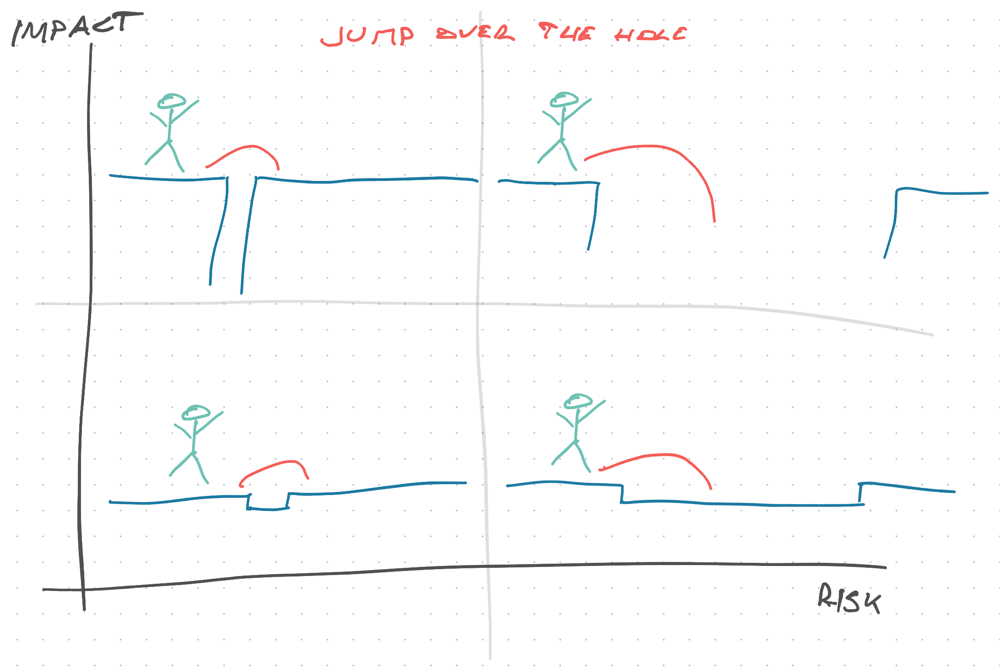

What slows you down the most when you're coding or doing software engineering?

I think underneath anything you just said lies your decision making speed. How fast can you make a decision, commit to a direction (for now), and keep moving?

That's what we talked about in this week's [Senior Mindset Mastermind](https://swizec.gumroad.com/l/RnuqQ).

## Thinking in bets

The book [Thinking in Bets](https://www.annieduke.com/books/) by Annie Duke changed my whole approach. Great read.

Her thesis is that:

1.  You will never have perfect information
2.  You need to decide anyway
3.  No single hand is the whole game

She learned this while becoming a poker champion as a research project. Started from zero, got into it, dominated tournaments for a couple years.

## 4 quadrants of decisions

Coding is not quite like poker, but it isn't far off either. Nice thing about software is how easy it is to change your mind later when you learn more.

If civil engineers can [pivot a building 90°](<https://en.wikipedia.org/wiki/AT%26T_Building_(Indianapolis)>), you can refactor your codebase [name|].

>)

The **mental framework** I use when faced with a decision is to classify it in 4 quadrants along the impact/risk axes.

### low impact low risk

> you might get it wrong and you can fix it fast

An example is naming a variable, function, or class. Doesn't matter. Pick something, anything, and keep coding. When you know more, use your IDE's global rename function to choose a better name.

Nearly all localized decisions with a small blast radius fall into this camp. Like choosing a looping construct.

### low impact high risk

> you're likely to get it wrong but it's easy to fix

An example is designing an API or data modeling in a new domain. You _will_ get it wrong the first time. Or the first couple of times.

The best approach is to pick something and try it out. See how it feels. Iterate until it feels right.

Pontificating on a whiteboard looking for perfection is a great way to waste a lot of time, feel productive, and get it wrong.

### high impact low risk

> you're unlikely to get it wrong and if you do, bad things happen

An example is deploying tested code to production or choosing a popular framework with wide community support.

The approach to use here are rules of thumb – don't deploy before going on vacation – and expert intuition. Once you've done something a lot, your gut knows best.

Take the bet when you're pretty certain. De-risk.

### high impact high risk

> you can be catastrophically wrong and it's hard to fix

An example here is choosing a 3rd party vendor for your project or a framework that's new and exciting. Once you're locked in and you realize it's wrong, it's hard to change your mind.

Take these decisions slowly. Make contingency plans. Design check-ins into your project. Have a deadline to make the decision.

A deadline helps you decide when you're about 80% sure.

Pre-decide when you're going to bail. When situation X, Y, Z arises, we bail. You're going to be too fond of the work when that time comes to think straight.

## Don't judge decisions by their outcomes

Just because the outcome was bad, doesn't mean your decision was bad. Just because the outcome was good, doesn't mean your decision was bad.

I sold 2 bitcoin for $1200 in 2013. Bad decision?

Nope. Bitcoin crashed right after and took another 5 years to reach the same value. And I needed the rent money.

If you're interested in these kinds of conversations, consider joining the [Senior Mindset Mastermind](https://swizec.gumroad.com/l/RnuqQ). We meet every 2 weeks

Cheers, 
~Swizec
