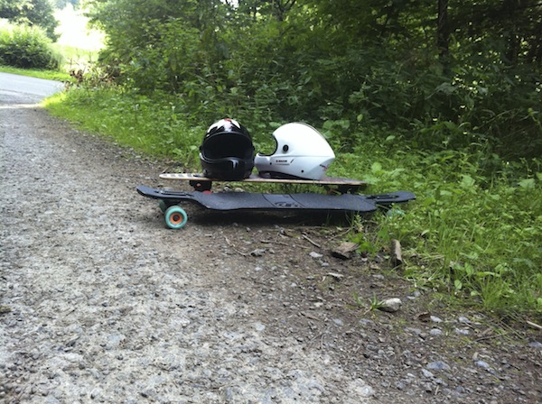

- 2 geeks
- 1 car
- 8000 kilometers
- 11 countries
- 26 epic days

We each went on the roadtrip of a lifetime for different reasons. He wanted to discover himself and grow up, I wanted to have fun and get away from everyone.

He traveled from [Serbia](<http://maps.google.com/maps?ll=44.8,20.4666666667&spn=10.0,10.0&q=44.8,20.4666666667 (Serbia)&t=h>) to pick me up with a car he'd bought a month prior specifically for this trip. @robertbasic is cool like that. Benny, as we later named the car, is a six year old [Citroen Berlingo](http://en.wikipedia.org/wiki/Citro%C3%ABn_Berlingo).

Longboards, helmets, knee pads, torn up jeans, a long week's worth of clothes each, plenty of camping gear and enough food to feed an army. In the end we left half the food on a Free Food Shelf at the hostel in [Innsbruck](http://en.wikipedia.org/wiki/Innsbruck).

In the wastelands of [Spain and Portugal](<http://maps.google.com/maps?ll=43.0,-4.0&spn=10.0,10.0&q=43.0,-4.0 (Iberian%20Peninsula)&t=h>), staying on highways had barely any impact on what we saw anyway. 

The spot near [Lago di Como](<http://maps.google.com/maps?ll=46.0,9.26666666667&spn=0.1,0.1&q=46.0,9.26666666667 (Lake%20Como)&t=h>) in Italy had a super rough road with too many tourists going up and down all the time. 

Each night we'd find some wi-fi and plan out where we're going the next day.

Benny was a real trooper too. He only had one problem all month and even that was just a tyre going boom.

But I don't think we learned anything too profound.

