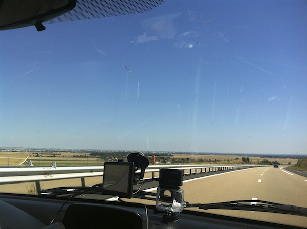

\[caption id=&quot;&quot; align=&quot;alignnone&quot; width=&quot;658&quot;] [Route of the roadtrip](https://maps.google.com/maps?saddr=Ljubljana,+Slovenia&daddr=lago+di+garda+to:Dongo,+Como,+Italy+to:Gap,+France+to:millau,+france+to:Andorra+la+Vella,+Andorra+to:Zaragoza,+Spain+to:M%C3%A9rida,+Spain+to:Sagres,+Portugal+to:Areia+Branca,+Portugal+to:Cabo+da+Roca,+Estrada+do+Cabo+da+Roca,+Colares,+Portugal+to:42.5456278,-5.7274269+to:Bordeaux,+France+to:Jargeau,+France+to:Neufch%C3%A2teau,+Belgium+to:Luxemburg+City,+Luxembourg+to:Freiburg,+Germany+to:Lucerne,+Switzerland+to:Vaduz,+Liechtenstein+to:Innsbruck,+Austria+to:Ljubljana,+Slovenia&hl=en&ie=UTF8&ll=43.133061,5.976563&spn=23.195964,34.013672&sll=43.425845,2.505237&sspn=23.089404,34.013672&geocode=FQPEvgIdJmDdACnRhpiW9TFlRzEg7D-CHPgABA%3BFTuBtwIdcw6iACm5IMCuqOyBRzG4m5YcfPDckQ%3BFRXHvwIdOZiNACnt3T1DjT-ERzFesH9B9WPy4A%3BFRbtpwIdDsVcACnVE6LYeD_LEjFgp5f9pRkIBA%3BFd_roAIdqfYuACmt914WGEuyEjE-_DSlZILJFw%3BFU2YiAIdrDgXACkL-yVKK_WlEjGAcpmRcJQACg%3BFZeCewIdE23y_ymRjmFe3RRZDTGoiYQV8RPfSQ%3BFdnIUQIdqzmf_ynnPwJ7kCYUDTHerSzCWsJa_g%3BFbm5NAId1aN3_yktGmvSF0wbDTFQt5DkvesABQ%3BFVj6VgIdo6Jx_ymBvfnPtTcfDTHhrwjoYu96kQ%3BFQG-TwId-w5v_yGvs_yYqNg6lSmNQ10jwNoeDTGvs_yYqNg6lQ%3BFdsxiQIdPpuo_ykVSBjzn4I3DTEmm9yYOqA35w%3BFZ0rrAIdlCn3_ymBylH36CdVDTGJejl7A4ZjeQ%3BFexi2gIdGGIgACmdlfQReBvlRzHRP8ZYmrw0-Q%3BFVqG-AIdQetSACkNESqJLYPqRzEwbU0vq5kABA%3BFWUD9QId35BdAClXLPOdzUiVRzEQbQXR1tEABA%3BFSBo3AIdOKl3ACll1gtWJhuRRzGwV9-lt2sfBA%3BFV_uzQId3eJ-ACl5c1R5KvqPRzGvUplA0Srwrg%3BFWNSzwIdZTqRACn9L0cdRDGbRzGXFpTOPpSWtw%3BFVxF0QIdRgOuAClzyvjhz26dRzENmx0ofRwgnQ%3BFQPEvgIdJmDdACnRhpiW9TFlRzEg7D-CHPgABA&oq=ljubljana&t=h&dirflg=h&mra=ls&via=11&z=5), roughly\[/caption]

- 2 geeks
- 1 car
- 8000 kilometers
- 11 countries
- 26 epic days

We each went on the roadtrip of a lifetime for different reasons. He wanted to discover himself and grow up, I wanted to have fun and get away from everyone. He traveled from [Serbia](<http://maps.google.com/maps?ll=44.8,20.4666666667&spn=10.0,10.0&q=44.8,20.4666666667 (Serbia)&t=h> "Serbia") to pick me up with a car he&#x27;d bought a month prior specifically for this trip. @robertbasic is cool like that. Benny, as we later named the car, is a six year old [Citroen Berlingo](http://en.wikipedia.org/wiki/Citro%C3%ABn_Berlingo "Citroën Berlingo"). He only looks big until you start packing stuff. And my did we have stuff. \[caption id=&quot;&quot; align=&quot;alignnone&quot; width=&quot;600&quot;] Stuff the end of the trip\[/caption] \[caption id=&quot;&quot; align=&quot;alignnone&quot; width=&quot;448&quot;] We usually kept it tidier than this\[/caption] Longboards, helmets, knee pads, torn up jeans, a long week&#x27;s worth of clothes each, plenty of camping gear and enough food to feed an army. In the end we left half the food on a Free Food Shelf at the hostel in [Innsbruck](http://en.wikipedia.org/wiki/Innsbruck "Innsbruck") because we&#x27;d gotten lazy and ate out a lot. Sure Benny could take more stuff, but we wanted to increase our chances of surviving a month on the road by keeping all the windows clear. Except for the small side windows in the back we succeeded. There might have been a drying towel hanging over the rear window sometimes ... But it&#x27;s okay! We only noticed those when we couldn&#x27;t see if we&#x27;re cutting anyone off while changing lanes on the highway. Highways are weird anyway. They&#x27;re like a wormhole through the country - avoiding every interesting part of the country&#x27;s character and always routed through the most boring terrain. We tried avoiding them as much as possible. Especially in [Provence](http://en.wikipedia.org/wiki/Provence "Provence") and everything mountainous we passed through because those are pretty. \[caption id=&quot;&quot; align=&quot;alignnone&quot; width=&quot;600&quot;] This view dominated the month\[/caption] \[caption id=&quot;&quot; align=&quot;alignnone&quot; width=&quot;600&quot;] Accompanied by this sort of view\[/caption] In the wastelands of [Spain and Portugal](<http://maps.google.com/maps?ll=43.0,-4.0&spn=10.0,10.0&q=43.0,-4.0 (Iberian%20Peninsula)&t=h> "Iberian Peninsula") staying on highways had barely any impact on what we saw anyway. Even the freeways were just a bunch of straight lines through nothing. Might as well take the highway so you can drive 110 instead of 90. Much faster than that and the engine temperature climbs into scary town. And while the town-to-town roads in France and [Belgium](<http://maps.google.com/maps?ll=50.85,4.35&spn=10.0,10.0&q=50.85,4.35 (Belgium)&t=h> "Belgium") were a lot of fun and we loved praying to god that a tractor doesn&#x27;t come barreling down from the front lest we have nowhere to run, you don&#x27;t want to do that in the desert. Most of the time it was so hot we sweated like pigs despite the air conditioning. Nobody likes smelling a car full of two sweaty blokes, stale food and longboarding equipment that takes days to dry after a session ... \[caption id=&quot;&quot; align=&quot;alignnone&quot; width=&quot;600&quot;] At the epic spot in Belgium\[/caption] Not that we did much longboarding. This was supposed to be a longboarding roadtrip. Go around Europe, find epic spots, ride for a few hours every day, get super tired and come back with mad skillz. We drove on many buttery roads, but only found four ridable freeride spots and two good dancing spots. The spot near [Lago di Como](<http://maps.google.com/maps?ll=46.0,9.26666666667&spn=0.1,0.1&q=46.0,9.26666666667 (Lake%20Como)&t=h> "Lake Como") in Italy had a super rough road with too many tourists going up and down all the time. The spot near Gap in France had a lot of loose rocks on the road and it was getting dark, the spot near Lemon Tree Hostel in Portugal didn&#x27;t grip due to fine sands and the spot in Belgium was bloody perfect if a bit rough. But we did do _a lot_ of cruising. There&#x27;s nothing like a longboard to go into a town you know nothing about and see all the cool random sights you can find downtown in a single afternoon. I think we averaged something like two hours of cruising per day. No wonder all our trousers were falling off by the end of the trip ... Cruising around going _&quot;Oooh, that&#x27;s pretty! I wonder what it is?&quot;_ at random shit was our general approach to the roadtrip. Each night we&#x27;d find some wi-fi - luckily every camp and hostel we were at had some - and plan out where we&#x27;re going the next day. \[caption id=&quot;&quot; align=&quot;alignnone&quot; width=&quot;600&quot;] At the end of the world we ate a 17 euro hamburger\[/caption] We knew the general direction, looked at the large map of Europe and pointed fingers at places we&#x27;ve heard of before, then asked Kaylee the GPS how far it was. If it was under five to six hours, it was where we&#x27;d end up the next day. Except for that one time we went to Leon, arrived too late to find an open hostel, pushed onward to Bordeaux, ended up doing some 1200km in a single leg and spending about 15 hours on the road. Oops. But we only had to sleep in the car twice the whole month! It&#x27;s not very pleasant. \[caption id=&quot;&quot; align=&quot;alignnone&quot; width=&quot;600&quot;] In Belgium we fed baby dinosaurs\[/caption] Benny was a real trooper too. He only had one problem all month and even that was just a tyre going boom. On the way to Belgium just outside Messincourt there was a strange noise from the back. All the doors were closed (we had the back door pop open once), but we stopped anyway. Benny was limping. We tried to fix him up, but one of the screws defeated us and became round. Ever tried explaining that you need a mechanic in a small town in France without knowing how to speak French? It&#x27;s not easy. After I finally found somebody willing to at least listen to me, the most detailed description the two young mummies with strollers would understand was _&quot;Car. Tyre. Boom.&quot;_ They were kind enough to call the nearest garage from a nearby town. After they changed our tyre and we followed them back to the shop they explained that it&#x27;s dead and we needed a new one. But they only had winter tyres in stock so we had to buy two. Something about safety. Now there was a tyre next to all our _other_ stuff in the trunk. In the end we got home safe and sound. We had both gone through exactly the same cold, seen a lot of the same stuff with slightly different eyes, and gotten somewhat sick of driving. The first few days the fight was over who is driving first, the last few days it was over who isn&#x27;t. \[caption id=&quot;&quot; align=&quot;alignnone&quot; width=&quot;600&quot;] This is a story in one picture.\[/caption] But I don&#x27;t think we learned anything too profound. Robert is the same fool he&#x27;s always been, only now he knows that he&#x27;s been a happy fool all along, he&#x27;d just been hiding it. And upon coming home I learned that even though I love everybody here, I want to be anywhere other than home. Roadtrips don&#x27;t help you write quite as much as the movies will have you think.

