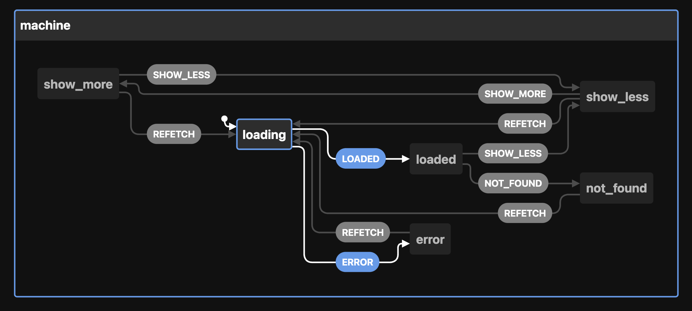

When you grok state machines, a new world of computational beauty and software design opens in front of your eyes. Things that used to be hard become easy. The impossible becomes possible. And you turn into that annoying team member.

_"Damn it! Stop it with these state machines. Nobody understands your code"_

It's true, nobody understands what the heck this means:

```javascript
const loader = createMachine({
  id: "loader",
  initial: "fetching",
  states: {
    fetching: { on: { FETCHED: "fetched", ERROR: "error" } },
    fetched: { on: { RELOAD: "fetching" } },
    error: { on: { RETRY: "fetching" } },
  },
})
```

But if you show it like this:


Now we're talking! This is a smol state machine that represents a data loader with 3 states – fetching, fetched, error – and transitions between them.

That's all a [state machine](https://en.wikipedia.org/wiki/Finite-state_machine) is – a collection of states with transitions. Best represented as a state chart like above, easily drawn by hand, popular building blocks for complex systems based on [the actor model of computation](https://en.wikipedia.org/wiki/Actor_model).

You can think of ant colonies, human cities, and generative video game landscapes as examples of actor-based computation with state machines. An exploration for another day :)

## You're already building implicit state machines

The one thing you should take away from this article is that _you are building state machines even if you don't realize it_. State machines are everywhere.

Take this (pseudocode) React component for example.

It uses [React Query](https://swizec.com/blog/how-react-query-gives-you-almost-everything-you-thought-you-needed-graphql-for/) to load some data, a `showMore` state to choose how big a list to render, and attempts to handle various edge cases.

```javascript
function pseudoCodeExample() {
  const { data, isLoading, isError } = useQuery()
  const [showMore, setShowMore] = useState(false)

  function onShowMore() {
    setShowMore(true)
  }
  function onHideMore() {
    setShowMore(false)
  }

  return (
    <div>
      {isLoading && <Spinner />}
      {!isLoading && !data && <NotFound />}
      {!isLoading && isError && <Ooopsies />}
      {!isLoading && data && (
        <>
          <List data={data} count={10} />
          {!showMore && <Button onClick={onShowMore} />}
        </>
      )}
      {!isLoading && data && showMore && (
        <>
          <List data={data} count={data.length} />
          <Button onClick={onHideMore} />
        </>
      )}
    </div>
  )
}
```

You can imagine how a component like this grows over time. [The bugs were whack-a-mole](https://swizec.com/blog/what-to-do-when-bugs-are-whack-a-mole/), new exceptions and edge cases were added, and nobody took the time to step back and think _"Is our approach wrong?"_

Can you spot the bug? Revealed at the bottom.

Complex conditionals like that break my brain and [When your brain is breaking, try XState](https://swizec.com/blog/when-your-brain-is-breaking-try-xstate/) ✌️

## Explicit state machines feel like more work

Adding an XState state machine to that component feels like extra work.

The state machine itself is not simple:

```javascript
const stateMachine = createMachine({
  id: "machine",
  initial: "loading",
  states: {
    loading: {
      on: { ERROR: "error", LOADED: "loaded" },
    },
    error: {},
    loaded: {
      on: { SHOW_LESS: "show_less", NOT_FOUND: "not_found" },
    },
    show_less: {
      on: { SHOW_MORE: "show_more" },
    },
    show_more: {
      on: { SHOW_LESS: "show_less" },
    },
    not_found: {},
  },
})
```

And then you have to write all the glue code to drive this state machine. React Query and XState don't natively talk to each other. Yet 🤞

https://twitter.com/jimbolla/status/1496895386136449024

Rumor has it [David](https://twitter.com/DavidKPiano) and the [Stately.ai](https://stately.ai/) team are working on a plugin system for XState.

But look what happens to our rendering logic:

```javascript
switch (state.value) {
  case "loading":
    return <Spinner />
  case "not_found":
    return <NotFound />
  case "error":
    return <Ooopsies />
  case "show_less":
    return (
      <>
        <List data={data} count={10} />
        <Button onClick={showMore} />
      </>
    )
  case "show_more":
    return (
      <>
        <List data={data} count={data.length} />
        <Button onClick={showLess} />
      </>
    )
  default:
    return <Spinner />
}
```

Feels much more readable to me. You see all the states and what they render. Add TypeScript and you'll know at a glance if anything is missing.

And we fixed the bug 😉

## Statelyai's VSCode extension 😍

Where state machines shine is visualizing your logic. Reading the original soup of conditionals is hard because you have to picture what's going on in your brain.

That's where the _"OMG Don't distract me!"_ meme about programmers comes in. Holding glass palaces of complexity in your brain is hard. Let the computer do it!

Install the [xstate-vscode](https://github.com/statelyai/xstate-vscode) extension and you get this 👇


Open the inspector and look at this. Right in your editor!


You can click around to simulate events and see what happens. There's a lot of dead ends in our state machine. Users could get stuck 🤔

### Editing state machines visually 🤯

The UX of our example component is terrible. All those dead-end states means users can get stuck. Why is there no retry on error? What about not found? What if you want fresh data after reading for a while?

[xstate-vscode](https://github.com/statelyai/xstate-vscode) comes with an editor! It's a little buggy right now and doesn't support everything XState can do, but it's wonderful for fixing issues like this.


That looks messy I agree. The visualizer is wonderful though.



Next time you're dealing with complex UI logic, consider employing a state machine. With Statelyai's new XState VSCode extension, they even shine on a team.

Cheers,<br/>
~Swizec

PS: the bug in my first component is that `<List />` renders twice when `showMore = true`. Users will see the first 10 elements twice

PPS: for an example of refactoring useReducer to XState, try [this series of articles](https://swizec.com/blog/refactoring-a-usereducer-to-xstate-pt1-codewithswiz-11/)
