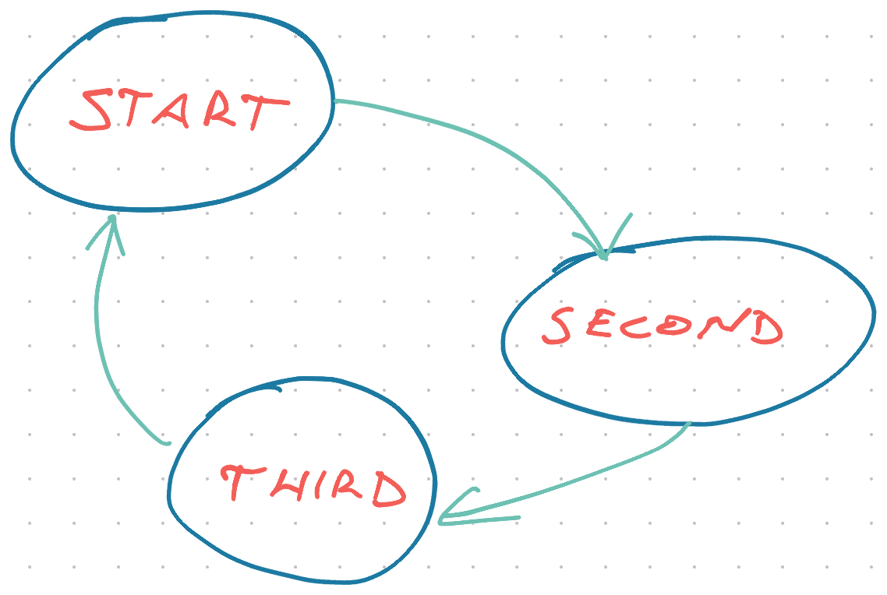

How do you write a reusable React hook?

Oh that's easy, _every_ hook is reusable! 🥳

```typescript
function useMyLittleStateMachine() {
  const [state, setState] = useState("start");
  let nextState = state;

  switch (state) {
    case "start":
      nextState = "second";
      break;
    case "second":
      nextState = "third";
      break;
    case "third":
      nextState = "start";
      break;
  }

  return { state, nextState };
}
```

You get a tiny little state machine that doesn't do much. Runs you 'round in a circle.



Let's pretend you're using it for routing because that's what I was building to get this idea. _"What is the next step in this UX flow?"_

You use the state machine like this:

```typescript
const GoNext = () => {
  const { nextState } = useMyLittleStateMachine();

  return <Link to={`/important_flow/{nextState}`}>Go Next</Link>;
};
```

Handy way to decouple sequences of UI views. You think it's silly until your PM starts shuffling things around to run A/B tests.

## A linear state machine is silly

You wouldn't bother with a linear state machine. Make it an array, use incrementing index. Way easier.

But UX flows like to depend on context.

```typescript
function useMyRoutingStateMachine(user: User) {
  // from React Router, returns current location
  const location = useLocation();

  let nextRoute = "start";

  switch (location.path) {
    case "start":
      if (user.valid) {
        nextState = "do_things";
      } else if (user.badName) {
        nextState = "fix_name";
      } else {
        nextState = "error";
      }
      break;
    case "fix_name":
      if (user.valid) {
        nextState = "do_things";
      }
    // ...
  }

  return { nextState };
}
```

Each state checks properties on the `user` model to decide what comes next. An error, a data-fixing form, the core functionality, ...

This is great. Put it anywhere in your app, give current user, and it says what screen comes next. 🥳

## A non-reusable state machine, phooey

You've got this cool little state machine that works for users.

What about for comments? Those are similar if you squint hard enough. The flow starts, then you can have an error, fix things ... hmmmm 🤔

Yes I know I'm stretching. It's an example to show a thing.

If comments and users share the important properties, you can do this:

```typescript
function useMyRoutingStateMachine(context: User | Comment) {
  // from React Router, returns current location
  const location = useLocation();

  let nextRoute = "start";

  switch (location.path) {
    case "start":
      if (context.valid) {
        nextState = "do_things";
      } else if (context.badContent) {
        nextState = "fix_content";
      } else {
        nextState = "error";
      }
      break;
    case "fix_content":
      if (context.valid) {
        nextState = "do_things";
      }
    // ...
  }

  return { nextState };
}
```

A [union type](https://www.typescriptlang.org/docs/handbook/unions-and-intersections.html#union-types) says the `context` param should be either a `User` or a `Comment`. You read it like an OR, but it's not an OR.

Union means the new type has all the _shared_ properties.

And that's where things blow up. The more you lean into union types, the harder TypeScript has to work, the more you'll see errors like this:

```
types of parameters 'user' and 'context' are incompatible
Type 'User | Comment' is not assignable to type 'Comment'
Type 'User' is missing the following properties from type 'Comment'
```

💩

## TypeScript generics to the rescue

[https://twitter.com/Swizec/status/1362132067010502656](https://twitter.com/Swizec/status/1362132067010502656)

When you're done pulling your hair out, here's what you do 👉 you sprinkle a TypeScript generic on your code. They're not as scary as they look.

```typescript
function useMyRoutingStateMachine<T>(context: T) {
  // ...
}
```

Context is of generic type `T` as specified when the hook is used.

```typescript
const GoNextUser = (user: User) => {
  const { nextState } = useMyLittleStateMachine<User>(user);

  return <Link to={`/important_flow/{nextState}`}>Go Next</Link>;
};

const GoNextComment = (comment: Comment) => {
  const { nextState } = useMyLittleStateMachine<Comment>(comment);

  return <Link to={`/important_flow/{nextState}`}>Go Next</Link>;
};
```

Call the hook and _tell it the type of its parameter_. You've done this before with library hooks, at least `useState`, but it feels special when it's your own.

You can go even further. Make the component generic.

```typescript
const GoNext = (context: T) => {
  const { nextState } = useMyLittleStateMachine<T>(context);

  return <Link to={`/important_flow/{nextState}`}>Go Next</Link>;
};
```

🤯

TypeScript doesn't care about the name of the type you're passing around. As long as its consistent.

Obvious in retrospect.

Cheers,<br/>
~Swizec

PS: you can use generics in type definitions and that blows my mind

```typescript
export type FlowMachine<T> = {
  // init step is required
  init: FlowStep<T>;
  [key: string]: FlowStep<T>;
};

type FlowStep<T> = {
  path: string;
  nextStep: (context: T) => FlowStep<T>;
};
```
