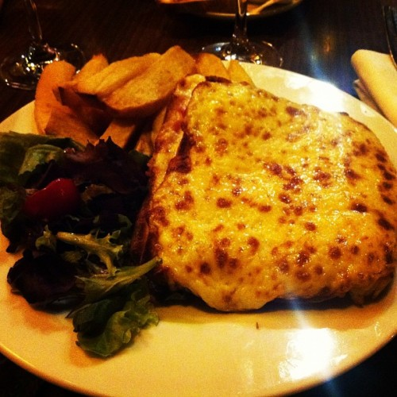

Paris, that city where [Starbucks](http://www.menuism.com/restaurant-locations/starbucks-coffee-39564 "Starbuck's Coffee Locations") is the cheap place to get your caffeine fix.

Despite having to subsist on nothing but sandwiches for a whole week, Paris was marvelous. As some bloke in a [Woody Allen](http://www.rottentomatoes.com/celebrity/woody_allen "Woody Allen") movie once said _"Paris is a wonderful city to just get lost in."_

It really is.

Since I went to Paris with a group of architecture students on a field trip there was certainly a lot of strolling around the city going on. An average of four hours of pure walking every day I would say ... consequently, I have no idea what the party night-life of Paris looks like.

Not that I could afford it anyway.

Buying a cup of tea in a lovely Parisian bistro - those things it's famous for - will set you back between four and five euro. That's a lunch here in [Ljubljana](<http://maps.google.com/maps?ll=46.0555555556,14.5083333333&spn=0.1,0.1&q=46.0555555556,14.5083333333 (Ljubljana)&t=h> "Ljubljana"). A single sandwich will cost anything between five-ish and seven-ish euro ... eating a proper meal is easily a twenty euro expense.

Even a falafel costs ten euro.

Luckily, everything other than food is reasonably priced. Clothes and gadgets cost about the same as at home, public transit is cheap and hostels aren't too pricey if you're willing to settle for a strange room with a bad paint job, one shower and bathroom per floor and a wash basin situated sort of in the middle of the room.

Unfortunately humans need food. A lot of food as it turns out.

But enough about money.

## Pretty things

My favourite aspect of Paris were the bistros. They all look very lovely, make you want to sit around, sipping cup after cup of tea, for hours on end and all the seats are turned into the street.

On the whole, the city felt a lot like letting a modern web designer loose on London. Wide streets, plenty of whitespace, silly sounding language and more room for activities. All the buildings are roughly the same height and look very similar to one another.

There are a lot of carousels.

Every two hundred meters there is a butchery, every hundred meters there's a bakery and every fifty meters there's a pharmacy. Fancy shops are situated on [Champs-Élysées](<http://maps.google.com/maps?ll=48.8697222222,2.3075&spn=0.01,0.01&q=48.8697222222,2.3075 (Champs-%C3%89lys%C3%A9es)&t=h> "Champs-Élysées") - much like [London's](<http://maps.google.com/maps?ll=51.5072222222,-0.1275&spn=0.1,0.1&q=51.5072222222,-0.1275 (London)&t=h> "London") [Oxford street](<http://maps.google.com/maps?ll=51.5136111111,-0.155555555556&spn=0.01,0.01&q=51.5136111111,-0.155555555556 (Oxford%20Street)&t=h> "Oxford Street").

There are very few commercial chains. Most shops are small things seemingly owned by families.

Since this was an architecture trip, I didn't get to go into any museums and such, we mostly looked at modern-ish buildings of various designs. This was a strangely pleasurable turn of events on how I usually experience cities that I visit.

You'd never guess how interesting building's facades can be - the arabic institute features shutters, Pompidue has all the installations on the outside and some manner of gallery thinks its facade is a forrest.

The national bibliotheque was wonderuful as well. All the books are stored in four skyscrapers, while the reading areas are all underground and in the middle of it all is a forest of very tall trees.

Marvelous.

Oh and I got to see [Loeb's](http://www.loebsclothing.com/ "Loeb's (department store)") rally car in the Citroen showroom, Morrison's grave and Wilde's terribly fangirl'd grave ... seriously, how can a guy who's been dead for 112 years still have that many fangirls trying to ruin his grave?

PS: I do not advise travelling with a group of ~12 females, it gets very ... group dynamics and stuff.

###### Related articles

- [Picture Perfect Paris](http://www.misscocomarie.com/picture-perfect-paris/)
- [Series of itineraries for the first time visitor: PARIS](http://experttraveltipsbygerri.wordpress.com/2012/10/11/series-of-itineraries-for-the-first-time-visitor-paris/)
- ["Père Lachaise" by Wes Craven](http://jimmorrisonsparis.com/2012/10/01/pere-lachaise-by-wes-craven/)
- [Paris Highlights - Jardin des Tuileries](http://afreckleintime.wordpress.com/2012/10/22/paris-highlights-jardin-des-tuileries/)

