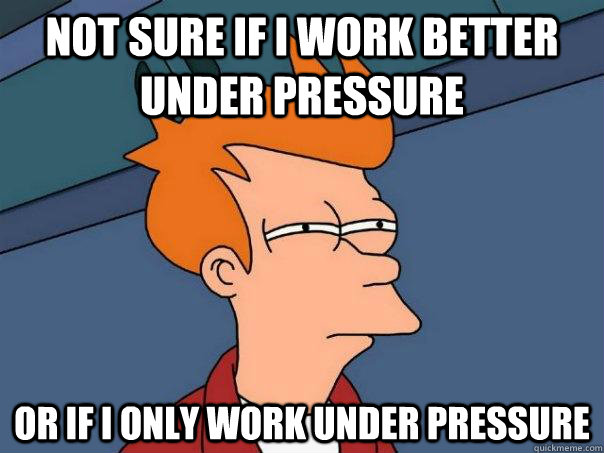

A coworker asked me for tips on how to stay focused during the day. Here's what I said.

She's a former chef and never learned to focus manually. Adrenaline! Me, I'm a scatter brained mess. Social media is my poison. I got distracted 5 times writing this paragraph 😅

## The basics

This post assumes you're doing the basics – phone and computer on Do Not Disturb. Mine have been in that mode since 2012. Deny notification permissions to any app that asks. Hide visible unread counters too.

Mute all group chats and for-fun Slack, Telegram, and Discord channels. Set your work chats to make noise only if you are @-mentioned.

You may check these a lot, I go every few minutes, but this makes it your choice. Check when it's convenient for you, not when something goes beep.

## You might be thinking about focus the wrong way

As my role shifts from [deep work](https://www.calnewport.com/books/deep-work/) towards the [manager schedule](http://www.paulgraham.com/makersschedule.html) – my highest impact is no longer doing the work myself – focus has been harder and harder. Some days feel like you're being tossed from one 5 minute question to another like a hurricane.

That's [Why senior engineers get nothing done](https://swizec.com/blog/why-senior-engineers-get-nothing-done/).

https://twitter.com/Swizec/status/1547382684905017345

And that's okay! You don't have to get _everything_ done and you shouldn't expect 100% focus all of the time. That's not how brains work.

Instead of staying laser sharp glued to your desk banging on the keyboard for long stretches of time, think about focus like this. What's the most important thing to get done today?

Focus on _that_.

## The ritual

That's where The Ritual comes from. What's the one thing I have to do today that makes everything else easier or unnecessary?

When I code, [I write down everything](https://swizec.com/blog/when-you-code-write-down-everything/). Another little trick that keeps my mind from wandering. Helps with getting back into it after a _"Can you help me look at this real quick?"_ too.

On a solid day of coding I'll cover 8 pages of scribbled notes. Lately it's been 3 😅

But I start every day the same: I make my tea. Switch laptops. Then write at the top of a new page – _"What do yesterday and what doing today?"_

Then comes a list of all you accomplished the previous day. Makes you feel good, reminds you lots got done even if you don't remember, and gives you a chance to review any balls that got dropped.

Scraaaaaaaatch. Long line. Yesterday is no more.

List the immovable obstacles in your schedule. The meetings, the ... yeah it's just meetings. You can't change those and they _are_ work. [A good meeting is your secret weapon](https://swizec.com/blog/meetings-a-senior-engineers-secret-weapon/).

After immovable obstacles come your biggest priorities for the day. Then every little thing you'd like to get done.

Some people use the 2+3 formula – 2 things you _have to_ get done, 3 things you'd like to get done. Others say 1+N – 1 rock that _will_ get done no matter what, N little things.

I don't work that way. [Time box](https://en.wikipedia.org/wiki/Timeboxing) your work to the time you allow and make your best effort. There's always tomorrow.

As long as you work every day on the biggest priority first, that's all you need. And make sure there's a barrier between work life and home life. I like the boxing gym 🥊

Cheers, 
~Swizec

PS: if you find it impossible to focus, you may be working at the wrong level of difficulty. Mihály Csíkszentmihályi in his [theory of flow](<https://en.wikipedia.org/wiki/Flow_(psychology)>) describes that we work best when we're challenged, but not too much. Too easy and you lose focus, too hard and you run away. Ask your manager and team to help you find the right balance.
