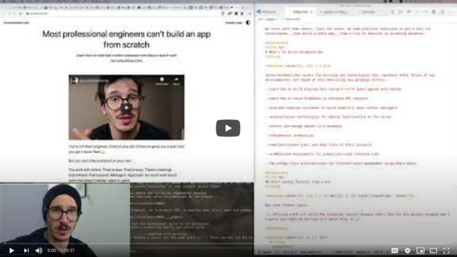
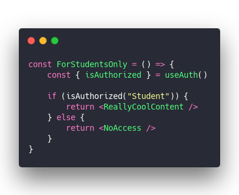
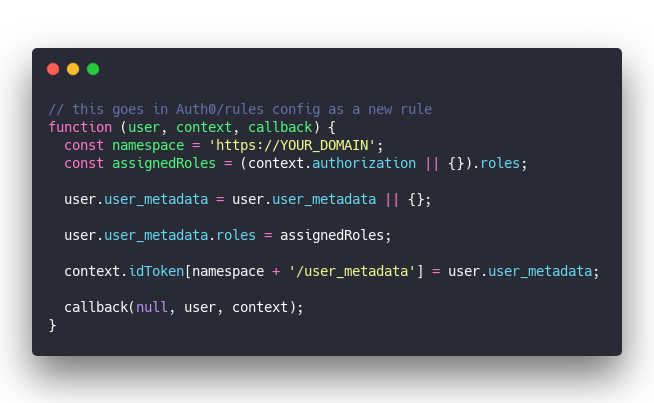
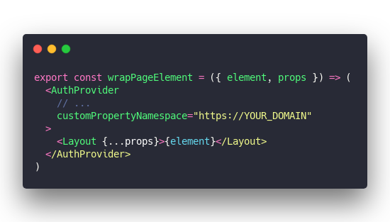
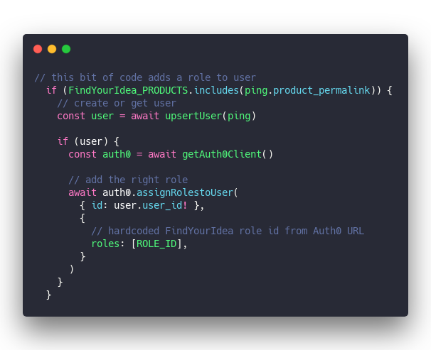
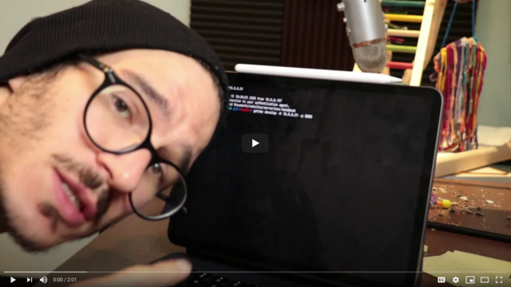

Say you've got a JAMStack app with authentication. Works great, loads fast, some pages need login.

That part's easy with something like [useAuth](https://github.com/Swizec/useAuth), a manual integration with Auth0, or any number of 3rd party providers.

You have some code that asks _"Is this user logged in?"_. Show them the page or some "Please Login" interface. There's a button somewhere that starts the login flow.

Something like this for example:

Now what if you want to add an area that only some users have access to? How would you do that?

🤔

## Roles are the answer

User roles are the simplest approach to granular permissions. Everything else I've tried gets out of hand super fast.

Is this user a student or not? Access to course.

Does this user have module X? Access.

You can go as detailed as you want. Admin vs. not-admin is often the first and only role-based permission. Some apps eventually need more.

The more roles you add, the more complex it all gets. But trust me, roles are the only approach that scales at all.

A friend of mine lived through a horror story where it took an entire team and 3 years to build a robust permission system for a large app. 3 years 😳

Roles are way easier.

## With useAuth 0.7.0

Hot off the presses, [useAuth 0.7.0](https://github.com/Swizec/useAuth) adds a helper to check for user roles. Still just for Auth0, soon for others I promise.

Here's what you do:

&t=seti&l=javascript&ds=true&wc=true&wa=true&pv=48px&ph=32px&ln=false&code=const%20ForStudentsOnly%20%3D%20()%20%3D%3E%20%7B%0A%09const%20%7B%20isAuthorized%20%7D%20%3D%20useAuth()%0A%09%0A%09if%20(isAuthorized(%22Student%22))%20%7B%0A%09%09return%20%3CReallyCoolContent%20%2F%3E%0A%09%7D%20else%20%7B%0A%09%09return%20%3CNoAccess%20%2F%3E%0A%09%7D%0A%7D>)

And that's pretty much it, really.

The `isAuthorized` method verifies your user is currently logged-in and that they have the `Student` role.

You'll need to add a rule to your Auth0 config as well. They don't send this info by default. Don't know why, I tried everything. 😔

&t=seti&l=javascript&ds=true&wc=true&wa=true&pv=48px&ph=32px&ln=false&code=%2F%2F%20this%20goes%20in%20Auth0%2Frules%20config%20as%20a%20new%20rule%0Afunction%20(user%2C%20context%2C%20callback)%20%7B%0A%20%20const%20namespace%20%3D%20'https%3A%2F%2FYOUR_DOMAIN'%3B%0A%20%20const%20assignedRoles%20%3D%20(context.authorization%20%7C%7C%20%7B%7D).roles%3B%0A%20%20%0A%20%20user.user_metadata%20%3D%20user.user_metadata%20%7C%7C%20%7B%7D%3B%0A%0A%20%20user.user_metadata.roles%20%3D%20assignedRoles%3B%0A%0A%20%20context.idToken%5Bnamespace%20%2B%20'%2Fuser_metadata'%5D%20%3D%20user.user_metadata%3B%0A%0A%20%20callback(null%2C%20user%2C%20context)%3B%0A%7D>)

And you have to make sure that namespace matches a config in the `<AuthProvider>` that wraps your whole component tree. That's how `useAuth` hooks into the React context and keeps track of everything.

&t=seti&l=javascript&ds=true&wc=true&wa=true&pv=48px&ph=32px&ln=false&code=export%20const%20wrapPageElement%20%3D%20(%7B%20element%2C%20props%20%7D)%20%3D%3E%20(%0A%20%20%3CAuthProvider%0A%20%20%20%20%2F%2F%20...%0A%20%20%20%20customPropertyNamespace%3D%22https%3A%2F%2FYOUR_DOMAIN%22%0A%20%20%3E%0A%20%20%20%20%3CLayout%20%7B...props%7D%3E%7Belement%7D%3C%2FLayout%3E%0A%20%20%3C%2FAuthProvider%3E%0A)>)

No, I don't know why the namespace needs to be a full URL. The Auth0 documentation isn't clear on that part and I was unable to hunt down details on the forums.

## How do you get roles onto users in the first place?

Ah yes, _adding_ roles to users. That part is a little tricky.

Here's an article I wrote on [Connecting Gumroad to Auth0 for paywalled JAMStack apps](https://swizec.com/blog/connecting-gumroad-to-auth0-for-paywalled-jamstack-apps/) ❤️

The TL;DR is that your checkout provider triggers your cloud function through a webhook and that adds a role to your user. You can also do it manually.

I use Gumroad, Stripe works too. I use AWS Lambda, a Netlify or Vercel cloud function should be fine.

&t=seti&l=javascript&ds=true&wc=true&wa=true&pv=48px&ph=32px&ln=false&code=%2F%2F%20this%20bit%20of%20code%20adds%20a%20role%20to%20user%0A%20%20if%20(FindYourIdea_PRODUCTS.includes(ping.product_permalink))%20%7B%0A%20%20%20%20%2F%2F%20create%20or%20get%20user%0A%20%20%20%20const%20user%20%3D%20await%20upsertUser(ping)%0A%0A%20%20%20%20if%20(user)%20%7B%0A%20%20%20%20%20%20const%20auth0%20%3D%20await%20getAuth0Client()%0A%0A%20%20%20%20%20%20%2F%2F%20add%20the%20right%20role%0A%20%20%20%20%20%20await%20auth0.assignRolestoUser(%0A%20%20%20%20%20%20%20%20%7B%20id%3A%20user.user_id!%20%7D%2C%0A%20%20%20%20%20%20%20%20%7B%0A%20%20%20%20%20%20%20%20%20%20%2F%2F%20hardcoded%20FindYourIdea%20role%20id%20from%20Auth0%20URL%0A%20%20%20%20%20%20%20%20%20%20roles%3A%20%5BROLE_ID%5D%2C%0A%20%20%20%20%20%20%20%20%7D%0A%20%20%20%20%20%20)%0A%20%20%20%20%7D%0A%20%20%7D>)

Full details in the [Connecting Gumroad to Auth0 for paywalled JAMStack apps](https://swizec.com/blog/connecting-gumroad-to-auth0-for-paywalled-jamstack-apps/) article.

## What if there's many roles to check?

This is where life gets tricky. The more roles you have, the trickier. 😅

Somewhere in your code there's going to be a component like this.

&t=seti&l=javascript&ds=true&wc=true&wa=true&pv=48px&ph=32px&ln=false&code=const%20LockedContent%20%3D%20(props)%20%3D%3E%20%7B%0A%20%20const%20allowUnauth%20%3D%20UNAUTH_PAGES.includes(currentLocation(props))%0A%20%20const%20%7B%20isAuthorized%2C%20isAuthenticated%20%7D%20%3D%20useAuth()%0A%0A%20%20if%20(!allowUnauth%20%26%26%20!isAuthenticated())%20%7B%0A%20%20%20%20%2F%2F%20not%20even%20logged%20in%2C%20ask%20for%20login%0A%20%20%20%20return%20%3CPleaseLogin%20%2F%3E%0A%20%20%7D%20else%20%7B%0A%20%20%20%20if%20(isFindYourIdeaPage(props))%20%7B%0A%20%20%20%20%20%20if%20(isAuthorized(%22FindYourIdea%22))%20%7B%0A%20%20%20%20%20%20%20%20%2F%2F%20FindYourIdea%20page%2C%20access%20-%3E%20show%0A%20%20%20%20%20%20%20%20return%20%3CContent%20%7B...props%7D%20%2F%3E%0A%20%20%20%20%20%20%7D%20else%20%7B%0A%20%20%20%20%20%20%20%20%2F%2F%20FindYourIdea%20page%2C%20no%20access%20-%3E%20buy%0A%20%20%20%20%20%20%20%20return%20%3CPleasePurchase%20findYourIdea%20%2F%3E%0A%20%20%20%20%20%20%7D%0A%20%20%20%20%7D%20else%20if%20(isAuthorized(%22Student%22))%20%7B%0A%20%20%20%20%20%20%2F%2F%20ServerlessReactDev%20page%2C%20acces%20-%3E%20show%0A%20%20%20%20%20%20return%20%3CContent%20%7B...props%7D%20%2F%3E%0A%20%20%20%20%7D%20else%20if%20(allowUnauth)%20%7B%0A%20%20%20%20%20%20%2F%2F%20no%20auth%20required%20-%3E%20show%0A%20%20%20%20%20%20return%20%3CContent%20%7B...props%7D%20%2F%3E%0A%20%20%20%20%7D%20else%20%7B%0A%20%20%20%20%20%20%2F%2F%20ServerlessReactDev%20page%2C%20no%20access%20-%3E%20buy%0A%20%20%20%20%20%20return%20%3CPleasePurchase%20%2F%3E%0A%20%20%20%20%7D%0A%20%20%7D%0A%7D>)

Like I said, messy. And there's nothing you can do about it.

Might look a little better, if you bake it into your router and use individual checks on individual pages. But the complexity remains. Somewhere something has to check this stuff. 🤷‍♀️

Using different components for different content pages makes it easier – check authorization in the component itself. But I'm using some MDX shenanigans and the `<Content>` component doesn't know what it's showing.

So a nice big truth table is what I gotta do.

## What about without useAuth?

Same principle my friend. You get the role for your user and you ask _"Does this role have access to this page?"_

✌️

Cheers,  
~Swizec

PS: the [coding-on-a-ipad workflow I suggested on Friday totally worked](https://swizec.com/blog/looking-for-the-perfect-light-work-device/) 🤘

