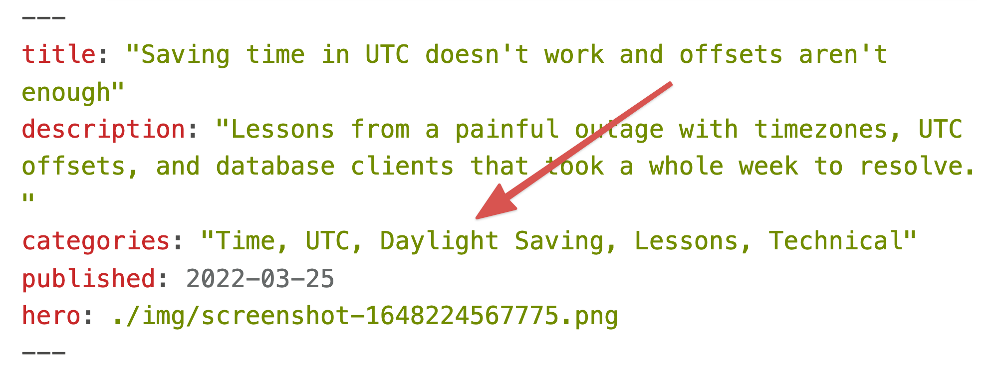

One of my biggest frustrations since [migrating swizec.com from Wordpress to Gatsby](https://swizec.com/blog/moving-13-years-of-wordpress-blog-to-gatsby-markdown/) was that I never added categories. Always wanted to, never did. Thought it would be super hard.

For ... years ... I diligently wrote categories in the frontmatter of all my markdown and the software dutifully ignored all that. 💩

For example, I added a bunch of categories to [Saving time in UTC doesn't work, and offsets aren't enough](https://swizec.com/blog/saving-time-in-utc-doesnt-work-and-offsets-arent-enough/):



And until a few days ago, those categories rendered as useless plaintext:


Between you and me, I doubt any human in the history of reading articles on the web has ever wanted to click on one of those. But the Google bot does. And Google loooooves internal links.

## Use Gatsby to create category pages

You can use Gatsby's wonderful [Creating Pages from Data Programmatically](https://www.gatsbyjs.com/docs/programmatically-create-pages-from-data/) tutorial as a guide. Here's what I did.

Add a new function call to the `createPages` hook in `gatsby-node.js`. This lets you hook into the page creation part of Gatsby's build lifecycle.

```javascript
// gatsby-node.js

exports.createPages = async ({ graphql, actions }) => {
  createCategoryPages({ graphql, actions });
};
```

I like to name my functions so it's easier to keep track.

The `createCategoryPages` function works in 3 steps:

1.  Use GraphQL to collect all category lists
2.  Create a `Set()` of unique categories
3.  Iterate and make pages

### Use GraphQL to collect all category lists

Gatsby revolves around the idea of using GraphQL to access everything. And they mean _everything_. Even markdown files in your project.

    // gatsby-node.js

    async function createCategoryPages({ graphql, actions }) {
      const result = await graphql(`
        query Categories {
          allMdx(filter: { fileAbsolutePath: { regex: "/blog|articles/.+/" } }) {
            nodes {
              frontmatter {
                categories
              }
            }
          }
        }
      `)

      if (result.errors) {
        console.error(result.errors) // eslint-disable-line no-console
        throw result.errors
      }

That GraphQL query looks for all [MDX files](https://www.gatsbyjs.com/docs/glossary/mdx/) under the `/blog/` or `/articles/` paths and extracts the `categories` field from their frontmatter. If there's an error, we throw.

### 2. Create a `Set()` of unique categories

The query gives us an array of strings like `"Time, UTC, Daylight Saving, Lessons, Technical"`. We need to split that into individual categories and make sure we clear duplicates.

```javascript
// gatsby-node.js

// extract categories out of graphql and make a set
const allCategories = new Set(
  result.data.allMdx.nodes
    .filter((node) => !!node.frontmatter.categories)
    .map((node) => node.frontmatter.categories)
    .map((categories) => categories.split(","))
    .flat()
    .map((category) => category.trim().toLowerCase())
);

allCategories.add("uncategorized");
```

First, a filter clears empty strings. Second, a map extracts the `categories` property. Third, a map splits by comma. Fourth, a flat flattens the array of arrays. Fifth, a map clears leading and trailing whitespace and lowercases the categories.

We're now ready to make pages.

### 3. Iterate and make pages

The last step in `createCategoryPages`, uses [Gatsby's createPage action](https://www.gatsbyjs.com/docs/reference/config-files/gatsby-node/#createPages) to create pages based on a React component.

```javascript
for (const category of allCategories) {
  await actions.createPage({
    path: `/categories/${category}`,
    component: require.resolve("./src/templates/category.js"),
    context: { category, categoryRegex: `/${category}/gi` },
  });
}
```

We iterate through our list of categories and call `actions.createPage` for each.

Each page is going to live on a `/categories/*` path using the category name. It's going to render with the `category.js` React component. And will receive the `category` and a `categoryRegex` as its props.

## A React template for each category

To render each category page, we need a page component and a query that fetches all the articles.

### The component

The component is nothing special. A bunch of copy, email signup forms, and an `<ArticleListing>` thingy that iterates through a list of articles and renders titles with descriptions.

```javascript
// /src/templates/category.js

const CategoryPage = ({ data, pageContext: { category } }) => {
  const title = `Swizec's ${category} articles`;
  const description = `Learn from Swizec's raw and honest from the heart articles filed under "${category}".`;

  return (
    <>
      <Head title={title} description={description} />
      <Container>
        // ...
        <FormCK copyBefore={<></>} />
        {data.allSitePage.nodes.map((props, i) => (
          <ArticleListing {...props} key={i} />
        ))}
        <FormCK copyBefore={<></>} />
      </Container>
    </>
  );
};
```

We're using [Gatsby's support for page queries](https://www.gatsbyjs.com/docs/how-to/querying-data/page-query/) to get article data into the `data` prop at build time. On every page deploy.

### The page query

The [page query](https://www.gatsbyjs.com/docs/how-to/querying-data/page-query/) leans heavily on GraphQL's flexibility to get a list of articles for a specific category from the file system.

```javascript
export const pageQuery = graphql`
  query ArticlesInCategory($categoryRegex: String) {
    allSitePage(
      filter: {
        path: { regex: "/blog|articles/.+/" }
        context: { frontmatter: { categories: { regex: $categoryRegex } } }
      }
      sort: { fields: context___frontmatter___published, order: DESC }
    ) {
      nodes {
        path
        context {
          frontmatter {
            title
            description
            published
          }
        }
      }
    }
  }
`;
```

`$categoryRegex` is a query variable that gets populated from the page context we defined when creating pages.

We use that to `filter` all pages on the site by whether they include the category in their frontmatter. We also filter by filepath to ensure only blogs or articles are included.

The query sorts by descending publish time and extracts properties that `<ArticleListing>` will use to render.

## Link categories on each article


Adding links to categories is the easy part. You split the category string by comma and render links in a loop.

```javascript
const Categories = ({ categories }) => {
  const cleaned = categories.split(",").map((category) => category.trim());

  return (
    <>
      {cleaned.map((category) => (
        <>
          <Link to={`/categories/${category.toLowerCase()}`}>{category}</Link>
          ,{" "}
        </>
      ))}
    </>
  );
};
```

I put that in my existing `ArticleMetaData` component.

## Voila

A Sunday afternoon of hacking around and swizec.com has 1440 category pages like this.


Google bot is happy, readers probably don't care, and every page has a link from somewhere. Perfection.

Cheers,<br/>
~Swizec

PS: I think this is a great example of the elegance at the core of Gatsby. Yes it feels more complicated than its competitors, but there's something beautiful about how this came together
