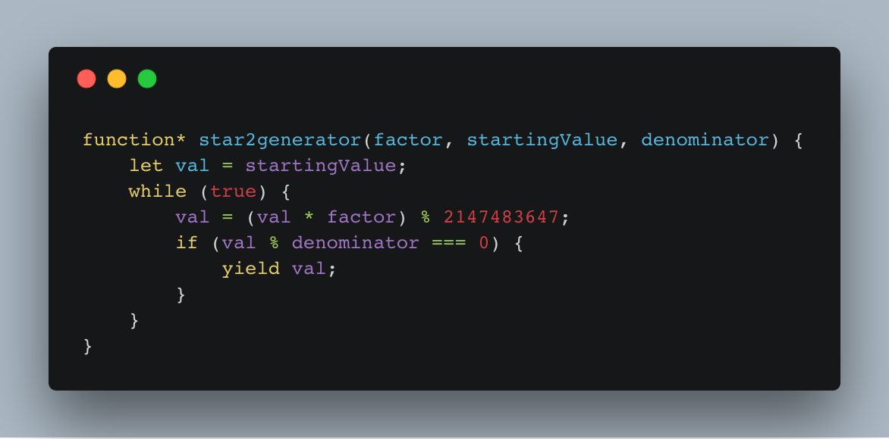

https://youtu.be/mM5iTlp-Pe4\[caption id=&quot;attachment_7972&quot; align=&quot;alignnone&quot; width=&quot;1172&quot;] JavaScript generators are 👌\[/caption]

Advent of Code Day 15 was basically all about finding the right programming language. It needs built-in support for generators. You don&#x27;t want to build that from scratch.

But what&#x27;s a generator anyway?

Well, a generator is like an infinite loop that doesn&#x27;t cause problems. The computer holds it paused in memory and only advances to the next iteration when you say, _&quot;Hey, what&#x27;s the next value?&quot;_

I don&#x27;t know how it&#x27;s implemented internally. If I had to guess, I&#x27;d say the engine holds the entire state on a stack of some sort and advances values when you ask for the next step. A lot like recursion.

The full generator for Day 15 looks like this 👇

```javascript
function* star2generator(factor, startingValue, denominator) {
  let val = startingValue;
  while (true) {
    val = (val * factor) % 2147483647;
    if (val % denominator === 0) {
      yield val;
    }
  }
}
```

This starts from a `startingValue` and multiplies `val` with `factor` and mods the result with `2147483647` _forever_. Notice the `while(true)`? When I say forever, I mean _forever_.

But it won&#x27;t crash your node runtime or your browser. Because `function*` and `yield` turn it into a generator that follows the &quot;only execute when called&quot; logic.

You get the next value like this:

```javascript
const A = generator(16807, startA, denomA);
A.next().value; // some number
A.next().value; // next number
```

The full generator only returns values that are divisible by a `denominator`. That&#x27;s from part 2 of Day 15. The first part returned every value.

If that `2147483647` number looks familiar, it&#x27;s because that&#x27;s the highest number you can represent in 32 bits. This is significant because we&#x27;re going to be doing some bitwise operations and JavaScript can only do those up to 32 bits.

Numbers are generally represented as 64 bits in JavaScript.

## Wtf are we doing?

Right, so that&#x27;s how generators work. The reason we need generators is that the puzzle for Advent of Code Day 15 goes like this

> Take two generators that follow similar logic and see how often the lowest 16 bits of their output match in 40,000,000 tries.
>
> For Star 2 we make them sync up a little better, check for only 5,000,000 tries

The generator above can handle both puzzle generators. They only differ in starting value and denominator.

To count the number of matches, I used this function 👇

```javascript
function countMatches({
  startA,
  startB,
  generator,
  denominators = [],
  sampleSize,
}) {
  const A = generator(16807, startA, denominators[0]),
    B = generator(48271, startB, denominators[1]);

  let judge = 0,
    mask = 0b00000000000000001111111111111111;

  for (let i = 0; i < sampleSize; i++) {
    if ((A.next().value & mask) === (B.next().value & mask)) {
      judge += 1;
    }
  }

  return judge;
}
```

The same function can do both Star 1 and Star 2 of the puzzle depending on input.

Here&#x27;s how it works:

1. Create generators `A` and `B`
2. Start at count of `0` (the `judge` variable)
3. Create a mask that takes out the lower 16 bits of a number
4. Loop until `sampleSize`
5. Take `next()` values from the generators, bitwise `AND` them with the mask[1](#fn1), compare values
6. If numbers match, increment `judge`
7. When it&#x27;s done looping, `judge` is our result

Solving for Star 1 and Star 2 then becomes a matter of calling the `matchCount` function with our inputs.

```undefined
<code>console.log(
    countMatches({
        startA: 591,
        startB: 393,
        generator: star2generator,
        denominators: [4, 8],
        sampleSize: 5000000
    })
);
</code>
```

Boom 💥 puzzle solved in about 20 minutes. 🤙

And now you know how generators work. Although I still don&#x27;t know where you&#x27;d use them in a web app.

1. If you&#x27;re not used to bitwise operations, they&#x27;re rare in JavaScript, the idea is that bits follow a truth table. 0 &amp; 0 == 0, 0 &amp; 1 == 0, 1 &amp; 0 == 0, 1 &amp; 1 == 1. You can use this to cut away parts of numbers with a `mask`. For example 0b1010 &amp; 0b0011 == 0b0010. 🤓 [↩](#ffn1)
