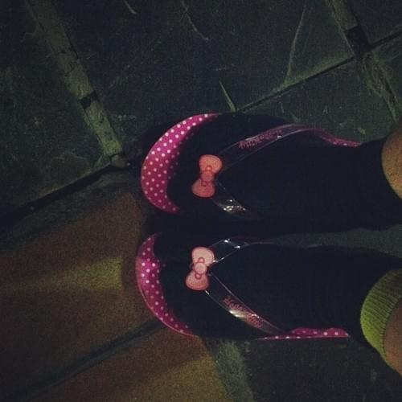
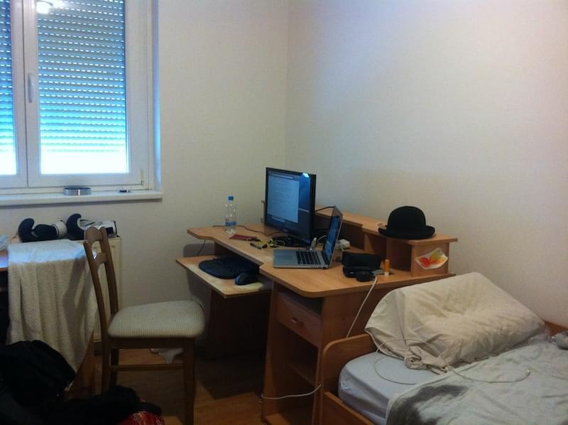

Today I ate müsli with a plastic fork out of a plastic cup. It was one of the most ridiculous things I&#x27;ve ever done and I spent August in [Hello Kitty](http://en.wikipedia.org/wiki/Hello_Kitty "Hello Kitty") flip-flops. \[caption id=&quot;&quot; align=&quot;alignnone&quot; width=&quot;400&quot;] Hello, Kitty\[/caption] Last night we finally moved back into our renovated apartment. And when I say renovated I mean two rooms are kind of sort of useful and the kitchen is off limits and the [living room](http://en.wikipedia.org/wiki/Living_room "Living room") is off limits and the bathroom is almost kind of clean. And when I say &quot;our&quot; I mean my room of 13 years is now my sister&#x27;s room and my sister&#x27;s room of 13 years is now my mum&#x27;s room and we threw my bed and my favorite chair away and all my stuff is in the garage. Right now I&#x27;m sitting in the barren used-to-be-mine-but-not-anymore room. One of my old monitors is attached to the laptop. The clothes I didn&#x27;t throw away are in a suitcase behind me. Everything&#x27;s got that temporary feel of a place you&#x27;ve just moved into or are about to move out of. A painter dude is working on the living room and kitchen, a carpenter is finishing up the built-in wardrobe separating the two rooms. Everything smells of paint and I&#x27;m freezing my ass off. The apartment is that special kind of cold that tells you _&quot;Nobody&#x27;s lived here in a while&quot;_ as soon as you step through the door. Everything being open so the workers can move around doesn&#x27;t help.

## &quot;Homeless&quot;

We&#x27;ve been sort of homeless for two weeks now. It took a weekend of real honest _work_ to clean everything out. None of that _&quot;Ooh I need a break, ooh I&#x27;m not feeling very productive or creative right now.&quot;_. Shut up, grab a thing, take it down four floors without an elevator, put in garage, come back for more. 20 of those giant 250 liter [trash bags](http://en.wikipedia.org/wiki/Bin_bag "Bin bag") were not enough. The stuff you accumulate in thirteen years! No wonder I&#x27;d been using the floor as storage room for the past few years. There was ten bags worth of useless crap in my room alone. I found t-shirts from elementary school and socks I haven&#x27;t seen in ten years! And I&#x27;m pretty sure I&#x27;m never going to need that pile of ~400 [CD-R](http://en.wikipedia.org/wiki/CD-R "CD-R")&#x27;s and [DVD-R](http://en.wikipedia.org/wiki/DVD-R "DVD-R")&#x27;s I used to so love recording in high school. Hell, I don&#x27;t even have a disc drive anymore. Then the apartment belonged to the workers. New floors, new doors, new giant wardrobe, walls stripped down to bare bones and repainted, some plumbing and a random new wall in the living room. Still not sure I agree with that one. It would all be done in ten days. Cat went to a cat hotel - they say she adapted nicely - sister went to a friend&#x27;s place - she says the food was fatty - mum went on a roadtrip - she says [Bosnia](<http://maps.google.com/maps?ll=44.0,18.0&amp;spn=10.0,10.0&amp;q=44.0,18.0 (Bosnia%20and%20Herzegovina)&amp;t=h> "Bosnia and Herzegovina") is pretty - and I stayed at my girl&#x27;s place - her mum says it&#x27;s crowdy. This was all fine and dandy until mum came back from the roadtrip and wanted to move back into the apartment in the evening. It was supposed to be in the state it was last night. It wasn&#x27;t.

## Lol, nope, not done

This was on Tuesday, almost a week ago. _&quot;Definitely on Thursday though! Pinky swear!&quot;_, the workers said. I decided I didn&#x27;t want to come back until the apartment was completely finished. I work from home, I can&#x27;t fuck around with not even being able to make tea. I need tea to live, let alone work! So I rented an [AirBnB](http://www.airbnb.com/ "Airbnb") style apartment from Thursday to Sunday. Why poke at a good thing and not just stay where I was? The reasons are multifaceted and complex - they involve Girl&#x27;s mum being irritated by my presence, her 85 year old dad breaking his arm, and her having to help out at his place. You don&#x27;t want to be the elderly. It sucks. Helping them doesn&#x27;t sound like a walk in the park either. Well, by Thursday evening mum and sister decided to join me in the AirBnB as well. The apartment was still a construction site and they didn&#x27;t want to stay at other people&#x27;s places anymore. You know what they say, guests go stale after three days. BUT! The lady of the AirBnB &quot;accidentally&quot; had a double booking. Five people were moving in Friday afternoon and since I was just one in a five bed flat, I can surely move can&#x27;t I? Well I wasn&#x27;t just one, but I did say that _maybe_ two more would decide to join me. Should&#x27;ve specified the maybe had an 80% probability attached. She arranged a new flat for two days. At 40% more expensive it was a shitty hell hole not fit for living. The beds were in a wobbly bunk layout, there were no dishes, there wasn&#x27;t even any toilet paper. But pay 140 euro for two nights we did. Mum was still certain she wouldn&#x27;t need it on Friday night. She stayed there both Friday and Saturday night. We moved back home Sunday - yesterday - mid day. But it doesn&#x27;t feel like home anymore. Can&#x27;t even imagine what the cat is going to think when she comes back tonight ... At least I learned a valuable lesson:

1. Moving your stuff around, even if it&#x27;s just a single suitcase, takes _time_. Serious amounts of time, even if you&#x27;re moving by just a kilometer or two.
2. When you depend on a deadline, you put penalties in the contract. If the promise sounds too good to be true, they&#x27;re counting on stretching the promise.
3. Not knowing where you&#x27;re going to sleep tonight really puts a damper on one&#x27;s productivity.

Okay, three lessons. \[caption id=&quot;&quot; align=&quot;alignnone&quot; width=&quot;640&quot;] &quot;My&quot; room\[/caption]

