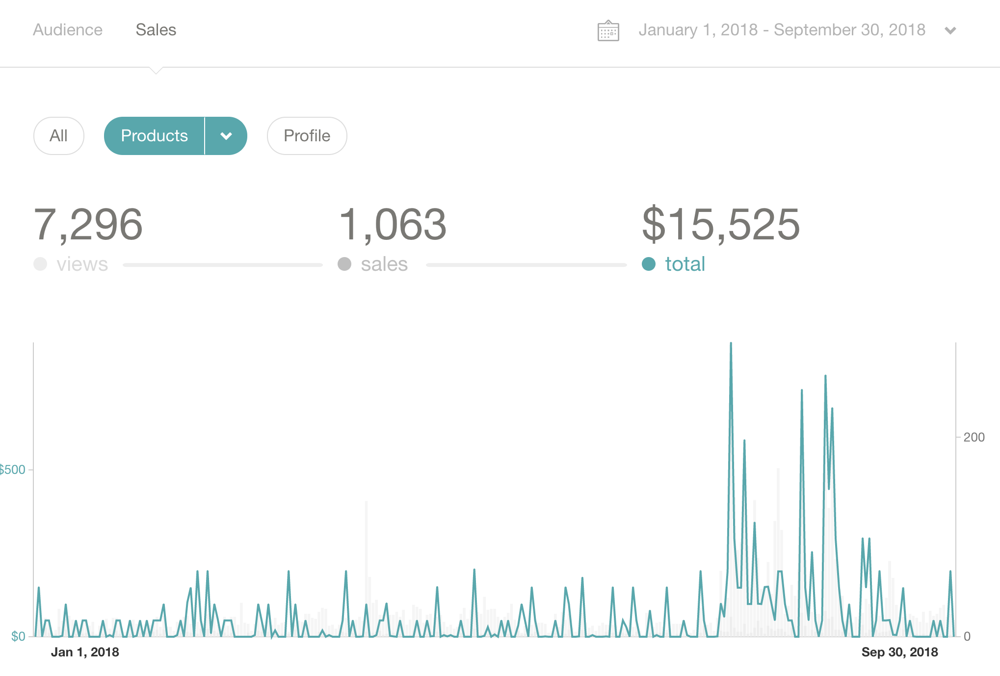
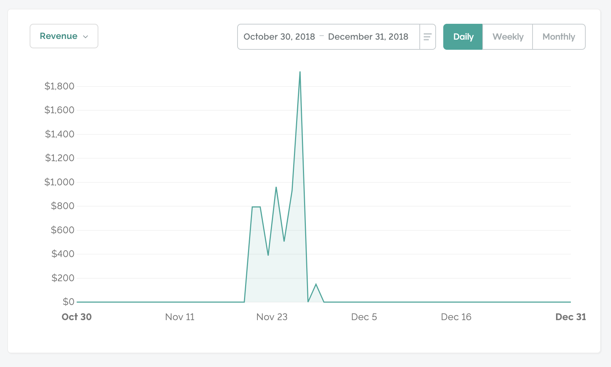
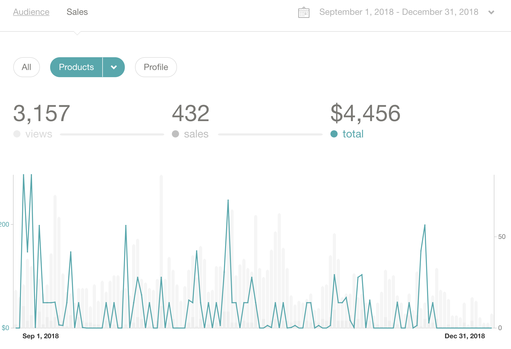
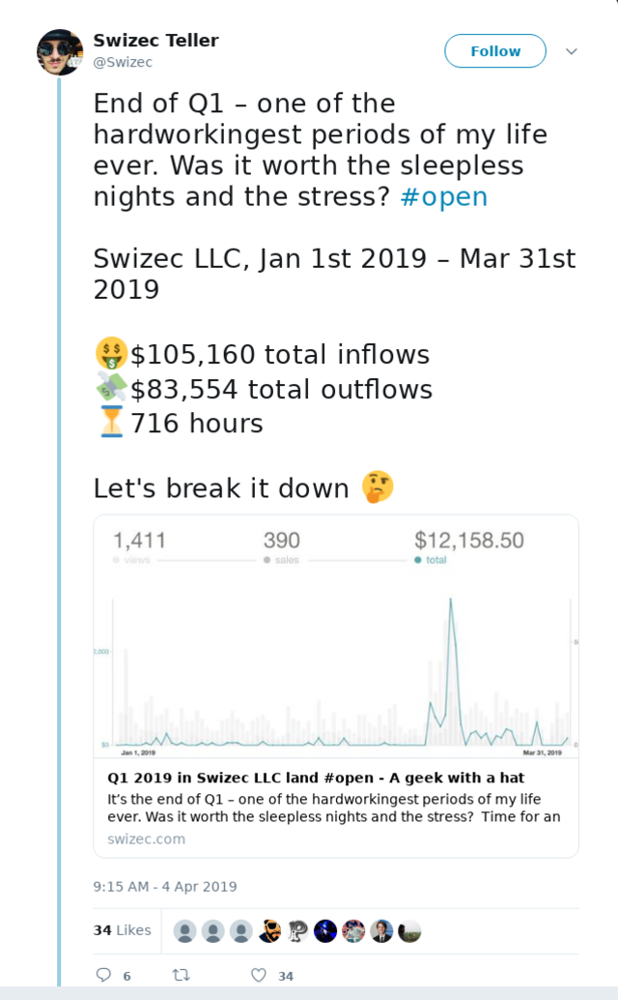
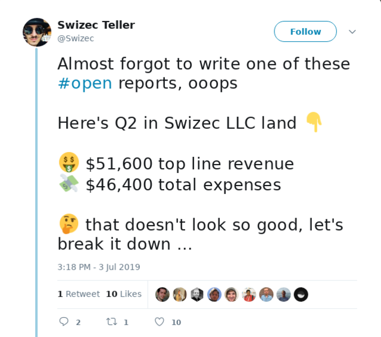
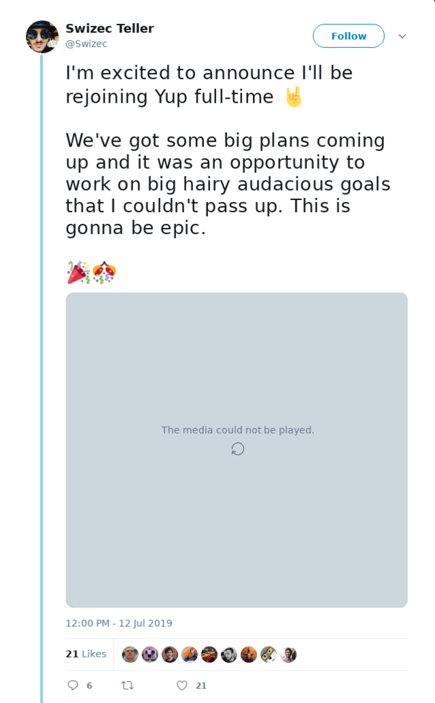

Well, my old job ... that I never quite left. It&#x27;s complicated.Let me tell you a story, friend. A story of freedom, hustle, side gigs, boundless ambition, and a very expensive city.October 2018 I quit my job to focus on the sidehustle – teaching React. It was scary. Terrifying. But leaving the only full-time job I&#x27;d ever had felt good. Refreshing. I didn&#x27;t like my boss and the work got boring.Well, I actually quit in March. It took until October to set up a company and [sponsor my own O-1 visa](https://swizec.com/blog/sponsored-genius-visa/swizec/8612). Ain&#x27;t it fun being an immigrant. 😅

Many thanks to everyone involved for letting me get away with these shenanigans. Quitting and being allowed to stay for 7 months while you deal with immigration is no joke.

Now here&#x27;s the problem: When I finally got my freedom in October, my business was all but dead.

The stress of dealing with immigration, training a React team at a large Fortune5 company, a full-time day job with boss problems, and trying to keep infoproducts selling almost killed my business. You can read about that in my annual review 👉 [How I sidehustled $180k and why it almost killed my business](https://swizec.com/blog/sidehustled-180k-almost-killed-my-business/swizec/8835)

## Freedom

So here I was. Free of all shackles, immigration or otherwise, a few thousand dollars in the hole, contracting 4 days/week at my old job, and product sales that looked like this.

Damn right I continued contracting at my old job! Have you seen how expensive San Francisco gets?

We struck a deal.

Swizec shapes up, stops coming to work tired and groggy, contributes like there&#x27;s no tomorrow, and we promise to let him come in, get his work done, and go home. No startup kool-aid, just a proper business relationship between adults.

I rolled up my sleeves and got to work.

Found some other freelance clients, dusted off my infoproducts, ran a couple of launches, and embarked on a huge revamp of React for Dataviz. Things were looking great.

Product sales were ... heh.

$9,217 in sales from October 1st to December 31st. That&#x27;s not gonna pay rent in San Francisco 😅

## Freedom is tough

Life was tough, money short, and for the first time in _years_ I started counting pennies again. Dropped the lattes, stopped taking Uber, bought the cheapest possible boxing gear ...

There&#x27;s this thing about money. Abundance vs. Scarcity mindsets.

You want to adopt an abundance mindset. Replace _&quot;I don&#x27;t have enough&quot;_ with _&quot;How do I get enough?&quot;_. Instead of penny pinching, try making more. Stuff like that.

When there&#x27;s too much month left at the end of the money, it&#x27;s easy to fall back into scarcity. Especially if you grew up with a scarcity mindset your whole life like I did.

So I kept hustling. [Q1 of 2019 was amazing](https://swizec.com/blog/q1-2019-in-swizec-llc-land-open/swizec/9007).

Product sales were looking up at $14k, I ran two sold out workshops at Reactathon, a late invoice came in, and a wonderful freelance project wrapped up.

Swizec was out of the woods. Fuck yeah!

Q2 looked almost just as great. Product sales slowed a little due to summer, email engagement slowed in June and July, but it&#x27;s all good. You&#x27;re here and I love you ❤️

And thanks to adopting the [Profit First](https://profitfirstbook.com/) method of paying yourself first, then the IRS, then you fit the business into what&#x27;s left, I have more runway in the bank than ever before. Could go 6 months with no income, in San Francisco, and keep my new slimmed-down lifestyle.

🤘

## A gnawing feeling

In the beginning it was all hustle. No time to think. Will I make rent this month? Will I pay my freelancers? What do I gotta do to make that happen?

Work. Work. Work.

As the runway lengthened, as money piled up, a gnawing feeling started to grow 👉 is this worth it?

I love teaching. I love solving complex problems and breaking them down for everyone to understand. I love helping coders become engineers. That&#x27;s a $20k+ difference in salary. I love helping people get that shit and earn what they&#x27;re worth.

But is that the biggest contribution I can make in the world? **If I win this game, was it worth winning?**

> If you don&#x27;t find a way to make money while you sleep, you will work until you die. ~ Warren Buffett

Infoproducts make money while you sleep. You set up your funnels, your mailing list, your sales page, you run a couple launches per year, and yeah you&#x27;re making money while you sleep.

The infoproduct playbook is a simple one:

1. Offer shitloads of value for free
2. Get email subscribers
3. Launch 1 product per quarter
4. Convert about 1% of your list each time
5. Money falls out

You will never get more than about 1% conversions. You will never convert more than 5% on your sales page. You will never have more than 10% opt-ins on your email list. You will never churn less than 0.1% of email opens.

That&#x27;s the physics.

Can you make $10,000/year with infoproducts? Easy.

Can you make $100,000/year with infoproducts? Yeah, just keep pulling that lever.

Can you make $1,000,000/year? Tough. A few dozen people pulled it off.

Can you make $10,000,000/year? Oof. Maybe like 5 people managed to do that?

Can you make $100,000,000/year? Yeah maybe if you&#x27;re Tony Robbins.

It&#x27;s kinda soul crushing when you think about it. You&#x27;re putting in all that risk and hard work and the most you&#x27;ll ever have is a small business that lives and dies on its next launch.

Like showbiz: You&#x27;re only as good as your last hit.

* * *

Plus technical infoproducts are really more of a sidehustle.

You need a constant stream of interesting challenges. Stuff to write about. Things to teach.

If all you do is teach, you drift from industry best practice and your teaching becomes shit. You need to keep your hands in the real world.

And anyway do you really want to keep saying and re-saying the same stuff for the next 10 years of your life? Techniques you figured out years ago and know like the back of your hand?

I don&#x27;t know about you, but I&#x27;m a very bad lever puller. It&#x27;s fun the first time. The first 5 times maybe. Then I want to find a new lever.

> The biggest reason why smart people fail is that they get bored of doing what works.

That&#x27;s me.

## The day job gets better

At the same time as I realized what it would take to scale my business to the $120,000/year minimum that I need in San Francisco, the day job got _so much better_.

My boss changed.

The new kid is awesome. A manager who really tries to manage. Who&#x27;s invested in figuring out how this management thing works. Not just an engineer who scoffs at the idea that management is a real job with real challenges.

First thing he did was give me a raise. That was nice, helped me breathe.

More importantly he stopped treating me like a 2nd class citizen just because I was contracting. That was beyond wonderful. I became involved in real decisions again. I was asked questions. My opinion became valued.

Sure I loved the few months where I could do nothing but focus and code. It was a wonderful break from the stress and ambiguity of before.

I had started to chafe at the constraints. I like being an IC (individual contributor) and I never want to become a manager. That&#x27;s a different job.

But when I say IC, I don&#x27;t mean a task executor. I want to be something more akin to an internal consultant.

The guy who solves tough business critical technical challenges. You come to me with a problem, you set me loose, and I solve it for you.

That&#x27;s my sweet spot I think. A leader, but not a manager.

And under my new boss, the day job started morphing into that. I became more and more engaged. I started to enjoy coming into the office again.

When an opportunity showed up to make a big bet, but I gotta return full-time, I said _&quot;Fuck yes let&#x27;s do it!&quot;_

## So what happens next?

Today is my first day of being full-time at [Yup](https://www.yup.com/). We have big plans in store.

I&#x27;m keeping the side hustle. I love you guys too much to peace out ❤️

But for now my focus is shifting. More long term stuff, less week-to-week hustle.

You&#x27;re going to continue getting these emails. They might become less frequent. I hope to keep it up twice a week. A little less purely educational, a little more sharing lessons learned in the real world.

[Livecoding](https://www.youtube.com/channel/UCoyHgaeLLI7Knp7LDHOwZMw) continues with a focus on building cool stuff and hanging out. It&#x27;s a great commitment device for when I get an idea for a cool project.

Right now I have a longer list of project ideas than I have time 😅

I&#x27;m launching a new course this Fall. Recording is almost done and I&#x27;m stoked as hell. I think you&#x27;re gonna love it.

And I&#x27;m going to keep doing workshops when the opportunity arises. They&#x27;re fun.

Beyond that I have some long-term long-term ideas (think years, not months) that have been gestating for a while and I&#x27;ve been too busy hustling to get started.

For now 👇

When someone offers you a ride on a rocket ship, you hop on.

Cheers,  
~Swizec